# Kiseki OS Internals

### A Comprehensive Guide to Building a macOS-Compatible Operating System from Scratch

**Target audience:** Security engineers with zero systems-development experience but comfortable reading C and Python code. Limited ARM64 assembly knowledge assumed — all assembly is explained inline.

**Codebase reference:** All line numbers and code references point to the Kiseki repository as of the latest commit on `origin/main`. Where relevant, XNU source code from [apple-oss-distributions/xnu](https://github.com/apple-oss-distributions/xnu/) is cited for comparison.

---

## Table of Contents

- [Chapter 1: Introduction & Overview](#chapter-1-introduction--overview)
  - [1.1 What Is Kiseki?](#11-what-is-kiseki)
  - [1.2 Architecture at a Glance](#12-architecture-at-a-glance)
  - [1.3 How macOS Works (The 10,000-Foot View)](#13-how-macos-works-the-10000-foot-view)
  - [1.4 Hardware Target](#14-hardware-target)
- [Chapter 2: ARM64 Boot & Early Initialisation](#chapter-2-arm64-boot--early-initialisation)
  - [2.1 Exception Levels and the Boot Sequence](#21-exception-levels-and-the-boot-sequence)
  - [2.2 The Vector Table](#22-the-vector-table)
  - [2.3 Context Switching](#23-context-switching)
  - [2.4 The 17-Phase Kernel Bootstrap](#24-the-17-phase-kernel-bootstrap)
  - [2.5 Secondary Core Bring-Up (SMP)](#25-secondary-core-bring-up-smp)
- [Chapter 3: Physical & Virtual Memory](#chapter-3-physical--virtual-memory)
  - [3.1 The Buddy Allocator (PMM)](#31-the-buddy-allocator-pmm)
  - [3.2 ARM64 Page Tables](#32-arm64-page-tables)
  - [3.3 Kernel Address Space Setup](#33-kernel-address-space-setup)
  - [3.4 User Address Spaces](#34-user-address-spaces)
  - [3.5 Copy-on-Write](#35-copy-on-write)
  - [3.6 The VM Map](#36-the-vm-map)
- [Chapter 4: Threads, Scheduling & Synchronisation](#chapter-4-threads-scheduling--synchronisation)
  - [4.1 Thread Representation](#41-thread-representation)
  - [4.2 The MLFQ Scheduler](#42-the-mlfq-scheduler)
  - [4.3 SMP Load Balancing](#43-smp-load-balancing)
  - [4.4 Spinlocks, Mutexes & Condition Variables](#44-spinlocks-mutexes--condition-variables)
  - [4.5 The Timer Driver](#45-the-timer-driver)
- [Chapter 5: Processes — Fork, Exec, Exit](#chapter-5-processes--fork-exec-exit)
  - [5.1 The Process Table](#51-the-process-table)
  - [5.2 fork()](#52-fork)
  - [5.3 execve()](#53-execve)
  - [5.4 exit() and wait4()](#54-exit-and-wait4)
  - [5.5 Signals](#55-signals)
- [Chapter 6: Mach IPC](#chapter-6-mach-ipc)
  - [6.1 Ports, Rights & Names](#61-ports-rights--names)
  - [6.2 Message Anatomy](#62-message-anatomy)
  - [6.3 mach_msg_trap — The Send/Receive Path](#63-mach_msg_trap--the-sendreceive-path)
  - [6.4 Out-of-Line Memory Descriptors](#64-out-of-line-memory-descriptors)
  - [6.5 The Bootstrap Server](#65-the-bootstrap-server)
- [Chapter 7: BSD Syscalls & Security](#chapter-7-bsd-syscalls--security)
  - [7.1 Syscall Calling Convention](#71-syscall-calling-convention)
  - [7.2 The Syscall Table](#72-the-syscall-table)
  - [7.3 Unix DAC & Credentials](#73-unix-dac--credentials)
- [Chapter 8: Filesystem — VFS, Ext4, Buffer Cache](#chapter-8-filesystem--vfs-ext4-buffer-cache)
  - [8.1 The VFS Layer](#81-the-vfs-layer)
  - [8.2 The Buffer Cache](#82-the-buffer-cache)
  - [8.3 Ext4 On-Disk Layout](#83-ext4-on-disk-layout)
  - [8.4 Ext4 Read Path — Extents & Indirect Blocks](#84-ext4-read-path--extents--indirect-blocks)
  - [8.5 Ext4 Write Path](#85-ext4-write-path)
  - [8.6 devfs](#86-devfs)
- [Chapter 9: Networking — TCP/IP Stack](#chapter-9-networking--tcpip-stack)
  - [9.1 The Network Stack Overview](#91-the-network-stack-overview)
  - [9.2 Ethernet & ARP](#92-ethernet--arp)
  - [9.3 IPv4](#93-ipv4)
  - [9.4 TCP](#94-tcp)
  - [9.5 UDP & DHCP](#95-udp--dhcp)
  - [9.6 BSD Sockets](#96-bsd-sockets)
- [Chapter 10: IOKit & Device Drivers](#chapter-10-iokit--device-drivers)
  - [10.1 IOKit Object Model](#101-iokit-object-model)
  - [10.2 The I/O Registry](#102-the-io-registry)
  - [10.3 Driver Matching](#103-driver-matching)
  - [10.4 IOFramebuffer — The GPU Driver](#104-ioframebuffer--the-gpu-driver)
  - [10.5 IOHIDSystem — Input Events](#105-iohidsystem--input-events)
  - [10.6 VirtIO Drivers](#106-virtio-drivers)
  - [10.7 GICv2 — The Interrupt Controller](#107-gicv2--the-interrupt-controller)
- [Chapter 11: Userland — dyld, libSystem, crt0](#chapter-11-userland--dyld-libsystem-crt0)
  - [11.1 The Mach-O Binary Format](#111-the-mach-o-binary-format)
  - [11.2 dyld — The Dynamic Linker](#112-dyld--the-dynamic-linker)
  - [11.3 libSystem.B.dylib](#113-libsystembdylib)
  - [11.4 crt0 and Program Startup](#114-crt0-and-program-startup)
- [Chapter 12: WindowServer & GUI Architecture](#chapter-12-windowserver--gui-architecture)
  - [12.1 WindowServer Overview](#121-windowserver-overview)
  - [12.2 The IPC Protocol](#122-the-ipc-protocol)
  - [12.3 Window Compositing](#123-window-compositing)
  - [12.4 Input Event Dispatch](#124-input-event-dispatch)
  - [12.5 The Built-In VT100 Terminal](#125-the-built-in-vt100-terminal)
  - [12.6 loginwindow](#126-loginwindow)
  - [12.7 init — The launchd-Style PID 1](#127-init--the-launchd-style-pid-1)
- [Chapter 13: Framework Stack — CF through AppKit](#chapter-13-framework-stack--cf-through-appkit)
  - [13.1 The Freestanding Pattern](#131-the-freestanding-pattern)
  - [13.2 CoreFoundation](#132-corefoundation)
  - [13.3 CoreGraphics](#133-coregraphics)
  - [13.4 CoreText](#134-coretext)
  - [13.5 Foundation](#135-foundation)
  - [13.6 AppKit](#136-appkit)
  - [13.7 Toll-Free Bridging](#137-toll-free-bridging)
  - [13.8 The ObjC Runtime & objc_msgSend](#138-the-objc-runtime--objc_msgsend)
- [Chapter 14: Applications — Finder, Terminal, Dock](#chapter-14-applications--finder-terminal-dock)
  - [14.1 Application Architecture](#141-application-architecture)
  - [14.2 Dock.app](#142-dockapp)
  - [14.3 Finder.app](#143-finderapp)
  - [14.4 Terminal.app](#144-terminalapp)
  - [14.5 SystemUIServer.app](#145-systemuiserverapp)
- [Chapter 15: Build System & Toolchain](#chapter-15-build-system--toolchain)
  - [15.1 The COMDAT-Stripping Pipeline](#151-the-comdat-stripping-pipeline)
  - [15.2 TBD Stubs & GNUstep ABI v1](#152-tbd-stubs--gnustep-abi-v1)
  - [15.3 The Disk Image](#153-the-disk-image)
  - [15.4 QEMU Configuration](#154-qemu-configuration)

---

## Chapter 1: Introduction & Overview

### 1.1 What Is Kiseki?

Kiseki (奇跡, Japanese for "miracle") is a from-scratch operating system for ARM64 that faithfully reimplements the architecture of Apple's macOS — from the Mach/BSD hybrid kernel up through the Objective-C GUI frameworks. It is not a port of XNU or Darwin; every line of code is original, written to behave identically to macOS where it matters for binary compatibility and security understanding.

The codebase comprises roughly **22,000 lines of kernel C and assembly** and **45,000 lines of userland code**, producing a system that boots on QEMU's `virt` machine (and Raspberry Pi 4) with:

- A Mach + BSD hybrid kernel with 100+ syscalls and 10 Mach traps
- 4-core SMP with an MLFQ scheduler
- ARM64 4-level page tables with copy-on-write fork
- Full Mach IPC with per-task port namespaces and OOL memory descriptors
- A read/write ext4 filesystem with extent trees
- A TCP/IP networking stack with DHCP, ARP, ICMP
- A dynamic linker (`dyld`) that loads Mach-O binaries
- A complete C library (`libSystem.B.dylib`, ~7,900 lines)
- An IOKit driver framework with VirtIO GPU, input, block, and network drivers
- A Quartz-like WindowServer compositor
- CoreFoundation, CoreGraphics, CoreText, Foundation, and AppKit frameworks
- Four GUI applications: Dock, Finder, Terminal, and SystemUIServer
- 65+ command-line utilities including `bash` and a native C compiler (`tcc`)

The goal is not to run unmodified macOS binaries (that would require Apple's proprietary code), but to build a system that is **structurally identical** to macOS — so that studying Kiseki teaches you exactly how macOS works, from the syscall ABI to the Mach message format to the way AppKit dispatches events.

**Why should a security engineer care?**

If you want to find vulnerabilities in macOS, you need to understand how the kernel handles Mach messages, how `mach_msg_trap` copies OOL descriptors across address spaces, how the VM subsystem manages copy-on-write pages, how IOKit user clients validate external method arguments. These are exactly the attack surfaces that have produced CVEs like:

- **CVE-2021-30858** (use-after-free in IPC port lifecycle)
- **CVE-2023-32434** (integer overflow in vm_map)
- **CVE-2024-23296** (IOKit user client type confusion)

Kiseki implements all of these subsystems. By reading this book, you will understand the exact code paths that an attacker targets — because you will have written equivalent code yourself.

### 1.2 Architecture at a Glance

The following diagram shows the major components and their relationships:

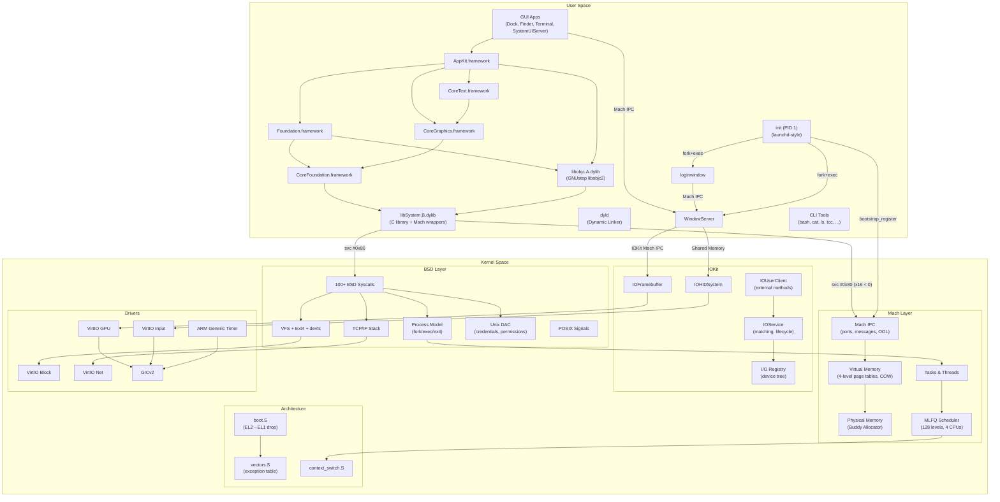

### 1.3 How macOS Works (The 10,000-Foot View)

Before diving into Kiseki's implementation, let's establish how a real macOS system is structured. If you already know this, skip ahead — but most security engineers have a fuzzy picture of the layers, so let's make it concrete.

**macOS is not a monolithic kernel.** It is a **hybrid** of two very different operating system traditions:

1. **Mach** (from Carnegie Mellon University, 1985) — provides the low-level primitives: tasks (address spaces), threads, virtual memory, and inter-process communication via message-passing on ports.

2. **BSD** (from UC Berkeley, 1977) — provides the POSIX interface: processes, file descriptors, the VFS, the TCP/IP stack, signals, and the syscall ABI.

Apple's kernel, **XNU** ("X is Not Unix"), welds these together. A single kernel image contains both the Mach layer and the BSD layer. Every process is simultaneously a Mach task (with a port namespace and threads) and a BSD process (with a PID, file descriptors, and credentials). The syscall entry point (`svc #0x80` on ARM64) inspects register `x16`:

- **Positive x16** → BSD syscall (e.g., `x16=4` → `write()`)
- **Negative x16** → Mach trap (e.g., `x16=-31` → `mach_msg_trap()`)

This duality is the heart of macOS, and it is the heart of Kiseki.

> **XNU reference:** The syscall dispatch lives in [`bsd/dev/arm/systemcalls.c`](https://github.com/apple-oss-distributions/xnu/blob/main/bsd/dev/arm/systemcalls.c) and [`osfmk/arm64/sleh.c`](https://github.com/apple-oss-distributions/xnu/blob/main/osfmk/arm64/sleh.c). In Kiseki, the equivalent is `kernel/kern/trap.c` (line 169, `trap_sync_el0`).

**Above the kernel**, macOS provides:

- **`dyld`** — the dynamic linker that loads Mach-O executables and their dependent `.dylib` files
- **`libSystem.B.dylib`** — the C library (wrapping `libsystem_c`, `libsystem_kernel`, `libsystem_malloc`, etc.)
- **`launchd`** (PID 1) — the init system that reads property lists and launches daemons
- **WindowServer** — the display compositor (a userland process, not in-kernel)
- **CoreFoundation → CoreGraphics → CoreText → Foundation → AppKit** — the framework stack

Kiseki reimplements all of these.

### 1.4 Hardware Target

Kiseki targets the **QEMU `virt` machine** with the following configuration:

```
qemu-system-aarch64 \
    -M virt -accel tcg -cpu cortex-a72 -smp 4 -m 4G \
    -display cocoa \
    -kernel build/kiseki.elf \
    -serial mon:stdio \
    -drive id=hd0,file=build/disk.img,format=raw,if=none \
    -device virtio-blk-device,drive=hd0 \
    -device virtio-gpu-device \
    -device virtio-keyboard-device \
    -device virtio-tablet-device \
    -netdev vmnet-shared,id=net0 \
    -device virtio-net-device,netdev=net0
```

The QEMU `virt` machine provides:

| Component | Address / IRQ | Kiseki Driver |
|-----------|--------------|---------------|
| ARM Generic Timer | PPI #27 | `kernel/drivers/timer/timer.c` |
| GICv2 (interrupt controller) | `0x08000000` (GICD), `0x08010000` (GICC) | `kernel/drivers/gic/gicv2.c` |
| PL011 UART | `0x09000000`, SPI #33 | `kernel/drivers/uart/uart.c` |
| VirtIO MMIO (8 slots) | `0x0A000000`+, SPI #48+ | `kernel/drivers/virtio/` |
| RAM | `0x40000000` — `0x13FFFFFFF` (4 GB) | Managed by PMM + VMM |

> **Why TCG instead of HVF?** Apple Silicon's hardware virtualisation (HVF) has cache-coherency issues that cause External Abort exceptions during instruction fetch after `fork()`. The `tcg` (software emulation) accelerator avoids this at the cost of speed. See `Makefile:run` target.

The kernel is loaded as an ELF at physical address `0x40080000` (the first 512 KB of RAM is reserved for QEMU's device tree blob). The linker script (`kernel/arch/arm64/linker-qemu.ld`) places `.text` first (with `boot.S` at the entry point), followed by `.rodata`, `.data`, `.bss`, a 128 KB stack area (32 KB × 4 cores), and the heap start marker.

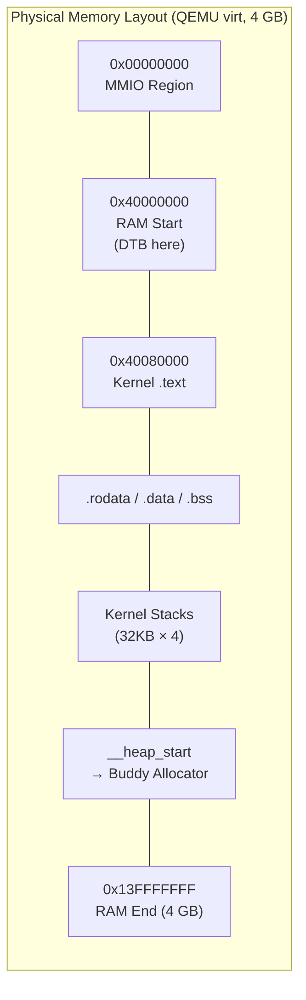

Kiseki also supports the **Raspberry Pi 4** (BCM2711, GIC-400, eMMC) via an alternate linker script (`linker-raspi4.ld`, base `0x80000`) and platform-specific UART/eMMC drivers.

---

## Chapter 2: ARM64 Boot & Early Initialisation

Before we look at boot code, we need to understand five foundational concepts that everything else builds on. If you have done exploit development on x86, some of these will be familiar — but the ARM64 terminology is different, and the details matter.

#### Concept 1: Privilege Levels (Exception Levels)

A CPU does not treat all code equally. Your web browser should not be able to overwrite kernel memory or reprogram the interrupt controller. To enforce this, ARM64 processors have four **Exception Levels** (ELs), numbered 0 to 3. Think of them as concentric security rings — higher numbers mean more privilege:

| Level | Who Runs Here | What They Can Do |
|-------|--------------|-----------------|
| **EL0** | Your apps (Safari, Terminal, malware) | Access own memory only. Cannot touch hardware registers. Must ask the kernel for everything via syscalls. |
| **EL1** | The OS kernel (XNU on macOS, Kiseki) | Full control over memory mapping, hardware devices, interrupt handling. Can read/write any physical address. |
| **EL2** | Hypervisor (used by VMs) | Can intercept and virtualise EL1 operations. Controls which physical memory the kernel can see. |
| **EL3** | Secure Monitor (TrustZone/SEP) | Highest privilege. Controls the boundary between "secure world" and "normal world". |

On macOS, your apps run at EL0, XNU runs at EL1, and Apple's Secure Enclave Processor firmware uses EL3. Kiseki follows the same split: user processes at EL0, kernel at EL1.

The key rule: **code at a lower EL cannot directly access resources at a higher EL.** An EL0 process cannot read kernel memory, modify page tables, or disable interrupts. The only way to cross the EL boundary is through a controlled gate — which brings us to the next concept.

#### Concept 2: Syscalls — How User Code Talks to the Kernel

When your program calls `read(fd, buf, 100)`, the C library does not magically access the disk. Instead, it executes a special CPU instruction that **traps** into the kernel:

```
User code (EL0)                    Kernel (EL1)
─────────────────                  ─────────────
mov x16, #3         // syscall number for read()
mov x0, fd          // arg 1: file descriptor
mov x1, buf         // arg 2: buffer address
mov x2, 100         // arg 3: byte count
svc #0x80           // ← THIS INSTRUCTION TRAPS TO EL1
                     ────────────────────────────────►
                           trap_sync_el0() runs
                           reads x16 → "oh, it's read()"
                           does the actual disk I/O
                           puts result in x0
                     ◄────────────────────────────────
// x0 now contains        eret  // return to user
// bytes read (or error)
```

The `svc` instruction (Supervisor Call) is ARM64's equivalent of x86's `syscall`/`int 0x80`. It causes the processor to:
1. Save the current PC (program counter) into a special register called `ELR_EL1` (Exception Link Register)
2. Save the current processor state (interrupt mask, flags) into `SPSR_EL1`
3. Switch from EL0 to EL1
4. Jump to a predefined address in the **vector table** (more on this shortly)

The kernel handles the request, then executes `eret` (Exception Return) to atomically switch back to EL0 and resume the user program.

On macOS/Kiseki, the convention is: syscall number goes in register `x16`, arguments in `x0`–`x5`, return value in `x0`. If there is an error, the kernel sets the carry flag in SPSR and puts a positive errno in `x0`.

#### Concept 3: Interrupts — Hardware Talking to the Kernel

While your process is running, hardware events happen asynchronously: the timer fires, a network packet arrives, a key is pressed. These are **interrupts** (or IRQs — Interrupt Requests).

When an interrupt occurs, the CPU does almost the same thing as with `svc`:
1. Saves PC and processor state
2. Switches to EL1 (if it was at EL0) or stays at EL1 (if the kernel was already running)
3. Jumps to the interrupt entry in the vector table

The kernel's interrupt handler identifies which device caused the interrupt (by reading the GIC — Generic Interrupt Controller), calls the appropriate driver, then returns to whatever was interrupted.

The critical difference from syscalls: **interrupts are asynchronous** — they can happen at any point during execution, between any two instructions. This is why interrupt handlers must be extremely careful about what data they touch, and why the kernel must save ALL registers (not just a few).

#### Concept 4: Page Faults — When Memory Doesn't Exist (Yet)

When code accesses a virtual address that has no valid mapping in the page table, the CPU generates a **page fault** (called a "Data Abort" or "Instruction Abort" on ARM64). This is another trip to EL1, just like a syscall or interrupt.

Page faults are not always errors. The kernel uses them intentionally for three purposes:

1. **Demand paging**: The kernel promised a process 8 MB of stack, but didn't actually allocate physical pages yet. When the process first touches a new stack page, the fault handler allocates a physical page and creates the mapping.

2. **Copy-on-Write**: After `fork()`, parent and child share pages marked read-only. When either writes, the fault handler copies the page and gives the writer their own private copy.

3. **Real errors (SIGSEGV)**: If the process accesses an address it never mapped, the fault handler delivers `SIGSEGV` and kills the process.

The page fault handler must examine the faulting address and the type of fault to decide which case applies. This logic is in `trap_sync_el0()` in `kernel/kern/trap.c`.

#### Concept 5: The Vector Table — Where the CPU Jumps

All three of the above events (syscalls, interrupts, page faults) are collectively called **exceptions** in ARM64 terminology. When any exception occurs, the CPU needs to know *where to jump*. This is configured via the **Vector Base Address Register** (`VBAR_EL1`) — a register that points to a table of 16 entry points, one for each combination of:

- **Exception type**: Synchronous (syscall, fault) vs IRQ vs FIQ vs SError
- **Origin**: From same EL (kernel) vs from lower EL (user)
- **ISA**: AArch64 vs AArch32

We'll see the exact layout in §2.2.

With these five concepts established, let's look at how Kiseki boots.

### 2.1 Exception Levels and the Boot Sequence

When QEMU boots an ARM64 kernel, it starts execution at **EL2** (the hypervisor level). The very first thing the kernel must do is drop down to EL1 — the level where an OS kernel is supposed to run. This is a one-way transition: once you leave EL2, you cannot return to it without taking an exception.

> **XNU reference:** Apple's iBoot hands off to XNU at EL1 directly (EL2 setup is done by iBoot/SecureROM). Kiseki handles EL2→EL1 itself because QEMU starts at EL2.

The boot sequence lives in `kernel/arch/arm64/boot.S` (181 lines). Here is the complete flow:

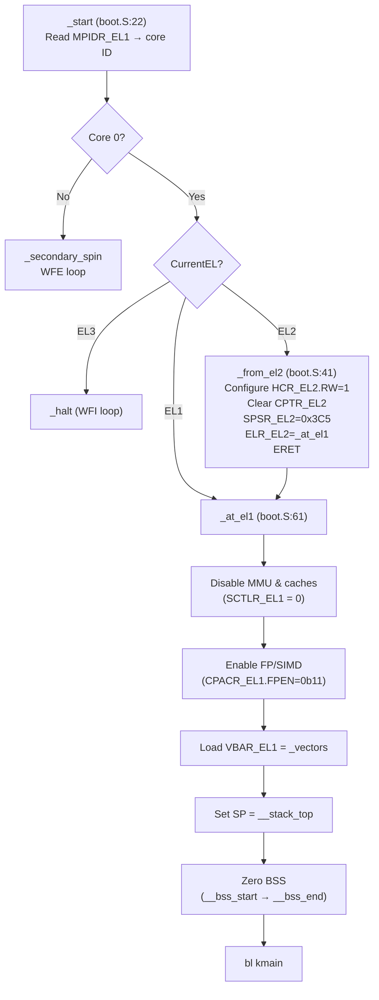

Let's walk through the critical steps:

**Step 1: Core identification** (`boot.S:23-26`)

```asm
mrs     x0, mpidr_el1       // Read Multiprocessor Affinity Register
and     x0, x0, #0xFF       // Extract Aff0 (core number within cluster)
cbnz    x0, _secondary_spin // If not core 0, go to sleep (WFE loop)
```

`MPIDR_EL1` is an ARM system register that tells each core its own ID. On a 4-core system, core 0 gets `Aff0=0`, core 1 gets `Aff0=1`, etc. Only core 0 runs the boot code; the others spin in a low-power `WFE` (Wait For Event) loop until the kernel explicitly wakes them later.

**Step 2: Exception level check** (`boot.S:30-38`)

```asm
mrs     x0, CurrentEL       // Read current exception level
and     x0, x0, #0xC        // Mask to EL field (bits 3:2)
cmp     x0, #0x8            // 0x8 = EL2
b.eq    _from_el2
cmp     x0, #0x4            // 0x4 = EL1
b.eq    _at_el1
b       _halt                // EL3 or EL0 → halt
```

The `CurrentEL` register encodes the exception level in bits 3:2: `0x4` = EL1, `0x8` = EL2, `0xC` = EL3. QEMU starts at EL2, so we take the `_from_el2` path.

**Step 3: The EL2→EL1 drop** (`boot.S:41-58`)

This is the most architecturally significant part of the boot sequence. On ARM64, you cannot simply "switch" exception levels — you must configure the *return state* and execute `ERET` (Exception Return), which atomically transitions to the level specified in `SPSR_EL2`:

```asm
_from_el2:
    // 1. Tell hardware that EL1 runs AArch64 (not AArch32)
    mov     x0, #(1 << 31)      // HCR_EL2.RW = 1 (AArch64 at EL1)
    msr     hcr_el2, x0

    // 2. Don't trap FP/SIMD instructions to EL2
    msr     cptr_el2, xzr        // Clear all trap bits

    // 3. Set the "return" state: DAIF masked, EL1h mode
    mov     x0, #0x3C5           // SPSR: D=1 A=1 I=1 F=1, M[4:0]=00101 (EL1h)
    msr     spsr_el2, x0

    // 4. Set the "return" address to our EL1 code
    adr     x0, _at_el1
    msr     elr_el2, x0

    // 5. Drop to EL1
    eret
```

The `SPSR_EL2` value `0x3C5` is carefully chosen:
- Bits 9:6 (`DAIF`) = `0b1111` — all exceptions masked (we don't want interrupts during early boot)
- Bits 4:0 (`M`) = `0b00101` — EL1h mode (using SP_EL1, not SP_EL0)

After `ERET`, the processor is at EL1, running at `_at_el1`, with interrupts masked.

**Step 4: EL1 configuration** (`boot.S:61-99`)

At EL1, the kernel:
1. **Disables the MMU** by clearing `SCTLR_EL1` bits 0 (M), 2 (C), 12 (I) — we need the MMU off during early boot because page tables aren't set up yet
2. **Enables FP/SIMD** by setting `CPACR_EL1.FPEN` = `0b11` — without this, any floating-point instruction would trap
3. **Installs the exception vector table** at `VBAR_EL1` — pointing to `_vectors` in `vectors.S`
4. **Sets up the kernel stack** — loads `__stack_top` from the linker script into SP
5. **Zeroes the BSS section** — the C language requires uninitialised globals to be zero

**Step 5: Jump to C** (`boot.S:101`)

```asm
    bl      kmain            // Call kernel's C entry point
    b       _halt            // If kmain returns, halt
```

From this point, the kernel runs in C. The `kmain()` function in `kernel/kern/main.c` orchestrates the remaining 17 phases of boot (covered in §2.4).

> **Key difference from macOS:** On real Apple hardware, the firmware (iBoot) does the EL2→EL1 transition and much of the hardware initialisation before handing off to XNU. Kiseki does it all in `boot.S` because QEMU provides no firmware.

### 2.2 The Vector Table

Every ARM64 processor has a **vector table** — a block of code that the hardware jumps to when an exception occurs. Exceptions include syscalls (`SVC`), page faults, IRQs, and alignment faults. The table address is stored in `VBAR_EL1` (Vector Base Address Register).

The ARM architecture mandates a specific layout: 16 entries, each 128 bytes apart, organised in 4 groups of 4:

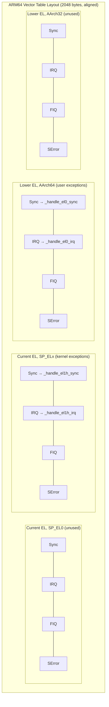

Kiseki's vector table is in `kernel/arch/arm64/vectors.S` (346 lines). Only 4 of the 16 entries are used:

| Vector | When | Handler |
|--------|------|---------|
| EL1 Sync | Page fault or bug *while in kernel* | `trap_sync_el1()` — diagnose and panic |
| EL1 IRQ | Hardware interrupt while in kernel | `trap_irq_el1()` — dispatch IRQ, maybe reschedule |
| EL0 Sync | **Syscall** (`SVC #0x80`) or page fault from user | `trap_sync_el0()` — the main entry point for all user→kernel transitions |
| EL0 IRQ | Hardware interrupt while in user mode | `trap_irq_el0()` — dispatch IRQ, check signals, maybe reschedule |

All other vectors point to `_vec_unhandled`, which dumps registers and panics.

**The Trap Frame**

When an exception occurs, the hardware saves the faulting PC in `ELR_EL1` and the processor state in `SPSR_EL1`, but it does *not* save general-purpose registers. That's the kernel's job. Kiseki's `SAVE_REGS` macro builds a **trap frame** on the kernel stack — a 288-byte structure containing all 31 GPRs plus the special registers:

```
Offset   Register    Purpose
──────   ────────    ────────────────────────────
0x000    x0-x30      31 general-purpose registers (248 bytes)
0x0F8    SP          Saved stack pointer (SP_EL0 if from user)
0x100    ELR_EL1     Return address (the faulting/syscall PC)
0x108    SPSR_EL1    Saved processor state (includes DAIF mask, EL, etc.)
0x110    ESR_EL1     Exception Syndrome (what happened)
0x118    FAR_EL1     Fault Address (for page faults)
──────
0x120    (total: 288 bytes = TF_SIZE)
```

> **XNU reference:** XNU's equivalent is `struct arm_saved_state64` in [`osfmk/arm64/proc_reg.h`](https://github.com/apple-oss-distributions/xnu/blob/main/osfmk/arm64/proc_reg.h). The layout differs slightly but serves the same purpose.

The `SAVE_REGS` macro takes an `el` parameter (0 or 1) to handle the SP differently:
- From **EL0** (user): saves `SP_EL0` — the user's stack pointer
- From **EL1** (kernel): computes the pre-exception SP as `current_sp + TF_SIZE`

After `SAVE_REGS`, the macro sets `x0 = sp` (pointer to the trap frame) and falls through to a `bl` to the C handler. When the C handler returns, `RESTORE_REGS` does the reverse: restores all registers, writes `ELR_EL1` and `SPSR_EL1`, and executes `ERET` to return to the point of exception.

**The Syscall Hot Path**

When a user process executes `svc #0x80`, the processor:

1. Saves PC → `ELR_EL1`, PSTATE → `SPSR_EL1`
2. Masks IRQs in `DAIF`
3. Switches to `SP_EL1` (kernel stack)
4. Jumps to vector table entry 8 (Lower EL, Sync)

The handler in `vectors.S` does:

```asm
_handle_el0_sync:
    SAVE_REGS 0          // Build trap frame, x0 = &tf
    bl  trap_sync_el0    // C handler
    RESTORE_REGS 0       // Restore registers, eret to user
```

Inside `trap_sync_el0()` (`kernel/kern/trap.c:169`), the first thing is to classify the exception by reading the **Exception Class** (EC) from `ESR_EL1` bits 31:26:

| EC | Meaning | Kiseki Action |
|----|---------|---------------|
| `0x15` | SVC from AArch64 | **Syscall** → enable IRQs, call `syscall_handler(tf)` |
| `0x24` | Data Abort from EL0 | **Page fault** → demand-page, COW, or SIGSEGV |
| `0x20` | Instruction Abort from EL0 | **Code fault** → demand-page executable pages |
| `0x26` | SP Alignment | Kill process |
| `0x3C` | BRK (breakpoint) | Kill process |

The syscall path is critical for performance — it is the gateway for every `read()`, `write()`, `mmap()`, `mach_msg()`, and all other kernel services. The key insight is that Kiseki **enables IRQs** (`msr daifclr, #0x2`) before calling `syscall_handler()`. This allows the timer to fire during long syscalls (like blocking reads), which is essential for preemptive multitasking.

> **XNU reference:** XNU does the same in [`osfmk/arm64/sleh.c:sleh_synchronous()`](https://github.com/apple-oss-distributions/xnu/blob/main/osfmk/arm64/sleh.c) — it calls `ml_set_interrupts_enabled(TRUE)` before dispatching the syscall.

**Special Return Paths**

Three assembly functions in `vectors.S` provide special ways to "return" to user space for newly-created threads:

1. **`fork_child_return`** (line 167): Used when a forked child is first scheduled. Switches `TTBR0_EL1` to the child's page table (using the `vm_space` pointer in `x19`), flushes the TLB, validates the trap frame, and does `RESTORE_REGS 0` to jump to user mode at the parent's saved PC (with `x0=0`, the fork return value for the child).

2. **`init_thread_return`** (line 265): Same as `fork_child_return` but simpler — used only for the first process (PID 1, init).

3. **`user_thread_return`** (line 306): For `pthread_create`-spawned threads. Additionally sets `TPIDR_EL0` (the user Thread-Local Storage base register) from `x20` before entering user mode.

All three share the pattern: switch address space → flush TLB → enable IRQs → `RESTORE_REGS 0` → `ERET`.

### 2.3 Context Switching

When the scheduler decides to run a different thread, it must save the current thread's CPU state and restore the new thread's state. This is the **context switch**, implemented in `kernel/arch/arm64/context_switch.S` (142 lines).

The key insight is that we only need to save **callee-saved registers** (x19–x30, SP). The C calling convention guarantees that the caller has already saved any caller-saved registers (x0–x18) before calling into the scheduler. This makes the context switch fast — only 13 registers to save/restore instead of 31.

```c
// The context structure (from thread.h)
struct cpu_context {
    uint64_t x19, x20, x21, x22, x23, x24;
    uint64_t x25, x26, x27, x28;
    uint64_t x29;  // Frame pointer
    uint64_t x30;  // Link register (return address)
    uint64_t sp;   // Stack pointer
};
```

The `context_switch(old_ctx, new_ctx)` function:

```asm
context_switch:
    // Save old thread's callee-saved registers
    stp     x19, x20, [x0, #0]     // old_ctx->x19, x20
    stp     x21, x22, [x0, #16]    // ...
    stp     x23, x24, [x0, #32]
    stp     x25, x26, [x0, #48]
    stp     x27, x28, [x0, #64]
    stp     x29, x30, [x0, #80]    // FP, LR
    mov     x2, sp
    str     x2, [x0, #96]          // SP

    // Restore new thread's callee-saved registers
    ldp     x19, x20, [x1, #0]
    ldp     x21, x22, [x1, #16]
    ldp     x23, x24, [x1, #32]
    ldp     x25, x26, [x1, #48]
    ldp     x27, x28, [x1, #64]
    ldp     x29, x30, [x1, #80]
    ldr     x2, [x1, #96]
    mov     sp, x2

    ret     // Jump to new thread's x30 (LR)
```

The `ret` instruction jumps to whatever address is in `x30`. For a thread that was previously preempted while running, `x30` points back into the scheduler code (specifically, the instruction after the `bl context_switch` call). The new thread resumes execution as if `context_switch()` had just returned — it doesn't even know it was asleep.

For a **newly-created thread**, `x30` is set to `thread_trampoline` (a function that calls the thread's entry point), so the first `ret` jumps into the trampoline.

Kiseki also includes debug validation: after restoring the new context, it checks that `x30` points into kernel RAM (`0x40000000`–`0x80000000`). If it doesn't, something has corrupted the saved context — the kernel panics with a detailed diagnostic dump rather than executing random code.

> **XNU reference:** XNU's context switch is `Switch_context()` in [`osfmk/arm64/pcb.c`](https://github.com/apple-oss-distributions/xnu/blob/main/osfmk/arm64/pcb.c) and the assembly in [`osfmk/arm64/locore.s`](https://github.com/apple-oss-distributions/xnu/blob/main/osfmk/arm64/locore.s). It also saves only callee-saved registers.

There is also `load_context(new_ctx)` — a one-way version that restores a context **without saving the old one**. This is used exactly twice:
1. At the end of `kmain()`, to abandon the boot stack and jump into the bootstrap thread
2. On each secondary CPU, to abandon that core's boot stack and jump into its idle thread

### 2.4 The 17-Phase Kernel Bootstrap

After `boot.S` jumps to `kmain()` (`kernel/kern/main.c:48`), the kernel initialises its subsystems in a strict order. Each phase depends on the ones before it — you cannot set up virtual memory without the physical allocator, cannot create threads without the scheduler, cannot mount the root filesystem without the block device driver, and so on.

```mermaid
flowchart TD
    P1["Phase 1: uart_init()<br/>Early serial console"] --> P2
    P2["Phase 2: gic_init() + gic_init_percpu()<br/>Interrupt controller"] --> P3
    P3["Phase 3: pmm_init()<br/>Physical memory (buddy allocator)"] --> P4
    P4["Phase 4: vmm_init()<br/>Virtual memory + MMU enable"] --> P5
    P5["Phase 5: thread_init() + sched_init()<br/>Threading + MLFQ scheduler"] --> P6
    P6["Phase 6: timer_init(100)<br/>ARM Generic Timer at 100 Hz"] --> P7
    P7["Phase 7: smp_init()<br/>Wake secondary CPU cores"] --> P8
    P8["Phase 8: blkdev_init()<br/>Block device subsystem"] --> P9
    P9["Phase 9: buf_init()<br/>Buffer cache (256 × 4 KB)"] --> P10
    P10["Phase 10: vfs_init() + tty_init() + pty_init()<br/>VFS layer + terminals"] --> P11
    P11["Phase 11: ext4_fs_init()<br/>Register ext4 driver"] --> P12
    P12["Phase 12: Mount root '/' + devfs '/dev'<br/>+ buf_start_sync_daemon()"] --> P13
    P13["Phase 13: ipc_init()<br/>Mach IPC subsystem"] --> P14
    P14["Phase 14: iokit_init()<br/>IOKit + master port"] --> P15
    P15["Phase 15: commpage_init() + proc_init()<br/>CommPage + process table"] --> P16
    P16["Phase 16: net_init() + GPU + HID<br/>TCP/IP stack + display + input"] --> P17
    P17["Phase 17: Create bootstrap thread<br/>→ load_context() → abandon boot stack"]
    P17 --> INIT["kernel_bootstrap_thread_func()<br/>→ kernel_init_process()<br/>→ creates PID 1<br/>→ thread_exit()"]
```

Here is what each phase does and why it must happen in this order:

| Phase | Function | What It Does | Why This Order |
|-------|----------|-------------|----------------|
| 1 | `uart_init()` | Configures PL011 UART for `kprintf()` output | Everything else uses `kprintf()` for debug output |
| 2 | `gic_init()` | Configures GICv2 distributor: disables all IRQs, sets priorities, routes SPIs to core 0 | IRQ infrastructure needed before enabling any device |
| 3 | `pmm_init(__heap_start, RAM_END)` | Initialises buddy allocator over all RAM after kernel image | VMM needs to allocate physical pages for page tables |
| 4 | `vmm_init()` | Identity-maps all RAM, configures MAIR/TCR, enables MMU + caches | Everything after this runs with caches and virtual memory |
| 5 | `thread_init()` + `sched_init()` | Zeroes thread pool (256 slots), creates CPU 0's idle thread, initialises MLFQ run queues | Timer needs scheduler to be initialised |
| 6 | `timer_init(100)` | Programmes ARM Generic Timer for 100 Hz ticks (10 ms quantum) | IRQs still masked — timer won't fire until Phase 17 |
| 7 | `smp_init()` | Wakes secondary cores via PSCI | Each core runs `secondary_main()`: enable MMU → init GIC → init scheduler → `load_context(idle_thread)` |
| 8 | `blkdev_init()` | Probes VirtIO block device | Filesystem mount needs a block device |
| 9 | `buf_init()` | Allocates 256 × 4 KB buffer cache with LRU eviction and hash table | Ext4 reads go through buffer cache |
| 10 | `vfs_init()` + `tty_init()` + `pty_init()` | Initialises VFS tables (512 files, 1024 vnodes, 16 mounts), TTY subsystem, 16 PTY pairs | Must exist before mounting filesystems |
| 11 | `ext4_fs_init()` | Registers "ext4" filesystem type with VFS | Must happen before `vfs_mount()` |
| 12 | `vfs_mount("ext4", "/", ...)` | Reads ext4 superblock, validates magic `0xEF53`, reads group descriptor table, creates root vnode (inode 2). Then mounts devfs at `/dev` and starts the buffer sync daemon | The root filesystem is now accessible |
| 13 | `ipc_init()` | Initialises Mach IPC: port pool (512 ports), kernel IPC space, vm_map_copy pool (256 entries) | IOKit uses Mach ports for kobject dispatch |
| 14 | `iokit_init()` | Initialises I/O Registry, creates "IOResources" root, allocates master port (`IKOT_MASTER_DEVICE`), registers in bootstrap as `uk.co.avltree9798.iokit` | Drivers need IOKit to register services |
| 15 | `commpage_init()` + `proc_init()` | Maps the CommPage (a read-only shared page at `0xFFFFFC000` with signal trampoline code), zeroes process table (256 slots), creates PID 0 (kernel process) | Fork/exec need process table |
| 16 | `net_init()` + GPU + HID | TCP/IP stack (including DHCP), VirtIO GPU → IOFramebuffer, VirtIO input → IOHIDSystem, framebuffer console | WindowServer needs display and input |
| 17 | Bootstrap thread + `load_context()` | Creates a kernel thread, sets it as current on CPU 0, does a **one-way** `load_context()` to abandon the boot stack forever | See explanation below |

**Phase 17: The Boot Stack Abandonment (XNU Pattern)**

This is the most subtle part of the boot sequence. The problem: `kmain()` has been running on the **boot stack** — a static 32 KB region allocated by the linker script. But the scheduler expects every thread to have a dynamically-allocated kernel stack. If we simply enable IRQs on the boot stack and start scheduling, the idle thread would share the boot stack with `kmain()`'s frame — a stack corruption disaster.

The solution, copied from XNU's `kernel_bootstrap()` in [`osfmk/kern/startup.c`](https://github.com/apple-oss-distributions/xnu/blob/main/osfmk/kern/startup.c):

1. Create a new kernel thread (`kernel_bootstrap`) with its own PMM-allocated stack
2. Set this thread as `cpu_data->current_thread` (the scheduler's notion of "current")
3. Call `load_context(&bootstrap_thread->context)` — this restores the bootstrap thread's saved registers and `ret`s into `thread_trampoline`, which calls `kernel_bootstrap_thread_func()`
4. The boot stack is **permanently abandoned** — `kmain()`'s stack frame will never be returned to

Inside `kernel_bootstrap_thread_func()`:
1. `kernel_init_process()` — creates PID 1, loads `/sbin/init` as a Mach-O binary, builds the user stack, enqueues init's thread on the scheduler run queue
2. `thread_exit()` — the bootstrap thread terminates itself and calls `sched_switch()`, which picks the next runnable thread (PID 1's init thread) and context-switches to it

From this point, the kernel is fully operational. The scheduler runs, IRQs fire, and PID 1 is the first user process.

### 2.5 Secondary Core Bring-Up (SMP)

Phase 7 wakes the secondary CPU cores via **PSCI** (Power State Coordination Interface), the ARM standard for SMP management. The primary core writes the entry point address to the PSCI `CPU_ON` call for each secondary core.

Each secondary core runs `secondary_main(core_id)` (`kernel/kern/main.c:390`):

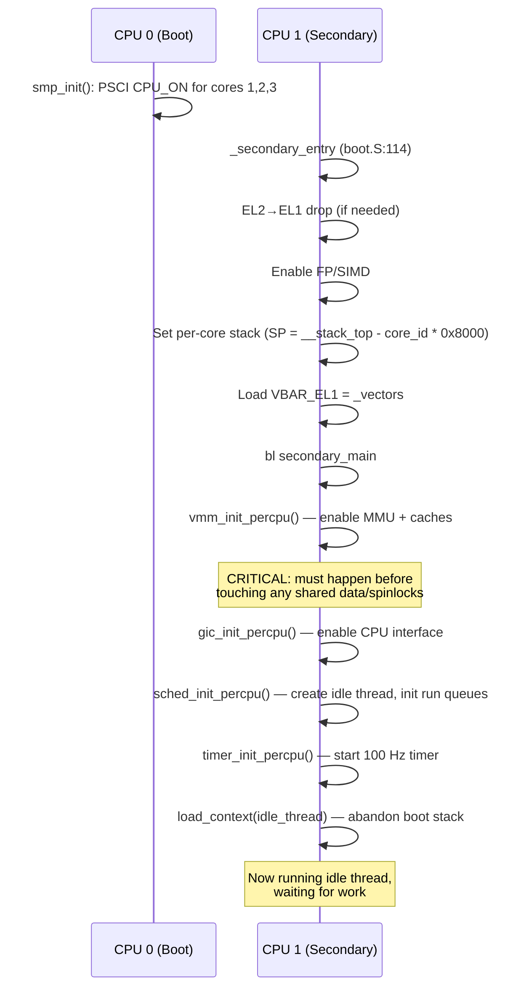

The critical ordering constraint is that `vmm_init_percpu()` must happen **before any spinlock acquisition**. Spinlocks use `LDAXR`/`STXR` (exclusive load/store), which require the data cache to be enabled. If a secondary core tries to acquire a spinlock before enabling its MMU and caches, the exclusive monitor will not work correctly, leading to either deadlock or double-acquisition.

Each secondary core gets its own 32 KB stack at `__stack_top - (core_id * 0x8000)`, and its own idle thread. The per-CPU data is stored in `TPIDR_EL1`, a system register that the hardware guarantees is private to each core — it serves as the "current CPU" pointer throughout the kernel.

> **XNU reference:** XNU's secondary core startup is `arm_init_cpu()` in [`osfmk/arm64/start.s`](https://github.com/apple-oss-distributions/xnu/blob/main/osfmk/arm64/start.s) → `cpu_init()` → `slave_main()` in [`osfmk/arm/cpu.c`](https://github.com/apple-oss-distributions/xnu/blob/main/osfmk/arm/cpu.c). The same pattern applies: MMU first, then scheduler, then `load_context()` to abandon the boot stack.

---

## Chapter 3: Physical & Virtual Memory

Before diving in, let's establish what "virtual memory" actually means and why every modern OS needs it.

#### What Problem Does Virtual Memory Solve?

Imagine a system without virtual memory: every program sees the real, physical RAM directly. Program A is loaded at address `0x1000`, program B at `0x5000`. This has three fatal problems:

1. **No isolation**: Program A can read/write program B's memory (and the kernel's memory). A single bug or malicious program compromises everything.

2. **No flexibility**: If program A was compiled to run at address `0x1000` and that address is already taken, it cannot run. Every program must know in advance where it will be loaded.

3. **No overcommit**: If you have 4 GB of RAM and programs collectively need 6 GB, some simply cannot run — even if most of that memory is rarely touched.

Virtual memory solves all three by adding a layer of **address translation** between the CPU and physical RAM:

```
Program A sees:         Page Table A          Physical RAM
0x0000 → code      ──►  VA 0x0000 → PA 0x8000  ──►  [A's code at 0x8000]
0x1000 → data      ──►  VA 0x1000 → PA 0xA000  ──►  [A's data at 0xA000]

Program B sees:         Page Table B          Physical RAM
0x0000 → code      ──►  VA 0x0000 → PA 0xC000  ──►  [B's code at 0xC000]
0x1000 → data      ──►  VA 0x1000 → PA 0xE000  ──►  [B's data at 0xE000]
```

Both programs think they're loaded at address `0x0000`, but they are actually at different physical addresses. Neither can see the other's pages because their page tables don't contain mappings for each other's physical memory.

The **page table** is a data structure in RAM (maintained by the kernel) that the CPU hardware reads *on every memory access* to translate virtual addresses to physical addresses. The unit of translation is a **page** — a 4 KB aligned chunk. The CPU has a dedicated piece of hardware called the **MMU** (Memory Management Unit) that performs this translation automatically; no software runs per-access.

#### Two Layers of Memory Management

The kernel manages memory at two layers:

1. **Physical Memory Manager (PMM)**: tracks which physical 4 KB pages are free or in use. Think of it as a warehouse inventory system — it knows which shelves are empty.

2. **Virtual Memory Manager (VMM)**: builds and modifies page tables to create the illusion of private address spaces for each process. It is the architect that decides which process sees which physical pages at which virtual addresses.

Both layers are covered in this chapter.

### 3.1 The Buddy Allocator (PMM)

Every operating system needs a way to manage physical RAM. The kernel must be able to allocate and free pages (4 KB chunks) of physical memory for page tables, user processes, DMA buffers, and kernel data structures.

Kiseki uses a **buddy allocator** (`kernel/kern/pmm.c`, 313 lines), the same algorithm used by Linux and (conceptually) by XNU's `vm_page` subsystem. The idea is elegant: physical memory is divided into blocks of power-of-two sizes, and adjacent ("buddy") blocks can be merged when freed.

**Orders and block sizes:**

| Order | Block Size | Pages |
|-------|-----------|-------|
| 0 | 4 KB | 1 |
| 1 | 8 KB | 2 |
| 2 | 16 KB | 4 |
| 3 | 32 KB | 8 |
| ... | ... | ... |
| 10 | 4 MB | 1024 |

The allocator maintains 11 **free lists** (orders 0–10), each a doubly-linked list of available blocks at that order.

**Page descriptors:**

Every physical page has a 32-byte descriptor:

```c
struct page {
    uint32_t flags;      // PAGE_FREE, PAGE_USED, PAGE_KERNEL, PAGE_RESERVED
    uint32_t order;      // Buddy order (if head of a free block)
    uint32_t refcount;   // Reference count (for COW)
    uint32_t _pad;       // Alignment padding
    struct page *next;   // Next in free list
    struct page *prev;   // Previous in free list
};
```

The `pages[]` array is statically allocated for up to 262,144 pages (1 GB of RAM), consuming about 8 MB of kernel BSS.

**Allocation algorithm (`pmm_alloc_pages(order)`):**

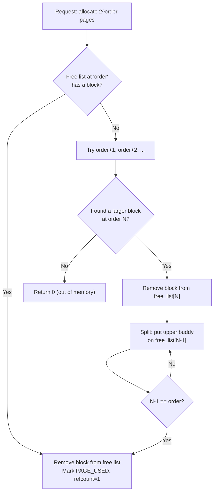

The key insight is **buddy splitting**: if you need a 4 KB block (order 0) but only have a 16 KB block (order 2) available, you split it:
1. Split the 16 KB block into two 8 KB buddies → put one on `free_list[1]`
2. Split the remaining 8 KB block into two 4 KB buddies → put one on `free_list[0]`
3. Return the other 4 KB block

**Deallocation algorithm (`pmm_free_pages(paddr, order)`):**

The reverse process — **buddy coalescing**:

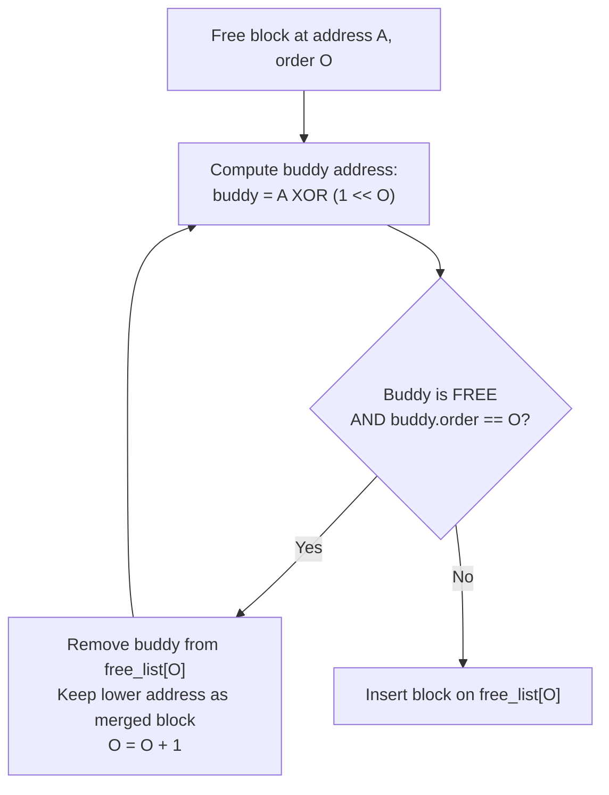

The buddy's address is computed with a single XOR: `buddy_idx = page_idx ^ (1 << order)`. This is the mathematical property that makes buddy allocation work — at any order, you can find your buddy by flipping exactly one bit.

**Reference counting for COW:**

Each page has a `refcount` field. When `fork()` shares a page between parent and child (copy-on-write), the refcount is incremented. When a COW fault resolves by allocating a new page, the old page's refcount is decremented. When the refcount reaches zero, the page is freed with buddy coalescing.

`pmm_page_unref()` performs the free **inline** (not by calling `pmm_free_pages()`) because it already holds the PMM lock — calling `pmm_free_pages()` would deadlock.

> **XNU reference:** XNU uses a different physical memory allocator — `vm_page` objects in a per-segment free list with a "free count" for each colour (for cache-line colouring). The buddy algorithm is simpler and works well for Kiseki's needs. See [`osfmk/vm/vm_page.c`](https://github.com/apple-oss-distributions/xnu/blob/main/osfmk/vm/vm_page.c).

> **Security note:** The buddy allocator is protected by a single global spinlock (`pmm_lock`) with IRQ save/restore. This means physical page allocation is serialised across all CPUs — a potential denial-of-service vector if an attacker can cause rapid allocation/deallocation. XNU mitigates this with per-CPU free lists.

### 3.2 ARM64 Page Tables

ARM64 with a 4 KB page granule uses a **4-level page table** structure. Each level is a 4 KB page containing 512 entries (64 bits each). The virtual address is split into index fields:

```
63        48 47    39 38    30 29    21 20    12 11       0
┌──────────┬────────┬────────┬────────┬────────┬──────────┐
│  unused  │ L0 idx │ L1 idx │ L2 idx │ L3 idx │  offset  │
│ (16 bits)│(9 bits)│(9 bits)│(9 bits)│(9 bits)│ (12 bits)│
└──────────┴────────┴────────┴────────┴────────┴──────────┘
```

The translation walk:


Each Page Table Entry (PTE) at L3 is a 64-bit value with the physical page address in bits 47:12 and attribute bits everywhere else:

| Bits | Name | Purpose |
|------|------|---------|
| 0 | Valid | Entry is valid (1) or invalid (0) |
| 1 | Page/Table | 1 = L3 page descriptor |
| 4:2 | AttrIdx | MAIR index (0=Device, 1=Normal-NC, 2=Normal-WB) |
| 7:6 | AP | Access Permission (RW_EL1, RW_ALL, RO_EL1, RO_ALL) |
| 9:8 | SH | Shareability (None, Outer, Inner) |
| 10 | AF | Access Flag (must be 1 or hardware raises fault) |
| 53 | PXN | Privileged Execute Never |
| 54 | UXN | User Execute Never |
| 55 | **COW** | **Software-defined** — Copy-on-Write marker (hardware ignores) |

Bit 55 is Kiseki's software-defined COW flag — when a page is shared between parent and child after `fork()`, both PTEs are set to read-only with bit 55 set. When either process writes to the page, a permission fault occurs, the kernel checks bit 55, and if set, performs the COW copy.

> **XNU reference:** XNU uses software PTE bits in the upper ignored range too. See `ARM_PTE_WRITEABLE` and `ARM_PTE_FAULT_HANDLER_MASK` in [`osfmk/arm64/proc_reg.h`](https://github.com/apple-oss-distributions/xnu/blob/main/osfmk/arm64/proc_reg.h).

**MAIR (Memory Attribute Indirection Register):**

The `AttrIdx` field in the PTE doesn't encode the cache policy directly — it indexes into `MAIR_EL1`, a register that maps indices to actual memory attributes:

| Index | Encoding | Meaning | Used For |
|-------|----------|---------|----------|
| 0 | `0x00` | Device-nGnRnE (strongly ordered) | MMIO registers |
| 1 | `0x44` | Normal, Non-Cacheable | Shared buffers |
| 2 | `0xFF` | Normal, Write-Back Cacheable | RAM (default) |

**Composite PTE macros** (from `kernel/include/kern/vmm.h`):

| Macro | Bits | Purpose |
|-------|------|---------|
| `PTE_KERNEL_RWX` | Valid + AF + Inner-Shareable + RW-EL1 + WB + UXN | Kernel code |
| `PTE_KERNEL_RW` | Above + PXN | Kernel data (no execute) |
| `PTE_USER_RWX` | Valid + AF + Inner-Shareable + RW-ALL + WB | User code + data |
| `PTE_USER_RO` | Valid + AF + Inner-Shareable + RO-ALL + WB + PXN + UXN | Read-only user data |
| `PTE_USER_RX` | Valid + AF + Inner-Shareable + RO-ALL + WB + PXN | User executable (read+exec, no write) |
| `PTE_DEVICE` | Valid + AF + No-Share + RW-EL1 + Device + PXN + UXN | MMIO |

### 3.3 Kernel Address Space Setup

`vmm_init()` (`kernel/kern/vmm.c:229`) sets up the kernel's page tables and enables the MMU. This is a one-time operation that transforms the system from raw physical addressing to virtual addressing.

The steps:

1. **Allocate the L0 table** via `alloc_pt_page()` (which uses `pmm_alloc_page()` — the PMM is already initialised)

2. **Identity-map all RAM** — for every page from `RAM_BASE` (`0x40000000`) to `RAM_BASE + RAM_SIZE`, create a mapping where virtual address == physical address, using `PTE_KERNEL_RWX` attributes

3. **Map MMIO regions** — UART (`0x09000000`), GIC distributor (`0x08000000`), GIC CPU interface (`0x08010000`), and VirtIO MMIO slots, all with `PTE_DEVICE` attributes

4. **Configure MAIR_EL1** — set the 3 memory attribute indices

5. **Configure TCR_EL1** — Translation Control Register:
   - `T0SZ=16` — 48-bit user virtual address space (TTBR0)
   - `T1SZ=16` — 48-bit kernel virtual address space (TTBR1)
   - `TG0=TG1=4KB` — 4 KB page granule
   - Inner-Shareable, Write-Back Write-Allocate for both halves

6. **Set TTBR0_EL1 and TTBR1_EL1** — both point to `kernel_pgd` (the kernel uses the lower half with identity mapping for now; the higher half is configured but not yet used)

7. **Full TLB invalidation** — `TLBI VMALLE1` + barriers

8. **Enable MMU** — set `SCTLR_EL1` bits M (MMU), C (data cache), I (instruction cache). **Crucially, bit A (alignment check) is cleared** — this is required because GNUstep's ObjC runtime performs unaligned accesses that would otherwise fault.

After this point, all memory accesses go through the page tables. Because the mapping is identity (VA == PA), existing pointers to kernel data structures still work.

> **Kiseki difference from macOS:** macOS runs the kernel in the **upper half** (addresses starting with `0xFFFF...`), with TTBR1 pointing to the kernel page tables. Kiseki currently uses the lower half with identity mapping. Both TTBR0 and TTBR1 point to the same `kernel_pgd`. A future improvement would be to move the kernel to the upper half, matching XNU's `KERNEL_VA_BASE = 0xFFFF000000000000`.

### 3.4 User Address Spaces

Each user process has its own **address space** represented by `struct vm_space`:

```c
struct vm_space {
    pte_t    *pgd;    // L0 page table (physical address)
    uint64_t  asid;   // Address Space ID for TLB tagging
    struct vm_map *map; // Software region tracking
};
```

**Creating an address space** (`vmm_create_space()`, line 343):

1. Allocate a new L0 page table
2. **Share kernel mappings** — copy the kernel's L1 entries into per-process L1 tables. This is subtle: the L0 entry at index 0 covers 512 GB, which includes both kernel and user virtual addresses. Sharing the kernel's L1 *directly* would cause cross-process corruption when `walk_pgd()` allocates new L2/L3 tables. Instead, each process gets its own L1 table with the kernel entries *copied in*.
3. Create a `vm_map` for tracking user regions
4. **Assign an ASID** (Address Space ID, 1–255). ASIDs let the TLB cache entries from multiple address spaces simultaneously, avoiding a full TLB flush on every context switch. When ASIDs wrap (255→1), a global `TLBI VMALLE1IS` broadcast is issued.

**Switching address spaces** (`vmm_switch_space()`, line 555):

```c
void vmm_switch_space(struct vm_space *space) {
    uint64_t ttbr0 = (uint64_t)space->pgd | (space->asid << 48);
    asm volatile("msr ttbr0_el1, %0" : : "r"(ttbr0));
    asm volatile("tlbi vmalle1is; dsb ish; isb");
}
```

The ASID is packed into the upper 16 bits of `TTBR0_EL1`. The hardware uses this to tag TLB entries, so entries from process A don't match lookups for process B.

**The page table walker** (`walk_pgd()`, line 70):

This is the core function that translates a virtual address to its L3 PTE slot, optionally allocating intermediate page table pages along the way:

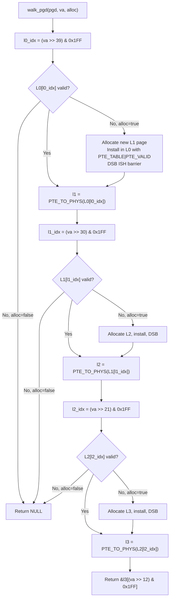

The `DSB ISH` (Data Synchronization Barrier, Inner Shareable) after installing each table entry is critical — it ensures the hardware page table walker sees the new entry before any subsequent translation.

### 3.5 Copy-on-Write

When `fork()` creates a child process, it would be enormously wasteful to copy all the parent's physical pages. Instead, Kiseki (like all modern OSes) uses **Copy-on-Write (COW)**: both parent and child share the same physical pages, marked read-only. When either process writes to a shared page, a permission fault occurs, the kernel allocates a new page, copies the data, and makes the faulting process's page writable.

**COW setup during fork** (`vmm_copy_space()`, line 1314):

For each valid user page in the parent:
1. If the page is writable (`AP_RW_ALL`): change **both** parent and child PTEs to read-only (`AP_RO_ALL`) with the `PTE_COW` bit set. Issue `TLBI VALE1IS` on the parent's PTE to flush any stale writable TLB entries.
2. If already read-only: share directly without COW marking.
3. Increment the page's `refcount` via `pmm_page_ref()`.

**COW fault resolution** (`vmm_copy_on_write()`, line 579):

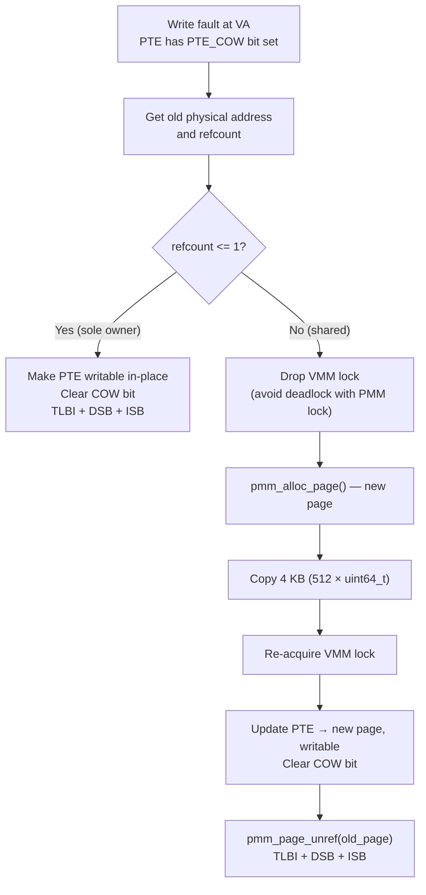

The lock-dropping in step E is a critical detail. `vmm_copy_on_write()` holds `vmm_lock`, but `pmm_alloc_page()` needs `pmm_lock`. If we held both simultaneously, other code paths that acquire them in the opposite order would deadlock. The solution: drop `vmm_lock`, allocate, re-acquire.

> **Security note:** The COW mechanism is a frequent source of vulnerabilities. If the kernel fails to properly re-check the PTE after re-acquiring the lock (a TOCTOU race), an attacker could manipulate the page table between the check and the update. XNU has had multiple COW-related CVEs. Kiseki's implementation re-reads the PTE after re-acquiring the lock.

### 3.6 The VM Map

Above the hardware page tables (the "pmap" layer), Kiseki maintains a software **VM map** — a sorted doubly-linked list of `vm_map_entry` structures that track which regions of the address space are allocated and their properties.

This is modelled directly on XNU's `struct vm_map` from [`osfmk/vm/vm_map.h`](https://github.com/apple-oss-distributions/xnu/blob/main/osfmk/vm/vm_map.h).

```c
struct vm_map_entry {
    struct vm_map_entry *prev, *next;  // Sorted doubly-linked list
    uint64_t vme_start;                // VA range start (inclusive, page-aligned)
    uint64_t vme_end;                  // VA range end (exclusive, page-aligned)
    uint8_t  protection;               // Current: VM_PROT_READ | WRITE | EXECUTE
    uint8_t  max_protection;           // Ceiling (mprotect cannot exceed this)
    uint8_t  inheritance;              // VM_INHERIT_COPY (COW on fork), SHARE, or NONE
    uint8_t  is_shared  : 1;           // MAP_SHARED mapping
    uint8_t  needs_copy : 1;           // Deferred COW
    uint8_t  wired      : 1;           // Pages pinned (mlock)
    int      backing_fd;               // File descriptor (-1 = anonymous)
    uint64_t file_offset;              // Offset into backing file
    struct vnode *backing_vnode;       // Vnode for file-backed mapping
};
```

The `vm_map` uses a **sentinel node** as the list head — its `prev` and `next` point to each other when the list is empty. Entries are allocated from a static pool of 512 per process.

**Key operations:**

- **`vm_map_enter()`** — Create a new mapping. If a fixed address is given, existing overlapping entries are removed first (XNU-style `vmf_overwrite`). Otherwise, `vm_map_find_space()` scans from `hint_addr` (initially `0x300000000`, the `USER_MMAP_BASE`) for the first gap large enough.

- **`vm_map_remove()`** — Remove mappings in a range. Uses `vm_map_clip_start()` and `vm_map_clip_end()` to split entries at the boundaries, then removes all entries fully within the range.

- **`vm_map_protect()`** — Change protection on a range. Again clips at boundaries, then updates the `protection` field on each entry.

- **`vm_map_fork()`** — Copy entries for `fork()`. Entries with `VM_INHERIT_COPY` are duplicated; entries with `VM_INHERIT_NONE` are skipped; entries with `VM_INHERIT_SHARE` are shared.

**User address space layout:**

```
0x0000000100000000  USER_VA_BASE     — Mach-O main binary load address (4 GB)
0x0000000300000000  USER_MMAP_BASE   — Anonymous mmap() region (12 GB)
0x00007FFFFFFF0000  USER_STACK_TOP   — User stack (grows down, 8 MB default)
0x0000000FFFFFC000  COMMPAGE_VA      — Darwin CommPage (read-only, 1 page)
```

This layout matches macOS's 64-bit address space conventions, allowing Mach-O binaries linked for macOS-like addresses to load without relocation.

> **XNU reference:** The real macOS vm_map uses a red-black tree for O(log n) lookups. Kiseki uses a linear list, which is O(n) but trivially correct and sufficient for 512 entries.

---

## Chapter 4: Threads, Scheduling & Synchronisation

#### What Is a Thread, Really?

If you have written Python or C programs, you have been running inside a thread without thinking about it. A **thread** is just an independent stream of execution — a program counter (which instruction to run next), a stack (local variables and function call history), and a set of register values.

A **process** can have multiple threads, and they all share the same memory space (same page tables, same heap, same global variables). This is how your web browser can download a file while still responding to mouse clicks — two threads in the same process.

The kernel's job is to decide which thread runs on which CPU core, and for how long. With 4 CPU cores and potentially hundreds of threads, the kernel must constantly switch between them — giving each thread a brief time slice (10 ms in Kiseki), saving its registers, loading the next thread's registers, and resuming. This is called **scheduling**, and the mechanism of saving/restoring register state is the **context switch** we saw in §2.3.

**macOS terminology note:** macOS uses *Mach tasks* where most OSes say "process" and *Mach threads* where most OSes say "thread". A Mach **task** = an address space + a collection of threads. A BSD **process** = a Mach task + a PID + file descriptors + credentials + signals. Kiseki uses both abstractions simultaneously, just like XNU.

### 4.1 Thread Representation

In Kiseki (as in XNU), the **thread** is the fundamental unit of execution. A Mach **task** is a container for one or more threads plus a shared address space. A BSD **process** wraps a task with PID, file descriptors, credentials, and signals.

```c
struct thread {
    uint64_t         tid;              // Unique thread ID
    int              state;            // TH_RUN(0), TH_WAIT(1), TH_IDLE(2), TH_TERM(3)
    int              priority;         // Base priority (0–127)
    int              effective_priority; // After MLFQ demotion/aging
    int              sched_policy;     // SCHED_OTHER(0), SCHED_FIFO(1), SCHED_RR(2)
    int              quantum;          // Remaining time ticks (reset to 10 on switch)
    int              cpu;              // CPU currently on (-1 = never scheduled)
    uint32_t         cpu_affinity;     // Bitmask (0 = any)
    struct cpu_context context;        // Saved callee-saved registers (see §2.3)
    uint64_t        *kernel_stack;     // Base address of 16 KB kernel stack
    struct task     *task;             // Owning Mach task
    void            *wait_channel;     // Sleep channel (like BSD's tsleep)
    struct thread   *run_next;         // Next in run queue linked list
    bool             on_runq;          // Double-enqueue prevention flag
    uint64_t         wakeup_tick;      // For timed sleeps
    struct thread   *sleep_next;       // Global sleep queue (sorted by deadline)
    uint64_t         tls_base;         // User TLS (written to TPIDR_EL0)
    // ... (join support, exit value, etc.)
};
```

Threads are allocated from a static pool of 256 (`thread_pool[MAX_THREADS]`). When a terminated thread's slot is reused, its old kernel stack is freed (it couldn't be freed during `thread_exit()` because the thread was still running on it).

**Thread creation** (`thread_create()`, `kernel/kern/sched.c:184`):

1. Allocate from `thread_pool`
2. Allocate 16 KB kernel stack (4 pages via `pmm_alloc_pages(2)`)
3. Set initial context:
   - `SP` = top of kernel stack
   - `x30` (LR) = `thread_trampoline`
   - `x19` = entry function pointer
   - `x20` = argument pointer

The `thread_trampoline` reads `x19` and `x20` *before* enabling IRQs (critical: a timer interrupt would trigger `context_switch`, which overwrites callee-saved registers), then calls the entry function. If the entry function returns, the trampoline calls `thread_exit()`.

### 4.2 The MLFQ Scheduler

Kiseki implements a **Multilevel Feedback Queue (MLFQ)** scheduler with 128 priority levels (0=lowest, 127=highest), matching macOS's scheduling priority range.

Each CPU has its own set of run queues:

```c
struct cpu_data {
    uint32_t      cpu_id;
    struct thread *current_thread;
    struct thread *idle_thread;
    spinlock_t     run_lock;
    struct thread *run_queue[128];     // Per-priority linked lists
    uint32_t       run_count;          // Total runnable threads
    bool           need_resched;       // Flag: higher-priority thread arrived
    uint64_t       idle_ticks, total_ticks;
};
```

**Scheduling algorithm** (`sched_switch()`, line 906):

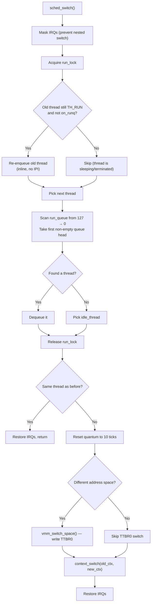

The MLFQ behaviour comes from the timer tick handler:

**On each tick** (`sched_tick()`, called 100 times/second):

1. Wake any threads whose sleep deadline has passed
2. Decrement current thread's quantum
3. When quantum reaches 0:
   - **Demotion**: if the thread is `SCHED_OTHER` and `effective_priority > PRI_MIN`, decrement its priority by 1
   - Set `need_resched` flag → the return-from-IRQ path will call `sched_switch()`

**Priority aging** (every 100 ticks ≈ 1 second):

For every thread on a run queue, if it's `SCHED_OTHER`, boost `effective_priority` by 1 toward its base `priority`. This prevents starvation — a thread that has been demoted by using its full quantum will gradually recover.

> **XNU reference:** XNU's scheduler is significantly more complex — it uses a "decay" factor based on CPU usage rather than simple MLFQ demotion. See [`osfmk/kern/sched_prim.c`](https://github.com/apple-oss-distributions/xnu/blob/main/osfmk/kern/sched_prim.c). Kiseki's simpler approach is functionally equivalent for its workload.

### 4.3 SMP Load Balancing

With 4 CPU cores, threads must be distributed to avoid overloading one core while others idle. Kiseki uses two mechanisms:

**1. Least-loaded placement** (`sched_find_least_loaded_cpu()`):

When a new thread is first enqueued (or when its affinity changes), it goes to the CPU with the lowest `run_count`. This spreads threads across cores on creation.

**2. Work stealing** (in the idle thread):

When a CPU's run queues are empty, its idle thread tries to steal work from the busiest CPU (must have ≥ 2 runnable threads). It steals the **lowest-priority** thread to minimise impact on the donor CPU's latency-sensitive threads.

**IPI (Inter-Processor Interrupt) for preemption:**

When a high-priority thread is enqueued on a remote CPU, the enqueuing code sends `IPI_RESCHEDULE` (SGI #0 via the GIC). The remote CPU's IRQ handler sets `need_resched`, and on the next return-from-interrupt, it calls `sched_switch()`.

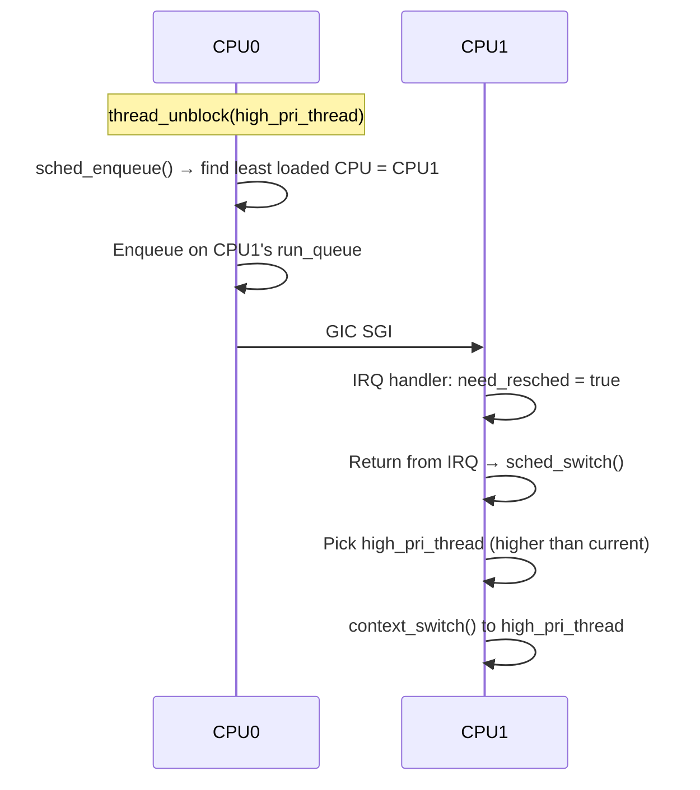

**The double-enqueue problem:**

A pervasive design challenge in SMP schedulers is preventing a thread from being on two run queues simultaneously. If CPU A sets a thread to `TH_WAIT` and CPU B calls `thread_unblock()` concurrently, the thread could end up running on two CPUs sharing one kernel stack — catastrophic corruption.

Kiseki's solution (matching XNU's pattern):
1. `thread_set_wait()` sets `TH_WAIT` under `thread_lock`
2. `thread_unblock()` atomically checks `TH_WAIT` under the same lock
3. `sched_enqueue_cpu()` checks the `on_runq` flag before inserting
4. `thread_block_check()` re-checks state: if already `TH_RUN` (woken by a concurrent unblock), dequeues self from the run queue instead of switching

### 4.4 Spinlocks, Mutexes & Condition Variables

Kiseki implements four synchronisation primitives (`kernel/kern/sync.c`, 578 lines):

**Spinlocks** — Non-sleeping, IRQ-disabling. Used for short critical sections (PMM lock, run queue lock, etc.).

The ARM64 implementation uses the `SEVL/WFE` + `LDAXR/STXR` pattern:

```asm
spin_lock:
    sevl                    // Set Event Locally (prevents first WFE from blocking)
1:  wfe                     // Wait For Event (low-power spin)
    ldaxr   w0, [lock]      // Load-Acquire Exclusive
    cbnz    w0, 1b           // If locked, retry
    stxr    w0, #1, [lock]   // Store Exclusive
    cbnz    w0, 1b           // If store failed (contention), retry
```

The `LDAXR` (Load-Acquire Exclusive) provides acquire semantics — all subsequent reads/writes are ordered after this load. The `STLR` (Store-Release) in `spin_unlock` provides release semantics. Together they form a happens-before relationship that guarantees mutual exclusion.

**Mutexes** — Adaptive spinning with direct handoff. Used for longer critical sections (VM map lock, file descriptor lock, etc.).

The adaptive spinning strategy:
1. **Fast path**: try `LDAXR/STXR` once
2. **Spin phase**: 100 iterations of `spin_trylock` + `yield`
3. **Sleep phase**: enqueue on the mutex's wait queue, call `thread_block()`

On unlock, **direct handoff**: if there are waiters, the mutex is NOT released — instead, ownership is transferred directly to the first waiter, and the waiter is unblocked. This prevents lock stealing by adaptive spinners on other CPUs.

> **XNU reference:** XNU's `lck_mtx` uses a similar adaptive spin → sleep strategy with turnstile-based priority inheritance. See [`osfmk/kern/locks.c`](https://github.com/apple-oss-distributions/xnu/blob/main/osfmk/kern/locks.c).

**Semaphores** — Counting semaphore with spinlock-protected wait queue. Used for Mach IPC port message queues (`msg_available`).

The `semaphore_timedwait()` implementation is particularly interesting: it inserts the calling thread into both the semaphore's wait queue and the global sorted sleep queue, then calls `thread_block_check()`. On wakeup (either by `semaphore_signal()` or deadline expiry), it removes itself from whichever queue it's still on.

**Condition Variables** — Used for `proc_wait()` (parent waiting for child exit). `condvar_wait()` atomically releases the associated mutex and blocks, re-acquiring the mutex on wakeup. `condvar_broadcast()` detaches the entire waiter list and unblocks all waiters in sequence.

### 4.5 The Timer Driver

The ARM Generic Timer (`kernel/drivers/timer/timer.c`, 181 lines) drives the scheduler. Each CPU core has its own independent timer, firing PPI #27 (Private Peripheral Interrupt — each core gets its own instance).

**Configuration:**
- Read `CNTFRQ_EL0` for the counter frequency (QEMU: typically 62.5 MHz)
- Compute interval: `timer_interval = freq / 100` (for 100 Hz)
- Write `CNTV_TVAL_EL0 = timer_interval` (countdown value)
- Enable: `CNTV_CTL_EL0 = CTL_ENABLE`

**IRQ handler** (`timer_handler()`):

1. **Atomically increment `tick_count`** using ARM64 `LDXR/STXR`:
   ```asm
   1: ldxr  x0, [&tick_count]
      add   x1, x0, #1
      stxr  w2, x1, [&tick_count]
      cbnz  w2, 1b
   ```
   This prevents lost increments when multiple CPUs fire their timer PPIs simultaneously.

2. **Rearm timer**: write `CNTV_TVAL_EL0 = timer_interval`

3. **Network polling** (core 0 only): call `virtio_net_recv()` — a NAPI-style approach that ensures network packets are never stuck in the VirtIO RX ring for more than one tick (10 ms)

4. **Call `sched_tick()`** — wake sleepers, decrement quantum, do MLFQ demotion/aging

---

## Chapter 5: Processes — Fork, Exec, Exit

### 5.1 The Process Table

Every process in Kiseki is represented by a `struct proc` — a 256-slot static table (`proc_table[PROC_MAX]`) in `kernel/kern/proc.c` (1784 lines). Each slot contains:

```c
struct proc {
    pid_t            p_pid, p_ppid;          // Process ID, parent PID
    char             p_comm[32];             // Process name
    int              p_state;                // UNUSED/EMBRYO/RUNNING/ZOMBIE/etc.
    struct task     *p_task;                 // Mach task (threads + VM)
    struct vm_space *p_vmspace;              // User address space
    struct ucred     p_ucred;                // Credentials (uid, gid, saved IDs)
    struct filedesc  p_fd;                   // Open file table
    struct sigacts   p_sigacts;              // Signal handlers + pending signals
    struct proc     *p_parent, *p_children, *p_sibling; // Process tree
    int              p_exitstatus;           // For wait()
    condvar_t        p_waitcv;              // Parent sleeps here for child exit
    struct vnode    *p_cwd;                  // Current working directory
    mode_t           p_umask;                // File creation mask (default 022)
    // ... (session, pgrp, timing, dyld info)
};
```

This is the Mach+BSD duality in action: every `struct proc` contains a `struct task *` (Mach side) and BSD fields (PID, files, credentials). A single entity viewed from two different API layers.

> **XNU reference:** XNU's `struct proc` is in [`bsd/sys/proc_internal.h`](https://github.com/apple-oss-distributions/xnu/blob/main/bsd/sys/proc_internal.h) — much larger (hundreds of fields), but the same dual-nature design.

**Process creation** (`proc_create()`, line 330) allocates a PID via linear scan, creates a `vm_space`, inherits credentials from the parent, initialises signal state, sets up stdio (for init-like processes), and links into the parent's child list.

### 5.2 fork()

`sys_fork_impl()` (`kernel/kern/proc.c:692`) creates a copy of the calling process. This is arguably the most complex syscall in any Unix kernel.

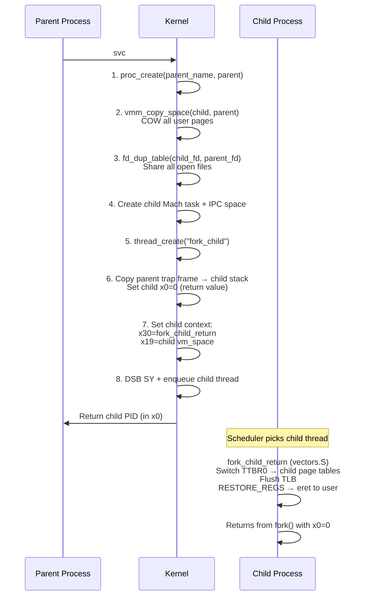

Key details:

- **Step 2** uses `vmm_copy_space()` (§3.5) for COW sharing — no physical pages are copied, just PTEs
- **Step 3** increments `f_refcount` on every open file — parent and child share file offsets and everything
- **Step 6** copies the parent's entire trap frame (saved at the top of the parent's kernel stack) to the top of the child's kernel stack, then sets `child_tf->regs[0] = 0` (so the child sees `fork()` returning 0)
- **Step 7** configures the child thread's context so the scheduler dispatches into `fork_child_return` assembly, which switches to the child's address space and returns to user mode

### 5.3 execve()

`sys_execve_impl()` (`kernel/kern/proc.c:1001`) replaces the current process image with a new Mach-O binary. It is the second most complex syscall.

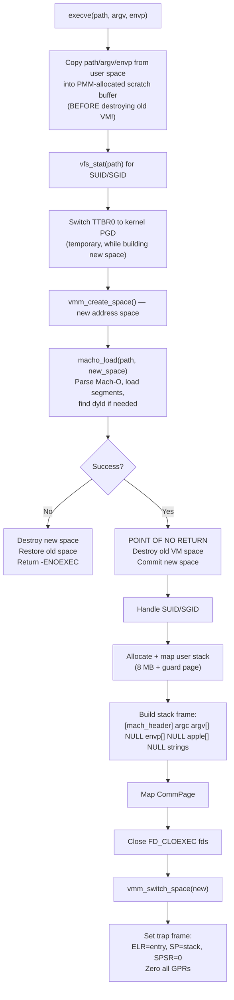

The **user stack layout** built by `execve()` matches the macOS/XNU convention:

```
SP → [mach_header *]    ← only if dyld is loaded (XNU convention)
      argc               ← int, number of arguments
      argv[0] pointer
      argv[1] pointer
      ...
      NULL               ← end of argv
      envp[0] pointer
      envp[1] pointer
      ...
      NULL               ← end of envp
      apple[0] pointer   ← "executable_path=/sbin/init"
      ...
      NULL               ← end of apple strings
      string data        ← actual characters for argv/envp/apple
```

This is the exact layout that `dyld` and `crt0.S` expect. The `mach_header` pointer pushed below `argc` tells `dyld` where the main binary's Mach-O header is mapped.

> **Security note:** The scratch buffer copy in step B is critical for security. If the kernel reads argv/envp directly from user memory during exec, a malicious concurrent thread could modify the strings after validation (a TOCTOU attack). Copying to kernel memory first eliminates this.

### 5.4 exit() and wait4()

**`proc_exit()`** (line 431):

1. Close all file descriptors
2. Release current working directory vnode
3. **Reparent all children to init** (PID 1) — if any child is already a zombie, wake init so it can reap it
4. **Switch TTBR0 to kernel PGD before freeing user page tables** — prevents the TLB walker from following freed page table pages
5. Destroy user VM space
6. Destroy IPC space
7. Set state = `PROC_ZOMBIE`, store exit status
8. Signal parent's `p_waitcv` condition variable

**`proc_wait()`** (line 516):

1. Acquire parent's `p_waitmtx`
2. Scan child list for a zombie matching the requested PID (-1 = any)
3. If found: collect exit status, unlink from child list, free PID slot
4. If no children at all: return `-ECHILD`
5. If `WNOHANG`: return 0 immediately
6. Otherwise: `condvar_wait()` on `p_waitcv`, then retry

### 5.5 Signals

Kiseki implements POSIX signals (`kernel/bsd/syscalls.c`, signal infrastructure starting at line 3790) with 32 signal types and the standard default actions:

| Default | Signals |
|---------|---------|
| Terminate | SIGHUP, SIGINT, SIGPIPE, SIGALRM, SIGTERM, SIGUSR1/2 |
| Core dump | SIGQUIT, SIGILL, SIGABRT, SIGFPE, SIGSEGV, SIGBUS, SIGSYS, SIGTRAP |
| Stop | SIGSTOP, SIGTSTP, SIGTTIN, SIGTTOU |
| Ignore | SIGCHLD, SIGURG, SIGWINCH |
| Continue | SIGCONT |

**Signal delivery** (`signal_check()`, line 3922) runs on the return-to-user path (after every syscall and IRQ from user mode):

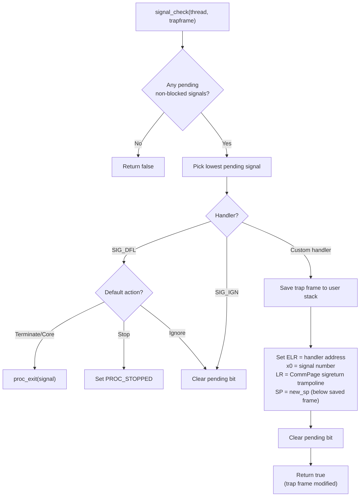

The **CommPage sigreturn trampoline** at `COMMPAGE_VA + 0x280` contains:

```asm
mov     x16, #184       // SYS_sigreturn
svc     #0x80
```

When the user's signal handler returns (via `ret`), it jumps to this trampoline, which invokes `sys_sigreturn()`. The kernel then restores the original trap frame from the user stack, and the process resumes exactly where it was interrupted.

> **XNU reference:** macOS uses the same CommPage trampoline mechanism. The CommPage is at `0x0000000FFFFFC000` on arm64. See [`osfmk/arm64/commpage/commpage.c`](https://github.com/apple-oss-distributions/xnu/blob/main/osfmk/arm64/commpage/commpage.c).

---

## Chapter 6: Mach IPC

#### Why Message Passing?

On Linux, processes communicate through shared files, pipes, or shared memory — all mediated by the filesystem or memory manager. macOS has all of those too, but it adds a fundamentally different mechanism inherited from the Mach microkernel: **message passing on ports**.

Think of a Mach port as a **mailbox**. Any process that holds a **send right** to the mailbox can put messages in it. Only the process that holds the **receive right** can take messages out. The kernel mediates all message transfers — the sender and receiver never share memory directly.

Why does this matter for security? Because **every system service on macOS is accessed through Mach ports:**

- WindowServer has a port. Apps send "draw this window" messages to it.
- `launchd` has a bootstrap port. Daemons register their services through it.
- IOKit user clients are accessed through ports. `IOConnectCallMethod()` is just a Mach message.
- Even XPC (Apple's high-level IPC framework) is built on Mach messages underneath.

This means Mach IPC is **the primary attack surface** for inter-process privilege escalation on macOS. Understanding how messages are copied between address spaces, how port rights are transferred, and how out-of-line memory descriptors work is essential for finding vulnerabilities in this layer.

### 6.1 Ports, Rights & Names

A **Mach port** is a kernel object — a message queue with a reference count, a lock, and a semaphore for blocking receivers. The kernel maintains a pool of 512 ports (`kernel/mach/ipc.c:54`).

```c
struct ipc_port {
    bool           active;
    uint32_t       refs;
    struct task   *receiver;           // Task that holds the receive right
    struct ipc_msg queue[16];          // 16-slot ring buffer
    uint32_t       queue_head, queue_tail, queue_count;
    spinlock_t     lock;
    semaphore_t    msg_available;      // Receiver blocks here
    void          *kobject;            // IOKit kernel object (if any)
    uint32_t       kobject_type;       // IKOT_NONE, IKOT_IOKIT_CONNECT, etc.
};
```

Processes do not access ports directly. Each task has an **IPC space** — a name table that maps integer names (like file descriptors) to port rights:

```c
struct ipc_space {
    struct ipc_port_entry table[256];  // Name → (port*, right_type)
    uint32_t next_name;                // Monotonically increasing name allocator
    spinlock_t lock;
};
```

When you call `mach_port_allocate()`, the kernel creates a port and inserts it into your task's name table, returning a `mach_port_name_t` (an integer). This is similar to how `open()` returns a file descriptor.

**Right types:**

| Right | What It Lets You Do | Transferred How |
|-------|-------------------|-----------------|
| **Send** | Put messages into the port's queue | Can be copied (`COPY_SEND`) or moved (`MOVE_SEND`) |
| **Receive** | Take messages out of the queue | Moved only (`MOVE_RECEIVE`) — exactly one receiver |
| **Send-Once** | Send exactly one message, then the right is consumed | Used for reply ports |

The critical rule: **there is exactly one receive right per port**, but there can be many send rights. This is like having one inbox but handing out your postal address to many senders.

> **XNU reference:** XNU's port structures are in [`osfmk/ipc/ipc_port.h`](https://github.com/apple-oss-distributions/xnu/blob/main/osfmk/ipc/ipc_port.h). The name space is in [`osfmk/ipc/ipc_space.h`](https://github.com/apple-oss-distributions/xnu/blob/main/osfmk/ipc/ipc_space.h). Kiseki's `ipc_port` and `ipc_space` are simplified but structurally equivalent.

### 6.2 Message Anatomy

A Mach message is a structured blob of bytes with a fixed header:

```c
typedef struct {
    mach_msg_bits_t   msgh_bits;         // Flags + port dispositions
    mach_msg_size_t   msgh_size;         // Total message size in bytes
    mach_port_name_t  msgh_remote_port;  // Destination port (send right)
    mach_port_name_t  msgh_local_port;   // Reply port (optional)
    uint32_t          msgh_voucher_port; // Voucher (unused, macOS compat)
    mach_msg_id_t     msgh_id;           // User-defined message ID
} mach_msg_header_t;
```

The `msgh_bits` field encodes how the port names should be interpreted during the send:

```
Bits 7:0   = remote port disposition (COPY_SEND, MOVE_SEND, MOVE_SEND_ONCE, etc.)
Bits 15:8  = local port disposition  (for the reply port)
Bit 31     = COMPLEX flag (message contains descriptors for OOL data or port transfers)
```

After the header, a message can contain:
1. **Inline data** — arbitrary bytes (up to 4096 in Kiseki)
2. **Descriptors** (if COMPLEX) — instructions to the kernel to transfer ports or memory between address spaces

This structure lets a single `mach_msg()` call do remarkably complex things: send data, transfer port rights, and share memory regions, all atomically.

### 6.3 mach_msg_trap — The Send/Receive Path

All Mach IPC goes through a single syscall: `mach_msg_trap()` (Mach trap number -31). It can send a message, receive a message, or both in one call, controlled by option flags:

```c
// From user space:
mach_msg(&msg, MACH_SEND_MSG | MACH_RCV_MSG, send_size, rcv_size,
         rcv_port, timeout, MACH_PORT_NULL);
```

This is the most complex function in the kernel (`kernel/mach/ipc.c:1216`, ~500 lines). Here is the complete flow:

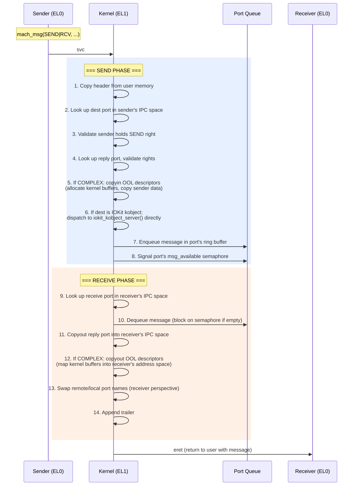

**Step 6 — IOKit interception** is particularly interesting. If the destination port is a **kobject port** (its `kobject_type != IKOT_NONE`), the kernel short-circuits the normal send path and calls `iokit_kobject_server()` directly. The reply is sent back synchronously on the reply port. This means IOKit calls like `IOConnectCallMethod()` never actually queue a message — they are handled inline in the sender's syscall context.

> **Security note:** The copyin/copyout phases are where many Mach IPC vulnerabilities live. If the kernel reads the message header from user memory, validates it, then reads it *again* to process it, a malicious concurrent thread could modify the header between reads (a double-fetch / TOCTOU bug). Kiseki copies the header into kernel memory once and works from the copy. XNU has had CVEs from improper handling of this.

### 6.4 Out-of-Line Memory Descriptors

For sending large amounts of data (like pixel buffers for WindowServer), Mach IPC supports **out-of-line (OOL) descriptors**. Instead of copying the data inline in the message, you describe a region of your address space:

```c
typedef struct {
    uint64_t  address;     // User VA of the data
    uint32_t  deallocate;  // Unmap from sender after send?
    uint32_t  copy;        // Copy semantics
    uint32_t  type;        // MACH_MSG_OOL_DESCRIPTOR (1)
    uint32_t  size;        // Size in bytes
} mach_msg_ool_descriptor_t;
```

**Send-side (copyin):**
1. Calculate how many pages the OOL region spans
2. Allocate kernel buffer pages via `pmm_alloc_pages()`
3. For each page of the sender's region: translate the virtual address via `vmm_translate()`, copy bytes to the kernel buffer
4. Create a `vm_map_copy` object pointing to the kernel buffer
5. If `deallocate=true`: unmap the pages from the sender's address space

**Receive-side (copyout):**
1. Call `vm_map_enter()` to find free virtual address space in the receiver
2. For each page: allocate a physical page, map it into the receiver, copy from the kernel buffer
3. Free the kernel buffer

This is how WindowServer receives pixel data from GUI applications. When an app calls `_WSDrawRect()`, it sends a Mach message with an OOL descriptor pointing to its CGBitmapContext backing store. The kernel copies the pixel data to WindowServer's address space, where it is composited into the framebuffer.

> **Kiseki vs macOS:** Real macOS can use **virtual copy** (COW page sharing) for OOL descriptors, avoiding physical copies. Kiseki always does a physical copy — simpler but slower. XNU's `vm_map_copy` can be of type `ENTRY_LIST` (COW sharing) or `KERNEL_BUFFER` (physical copy). Kiseki only uses `KERNEL_BUFFER`.

### 6.5 The Bootstrap Server

How does a process find the port for WindowServer? Or for any other system service? Through the **bootstrap server** — a simple name-to-port registry built into the kernel.

```c
// Kernel-side registry (ipc.c:1954)
struct bootstrap_entry {
    char             name[128];  // e.g., "uk.co.avltree9798.WindowServer"
    struct ipc_port *port;       // The service's receive port
    bool             active;
};
static struct bootstrap_entry bootstrap_registry[64];
```

Three Mach traps operate on the registry:

| Trap | Number | Who Calls It | What It Does |
|------|--------|-------------|-------------|
| `bootstrap_register` | -40 | `init` (PID 1) | **Pre-creates** a named service port before the daemon starts |
| `bootstrap_check_in` | -42 | The daemon itself | Claims the receive right for a pre-created port |
| `bootstrap_look_up` | -41 | Any client process | Gets a send right to the named service |

The flow for starting WindowServer:

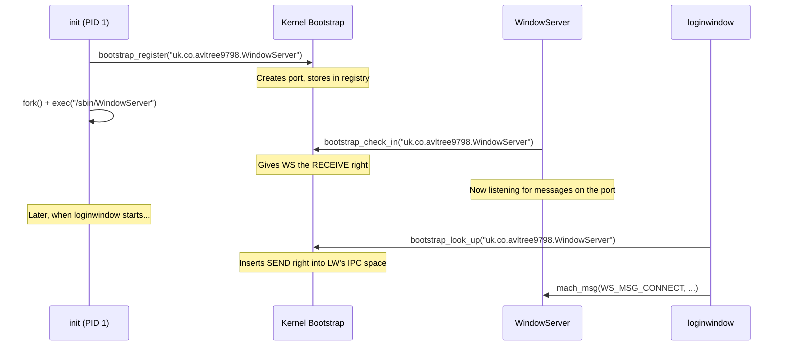

The key design decision is **pre-creation**: `init` registers the service port *before* forking the daemon. This means clients can `bootstrap_look_up()` and start sending messages immediately — even if the daemon is still starting up. The messages will queue in the port until the daemon calls `bootstrap_check_in()` and starts receiving.

> **macOS reference:** Real macOS uses `launchd`'s XPC mechanism for service registration, which is more sophisticated (supports on-demand daemon launch, domain isolation, etc.). The bootstrap server is the legacy predecessor. Kiseki uses the simpler bootstrap model, which is functionally equivalent for understanding the attack surface.

---

## Chapter 7: BSD Syscalls & Security

In Chapter 2 we introduced the `svc #0x80` instruction — the mechanism by which user code asks the kernel to do something. In Chapter 6 we covered the *Mach* half of that mechanism (negative syscall numbers). This chapter covers the *BSD* half: the POSIX-compatible system calls that provide the familiar Unix API — `open()`, `read()`, `write()`, `fork()`, `kill()`, and dozens more — plus the security model that governs who is allowed to do what.

#### What Is a System Call, Exactly?

If you have never written kernel code, you might think of `read()` as "just a function." It is not. `read()` is a **boundary crossing** — the most important boundary in the entire operating system.

User code runs at ARM64 Exception Level 0 (EL0). It can access its own memory, perform arithmetic, and call other user functions. But it *cannot*:

- Read a disk block
- Send a network packet
- Allocate a physical page
- Access another process's memory

All of those require kernel privilege (EL1). A system call is the controlled, auditable gate that lets unprivileged code request privileged services. The CPU enforces this — there is no way for EL0 code to "just jump" into kernel functions. The *only* entry point is through the exception vector, triggered by a specific instruction (`svc`).

```
┌─────────────────────────────────────────────────────────────────┐
│                      User Process (EL0)                         │
│                                                                 │
│    ssize_t n = read(fd, buf, count);                           │
│         │                                                       │
│         ▼                                                       │
│    libSystem wrapper:                                           │
│         mov  x16, #3          // SYS_read = 3                  │
│         svc  #0x80            // Trap to kernel                 │
│                                                                 │
├─────── HARDWARE EXCEPTION ──────────────────────────────────────┤
│                                                                 │
│                      Kernel (EL1)                               │
│                                                                 │
│    1. CPU jumps to vector table (vectors.S)                    │
│    2. SAVE_REGS — push all 31 GPRs + SP/ELR/SPSR/ESR          │
│    3. trap_sync_el0() — read ESR, dispatch on EC               │
│    4. EC=0x15 (SVC) → syscall_handler(tf)                      │
│    5. Read x16 from trap frame → positive → BSD dispatch       │
│    6. switch(3) → sys_read(tf)                                 │
│    7. Read args from tf: fd=x0, buf=x1, count=x2              │
│    8. Do the work (VFS lookup, buffer cache, disk I/O)         │
│    9. syscall_return(tf, bytes_read) — set x0, clear carry     │
│   10. Return to trap_sync_el0, signal_check, RESTORE_REGS     │
│   11. eret → back to EL0, right after the svc instruction     │
│                                                                 │
└─────────────────────────────────────────────────────────────────┘
```

This pattern — save state, dispatch, do work, restore state — is universal across every operating system that has ever existed. The details (which register holds the syscall number, how errors are signalled, how many arguments are supported) vary, but the structure is always the same.

> **Security implication:** Every system call is a potential attack surface. The kernel must validate *every* argument — pointers could be invalid, file descriptors could be out of range, paths could contain `../` traversals. A single missing check can be a privilege escalation vulnerability. This is why syscall auditing is one of the first things a security engineer does when assessing a kernel.

#### The Dual Personality: Mach + BSD

macOS (and Kiseki) have a unique twist: the same `svc #0x80` instruction serves *two* different syscall tables. The sign of the number in `x16` determines which one:

| x16 value | Dispatch | Example |
|-----------|----------|---------|
| Positive  | BSD syscall table | `read(3)`, `open(5)`, `fork(2)` |
| Negative  | Mach trap table | `mach_msg(-31)`, `task_self(-28)` |

This is not an arbitrary design choice. It reflects macOS's hybrid kernel architecture: the Mach microkernel provides low-level primitives (tasks, threads, IPC), while the BSD layer provides the POSIX API that applications actually use. Both must be reachable from a single trap instruction because there is only one `svc` vector.

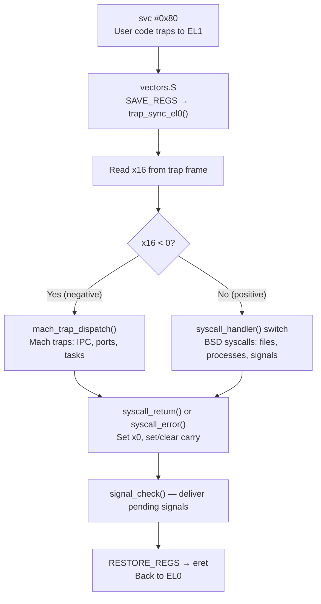

### 7.1 Syscall Calling Convention

The syscall calling convention defines the contract between user space and the kernel: which registers hold which values, how errors are communicated, and what state is preserved. Getting this wrong means every program on the system breaks. Getting it *almost* right means subtle, hard-to-debug failures where some programs work and others don't.

Kiseki uses the exact same convention as XNU on ARM64. This is not optional — real macOS binaries compiled with Apple's toolchain expect this convention, so any compatible implementation must follow it precisely.

#### Register Layout

| Register | Direction | Purpose |
|----------|-----------|---------|
| `x0`–`x5` | In | Syscall arguments (up to 6) |
| `x16` | In | Syscall number (positive=BSD, negative=Mach) |
| `x0` | Out | Return value (success) or errno (error) |
| SPSR bit 29 (carry flag) | Out | 0 = success, 1 = error |

Note that `x0` serves double duty: it is both the first argument *and* the return value. This works because the kernel reads all arguments before doing any work, so overwriting `x0` with the return value does not lose information.

**Why x16?** On ARM64, `x16` and `x17` are designated as "intra-procedure-call scratch registers" (IP0/IP1). They are *not* preserved across function calls and are used by the linker for veneers and thunks. XNU chose `x16` for the syscall number because it does not conflict with the standard C calling convention (`x0`–`x7` for arguments, `x8` for indirect result location). This means a C function can set up all its arguments in `x0`–`x5` using normal calling conventions, then set `x16` separately.

#### The Carry Flag Error Convention

The most unusual aspect of the XNU syscall convention is how errors are reported. Most Unix systems use a simple rule: negative return values indicate errors. XNU does something different — it uses the **carry flag** in the processor status register (PSTATE, saved as SPSR during the exception):

```c
/* kernel/bsd/syscalls.c:49-61 */

static inline void syscall_return(struct trap_frame *tf, int64_t retval)
{
    tf->regs[0] = (uint64_t)retval;
    /* Clear carry flag (success) */
    tf->spsr &= ~SPSR_CARRY_BIT;    /* bit 29 */
}

static inline void syscall_error(struct trap_frame *tf, int errno_val)
{
    tf->regs[0] = (uint64_t)errno_val;
    /* Set carry flag (error) */
    tf->spsr |= SPSR_CARRY_BIT;     /* bit 29 */
}
```

The SPSR (Saved Program Status Register) is the snapshot of the user's PSTATE that was captured when the exception occurred. By modifying it *before* the `eret` instruction restores it, the kernel can communicate a single bit of information through the processor flags. After `eret`, the user-mode code can test this bit directly:

```asm
/* userland/libsystem/syscall.S:23-38 — The SYSCALL_STUB macro */

.macro SYSCALL_STUB name, num
    .globl \name
\name:
    mov     x16, #\num
    svc     #0x80

    /* Check carry flag (PSTATE.C = NZCV bit 29) */
    mrs     x8, nzcv
    tbnz    x8, #29, 1f        /* Branch if carry set (error) */
    ret                         /* Success: x0 has return value */
1:
    neg     x0, x0              /* Error: negate errno to return -errno */
    ret
.endm
```

**Why not just use negative return values?** Because some syscalls legitimately return large positive values that, if interpreted as signed 64-bit integers, would be negative. For instance, `mmap()` returns addresses in the upper half of the 64-bit address space. A return value of `0xFFFF800000000000` looks negative if interpreted as `int64_t`, but it is a perfectly valid kernel address. The carry flag sidesteps this ambiguity entirely.

> **macOS reference:** This carry-flag convention originates from the Mach/BSD split in the NeXTSTEP era and has been maintained through every macOS/iOS release. It is documented in the XNU source at `osfmk/arm64/locore.s` and `bsd/dev/arm/systemcalls.c`. Apple's `libsyscall` (the closed-source equivalent of Kiseki's `syscall.S`) uses the same `mrs`/`tbnz` pattern.

#### The Entry Path in Detail

When user code executes `svc #0x80`, the CPU performs these hardware-level actions automatically:

1. **Save PSTATE** → `SPSR_EL1` (preserves interrupt mask, condition flags, execution state)
2. **Save return address** → `ELR_EL1` (address of the instruction *after* `svc`)
3. **Switch to EL1** (kernel privilege)
4. **Mask interrupts** (PSTATE.I = 1 — IRQs disabled)
5. **Jump to vector offset** 0x400 in VBAR_EL1 (synchronous exception from lower EL, AArch64)

The software then takes over:

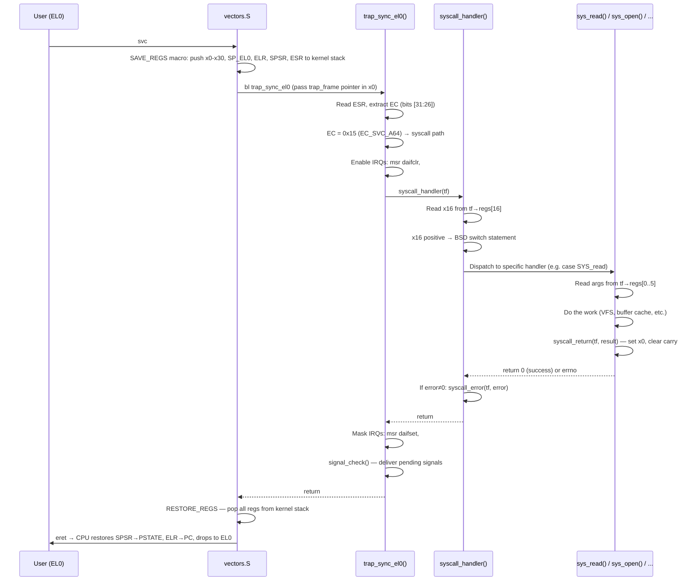

A critical detail: the kernel **enables interrupts** during syscall processing (`kernel/kern/trap.c:201`). This is essential because syscalls can block (e.g., `read()` waiting for disk I/O, `mach_msg()` waiting for a message). If interrupts remained disabled, timer ticks would not fire on that CPU, preventing the scheduler from running and potentially deadlocking the entire system. XNU does the same thing via `ml_set_interrupts_enabled(TRUE)` early in its syscall path.

#### Path Resolution

One more piece of the syscall machinery deserves mention: **path resolution**. Many BSD syscalls accept file paths (`open`, `stat`, `unlink`, `chdir`, etc.). These paths can be relative (e.g., `"../foo"`) or absolute (e.g., `"/usr/bin/ls"`). The kernel must resolve relative paths against the process's current working directory, then canonicalise `.` and `..` components.

```c
/* kernel/bsd/syscalls.c:165-198 — resolve_user_path() */

static int resolve_user_path(const char *user_path, char *abs_buf, uint32_t bufsz)
{
    if (!user_path || !user_path[0])
        return EINVAL;

    if (user_path[0] == '/') {
        /* Already absolute */
        sc_strncpy(abs_buf, user_path, bufsz);
    } else {
        /* Relative: prepend cwd */
        struct proc *p = proc_current();
        const char *cwd = (p && p->p_cwd_path[0]) ? p->p_cwd_path : "/";
        /* ... concatenate cwd + "/" + user_path ... */
    }

    canonicalize_path(abs_buf);    /* Resolve "." and ".." */
    return 0;
}
```

The `canonicalize_path()` function (`kernel/bsd/syscalls.c:99-154`) uses a stack-based algorithm to track directory depth, eliminating `.` (current directory) and `..` (parent directory) components. This is the same approach used by XNU's `vfs_lookup()` path (though XNU's version is significantly more complex, handling symlinks, mount-point crossings, and namespace isolation).

> **Security implication:** Path canonicalisation bugs are a classic source of directory traversal vulnerabilities. If `..` is not properly handled, an attacker can escape a chroot jail or access files outside their intended sandbox. Kiseki's implementation handles the basic cases but does not yet implement `chroot()` or sandbox profiles, so the attack surface is limited to permission checks.

### 7.2 The Syscall Table

Kiseki implements over 80 BSD syscalls and 11 Mach traps. Together, these provide the complete API surface that userland needs to implement a Unix shell, a window system, a TCP/IP network stack (from the application side), and a GUI desktop.

The syscall numbers are defined in a single shared header (`include/sys/syscall.h`) that is included by *both* kernel and userland code. This single-source-of-truth pattern prevents numbering mismatches — one of the most maddening bugs possible, where user code calls `open()` but the kernel dispatches `close()`.

#### BSD Syscall Numbers

The numbers are XNU-compatible. This is not coincidental — it means binaries compiled against macOS headers produce `svc #0x80` instructions with the right `x16` values, and the Kiseki kernel dispatches them correctly.

| # | Name | Category | Signature |
|---|------|----------|-----------|
| 1 | `exit` | Process | `exit(int status)` |
| 2 | `fork` | Process | `fork() → pid_t` |
| 3 | `read` | File I/O | `read(int fd, void *buf, size_t count) → ssize_t` |
| 4 | `write` | File I/O | `write(int fd, const void *buf, size_t count) → ssize_t` |
| 5 | `open` | File I/O | `open(const char *path, int flags, mode_t mode) → int` |
| 6 | `close` | File I/O | `close(int fd) → int` |
| 7 | `wait4` | Process | `wait4(pid_t pid, int *status, int options, ...) → pid_t` |
| 9 | `link` | Filesystem | `link(const char *old, const char *new) → int` |
| 10 | `unlink` | Filesystem | `unlink(const char *path) → int` |
| 12 | `chdir` | Filesystem | `chdir(const char *path) → int` |
| 15 | `chmod` | Security | `chmod(const char *path, mode_t mode) → int` |
| 16 | `chown` | Security | `chown(const char *path, uid_t uid, gid_t gid) → int` |
| 20 | `getpid` | Process | `getpid() → pid_t` |
| 23 | `setuid` | Security | `setuid(uid_t uid) → int` |
| 24 | `getuid` | Process | `getuid() → uid_t` |
| 25 | `geteuid` | Process | `geteuid() → uid_t` |
| 33 | `access` | Security | `access(const char *path, int mode) → int` |
| 36 | `sync` | Filesystem | `sync() → void` |
| 37 | `kill` | Signal | `kill(pid_t pid, int sig) → int` |
| 41 | `dup` | File I/O | `dup(int fd) → int` |
| 42 | `pipe` | File I/O | `pipe(int fd[2]) → int` |
| 46 | `sigaction` | Signal | `sigaction(int sig, ...) → int` |
| 48 | `sigprocmask` | Signal | `sigprocmask(int how, ...) → int` |
| 54 | `ioctl` | Device | `ioctl(int fd, unsigned long request, ...) → int` |
| 59 | `execve` | Process | `execve(const char *path, char *const argv[], ...) → int` |
| 73 | `munmap` | Memory | `munmap(void *addr, size_t len) → int` |
| 74 | `mprotect` | Memory | `mprotect(void *addr, size_t len, int prot) → int` |
| 93 | `select` | File I/O | `select(int nfds, ...) → int` |
| 97 | `socket` | Network | `socket(int domain, int type, int protocol) → int` |
| 98 | `connect` | Network | `connect(int fd, ...) → int` |
| 104 | `bind` | Network | `bind(int fd, ...) → int` |
| 106 | `listen` | Network | `listen(int fd, int backlog) → int` |
| 128 | `rename` | Filesystem | `rename(const char *old, const char *new) → int` |
| 136 | `mkdir` | Filesystem | `mkdir(const char *path, mode_t mode) → int` |
| 184 | `sigreturn` | Signal | `sigreturn(struct ucontext *ctx) → int` |
| 197 | `mmap` | Memory | `mmap(void *addr, size_t len, int prot, ...) → void *` |
| 202 | `sysctl` | System | `sysctl(int *name, u_int namelen, ...) → int` |
| 240 | `nanosleep` | Process | `nanosleep(const struct timespec *req, ...) → int` |
| 286 | `pthread_kill` | Signal | `pthread_kill(pthread_t thread, int sig) → int` |
| 338 | `stat` | Filesystem | `stat(const char *path, struct stat *buf) → int` |
| 360 | `bsdthread_create` | Thread | `bsdthread_create(func, arg, stack, ...) → int` |
| 500 | `getentropy` | Security | `getentropy(void *buf, size_t len) → int` |
| 501 | `openpty` | Terminal | `openpty(int *master, int *slave, ...) → int` |

(This table shows a representative subset. The full list has 80+ entries; see `include/sys/syscall.h` for the complete set. Numbers 396–406 are `_nocancel` variants that share the same handler as their cancellable counterparts.)

#### Mach Trap Numbers

| # | Name | Purpose |
|---|------|---------|
| −26 | `mach_reply_port` | Allocate a reply port for an IPC transaction |
| −27 | `thread_self_trap` | Get the current thread's Mach port |
| −28 | `task_self_trap` | Get the current task's Mach port |
| −31 | `mach_msg_trap` | Send and/or receive a Mach message |
| −32 | `mach_msg_overwrite_trap` | Same, with overwrite semantics |
| −36 | `mach_port_allocate` | Create a new Mach port |
| −37 | `mach_port_deallocate` | Destroy a Mach port |
| −39 | `mach_port_mod_refs` | Modify port reference counts |
| −40 | `bootstrap_register` | Register a named service port |
| −41 | `bootstrap_look_up` | Look up a named service port |
| −42 | `bootstrap_check_in` | Claim a pre-registered service port |

#### Dispatch Architecture

The dispatch is a giant `switch` statement in `syscall_handler()` (`kernel/bsd/syscalls.c:352-736`). This is a deliberate simplification. XNU uses a **syscall table** — an array of `{ function_pointer, arg_count, ... }` structs indexed by syscall number — which allows O(1) dispatch and supports features like syscall auditing and argument munging (converting 32-bit arguments for 64-bit kernels). Kiseki's switch statement achieves the same dispatch semantics with simpler code:

```c
/* kernel/bsd/syscalls.c:352-378 (simplified) */

void syscall_handler(struct trap_frame *tf)
{
    int64_t callnum = (int64_t)tf->regs[16];

    if (callnum < 0) {
        mach_trap_dispatch(tf, (int32_t)callnum);
        return;
    }

    int error = 0;

    switch ((uint32_t)callnum) {
    case SYS_exit:   sys_exit(tf);  return;
    case SYS_fork:   error = sys_fork(tf);   break;
    case SYS_read:
    case SYS_read_nocancel:
                     error = sys_read(tf);   break;
    case SYS_write:
    case SYS_write_nocancel:
                     error = sys_write(tf);  break;
    /* ... 80+ more cases ... */
    default:
        kprintf("[syscall] unimplemented BSD syscall %ld\n", callnum);
        error = ENOSYS;
        break;
    }

    if (error != 0)
        syscall_error(tf, error);
    else
        tf->spsr &= ~SPSR_CARRY_BIT;  /* Clear carry on success */
}
```

Note the `_nocancel` variants: macOS provides cancellation-point syscalls (e.g., `read`) and non-cancellation variants (e.g., `read_nocancel`) for thread cancellation support. In Kiseki, both map to the same handler since thread cancellation is not implemented.

#### A Representative Syscall: sys_open

To see how a real syscall works end-to-end, let's trace `sys_open()` (`kernel/bsd/syscalls.c:1073-1093`):

```c
int sys_open(struct trap_frame *tf)
{
    const char *path = (const char *)tf->regs[0];   /* x0 = path */
    uint32_t flags   = (uint32_t)tf->regs[1];        /* x1 = flags */
    mode_t mode      = (mode_t)tf->regs[2];          /* x2 = mode */

    if (path == NULL)
        return EINVAL;

    char abs_path[PATH_MAX_KERN];
    int err = resolve_user_path(path, abs_path, sizeof(abs_path));
    if (err)
        return err;

    int fd = vfs_open(abs_path, flags, mode);
    if (fd < 0)
        return (int)(-fd);   /* VFS returns negative errno */

    syscall_return(tf, (int64_t)fd);
    return 0;
}
```

The pattern is consistent across all syscalls:

1. **Extract arguments** from `tf->regs[0..5]`
2. **Validate inputs** (null checks, range checks, permission checks)
3. **Do the work** (delegate to a subsystem: VFS, network stack, scheduler, etc.)
4. **Return result** via `syscall_return(tf, value)` on success, or return a positive `errno` which the dispatch loop converts to `syscall_error(tf, errno)`

> **macOS reference:** XNU's real syscall table is generated from `bsd/kern/syscalls.master` by a Python script that produces `bsd/kern/init_sysent.c`. Each entry contains the handler function, the number of arguments, and flags for things like argument munging and return-value handling. Kiseki's approach is equivalent for the syscalls it implements; the table-driven approach would only become necessary when supporting the full ~550 XNU syscalls.

#### The sysctl Subsystem

One syscall deserves special mention: `sysctl` (number 202). This is the kernel's **query/configuration interface** — a hierarchical namespace of key-value pairs that expose system information and tunables.

```
CTL_KERN (1)              CTL_HW (6)              CTL_NET (4)
├── KERN_OSTYPE     (1)   ├── HW_MACHINE    (1)   ├── NET_KISEKI_IFADDR (100)
├── KERN_OSRELEASE  (2)   ├── HW_NCPU       (3)   ├── NET_KISEKI_IFMASK (101)
├── KERN_VERSION    (4)   ├── HW_PAGESIZE   (7)   ├── NET_KISEKI_IFGW   (102)
├── KERN_HOSTNAME  (10)   └── HW_MEMSIZE   (12)   └── NET_KISEKI_IFDNS  (103)
├── KERN_PROC      (14)
└── KERN_OSVERSION (65)
```

This is how `uname -a` gets the kernel version, how applications discover the number of CPUs, and how network utilities query interface addresses. The hierarchical namespace is addressed by an array of integers: `{CTL_KERN, KERN_OSTYPE}` returns `"Kiseki"`, while `{CTL_HW, HW_NCPU}` returns the SMP core count.

> **Security implication:** `sysctl` is a significant information disclosure vector. An attacker can use it to fingerprint the kernel version, discover the network topology, and enumerate processes. macOS restricts many sysctl nodes to root or adds sandbox checks. Kiseki currently does not restrict read access to sysctl, which is typical for a development kernel but would need hardening for production use.

### 7.3 Unix DAC & Credentials

Every process has an identity. Every file has an owner and a set of permission bits. The rules that connect these — *who can read this file?*, *who can send this signal?*, *who can bind this port?* — constitute the **Discretionary Access Control** (DAC) model. "Discretionary" because the file *owner* decides who gets access (by setting permission bits), as opposed to Mandatory Access Control (MAC) where a system policy overrides the owner's wishes.

This section covers Kiseki's implementation of the Unix credential system and permission checking, all in `kernel/bsd/security.c` (247 lines) and `kernel/include/bsd/security.h` (184 lines).

#### The ucred Structure

Every process carries a **credential** — a `struct ucred` that records its identity:

```c
/* kernel/include/bsd/security.h:68-78 */

struct ucred {
    uid_t       cr_uid;                 /* Effective user ID */
    gid_t       cr_gid;                 /* Effective group ID */
    uid_t       cr_ruid;                /* Real user ID */
    gid_t       cr_rgid;                /* Real group ID */
    uid_t       cr_svuid;               /* Saved user ID */
    gid_t       cr_svgid;               /* Saved group ID */
    gid_t       cr_groups[NGROUPS_MAX]; /* Supplementary group list (max 16) */
    uint32_t    cr_ngroups;             /* Number of supplementary groups */
    uint32_t    cr_ref;                 /* Reference count */
};
```

**Why three UIDs?** This is one of the most confusing aspects of Unix security, so let's be precise:

- **Real UID** (`cr_ruid`): The UID of the user who *started* the process. Never changes except via root calling `setuid()`. Used for accounting and determining who "really" owns the process.
- **Effective UID** (`cr_uid`): The UID used for *permission checks*. This is what matters when opening files or sending signals. Can differ from the real UID after `exec()` of a SUID binary.
- **Saved UID** (`cr_svuid`): A snapshot of the effective UID *before* a SUID exec changed it. Allows the process to temporarily drop privileges and restore them later.

The same triple exists for group IDs (`cr_gid`, `cr_rgid`, `cr_svgid`).

```mermaid
stateDiagram-v2
    [*] --> NormalProcess: fork() — inherits parent's credentials

    NormalProcess --> NormalProcess: setuid(own_uid) — no-op
    NormalProcess --> SUIDProcess: exec(SUID binary)
    NormalProcess --> RootProcess: setuid(0) — only if already root

    SUIDProcess --> SUIDProcess: cr_uid = file owner\ncr_svuid = old cr_uid\ncr_ruid unchanged
    SUIDProcess --> DroppedPrivs: setuid(cr_ruid) — drop to real UID
    DroppedPrivs --> SUIDProcess: setuid(cr_svuid) — restore saved UID

    RootProcess --> AnyUID: setuid(any) — root can change to any UID

    note right of SUIDProcess
        The classic pattern:
        1. exec /usr/bin/passwd (owned by root, SUID bit set)
        2. cr_uid becomes 0, cr_ruid stays 501, cr_svuid = 501
        3. Process does privileged work (update /etc/shadow)
        4. Process calls setuid(501) to drop back to normal user
    end note
```

#### Credential Allocation

Credentials are allocated from a fixed pool of 128 entries (`kernel/bsd/security.c:25-27`) using a free-list index chain. This is a common pattern in embedded and early-boot kernel code where dynamic memory allocation is not yet available or is too expensive:

```c
/* kernel/bsd/security.c:25-35 */

#define UCRED_POOL_SIZE     128

static struct ucred ucred_pool[UCRED_POOL_SIZE];
static int32_t ucred_free_next[UCRED_POOL_SIZE];
static int32_t ucred_free_head;
static spinlock_t ucred_lock = SPINLOCK_INIT;
```

The free list works by storing the index of the *next* free slot in `ucred_free_next[i]`. Allocation pops the head; deallocation pushes back:

```c
/* kernel/bsd/security.c:60-92 — ucred_create() */

struct ucred *ucred_create(uid_t uid, gid_t gid)
{
    spin_lock_irqsave(&ucred_lock, &flags);

    if (ucred_free_head < 0) {
        /* Pool exhausted */
        spin_unlock_irqrestore(&ucred_lock, flags);
        return NULL;
    }

    int32_t idx = ucred_free_head;
    ucred_free_head = ucred_free_next[idx];
    struct ucred *cr = &ucred_pool[idx];

    spin_unlock_irqrestore(&ucred_lock, flags);

    /* Initialise: all three UID/GID fields set to same value */
    cr->cr_uid = cr->cr_ruid = cr->cr_svuid = uid;
    cr->cr_gid = cr->cr_rgid = cr->cr_svgid = gid;
    cr->cr_ngroups = 0;
    cr->cr_ref = 1;

    return cr;
}
```

Credentials are **reference-counted**. When a process `fork()`s, the child shares the parent's credential (incrementing `cr_ref`). When either process changes credentials (e.g., `setuid()`), a new credential is allocated (copy-on-write semantics). When `cr_ref` drops to zero, the credential returns to the free list:

```c
/* kernel/bsd/security.c:105-128 — ucred_release() */

void ucred_release(struct ucred *cr)
{
    spin_lock_irqsave(&ucred_lock, &flags);

    cr->cr_ref--;
    if (cr->cr_ref == 0) {
        /* Return to free list */
        int32_t idx = (int32_t)(cr - ucred_pool);
        ucred_free_next[idx] = ucred_free_head;
        ucred_free_head = idx;
    }

    spin_unlock_irqrestore(&ucred_lock, flags);
}
```

#### VFS Permission Checks

The core of DAC is `vfs_access()` (`kernel/bsd/security.c:167-195`), which implements the classic Unix permission check algorithm:

```mermaid
flowchart TD
    START["vfs_access(vnode, requested_mode, credential)"]
    START --> ROOT{"cr_uid == 0<br/>(root)?"}
    ROOT -- "Yes" --> GRANT["GRANT — root bypasses all checks"]
    ROOT -- "No" --> OWNER{"cr_uid == file owner?"}
    OWNER -- "Yes" --> OBITS["Use owner bits (mode >> 6) & 0x7"]
    OWNER -- "No" --> GROUP{"cr_gid matches file group?<br/>Or in supplementary groups?"}
    GROUP -- "Yes" --> GBITS["Use group bits (mode >> 3) & 0x7"]
    GROUP -- "No" --> OTHBITS["Use other bits (mode & 0x7)"]
    OBITS --> CHECK{"(requested & granted)<br/>== requested?"}
    GBITS --> CHECK
    OTHBITS --> CHECK
    CHECK -- "Yes" --> GRANT2["GRANT — return 0"]
    CHECK -- "No" --> DENY["DENY — return -EACCES"]
```

The implementation:

```c
/* kernel/bsd/security.c:167-195 */

int vfs_access(struct vnode *vp, int mode, struct ucred *cr)
{
    if (vp == NULL || cr == NULL)
        return -EINVAL;

    /* Root bypasses all permission checks */
    if (cr->cr_uid == 0)
        return 0;

    mode_t file_mode = vp->v_mode;
    int granted;

    if (cr->cr_uid == vp->v_uid) {
        /* Owner: use bits 8-6 */
        granted = (int)((file_mode >> 6) & 0x7);
    } else if (groupmember(vp->v_gid, cr)) {
        /* Group member: use bits 5-3 */
        granted = (int)((file_mode >> 3) & 0x7);
    } else {
        /* Other: use bits 2-0 */
        granted = (int)(file_mode & 0x7);
    }

    /* Check that all requested bits are present */
    if ((mode & granted) == mode)
        return 0;

    return -EACCES;
}
```

The `mode_t` layout is a 12-bit value. The low 9 bits form three triads (owner, group, other), each containing read (4), write (2), and execute (1) permission:

```
  11  10   9   8   7   6   5   4   3   2   1   0
┌────┬────┬────┬────┬────┬────┬────┬────┬────┬────┬────┬────┐
│SUID│SGID│ T  │ r  │ w  │ x  │ r  │ w  │ x  │ r  │ w  │ x  │
│    │    │    │    owner    │    group     │     other     │
└────┴────┴────┴────┴────┴────┴────┴────┴────┴────┴────┴────┘
```

For example, `0755` means:
- Owner: rwx (7 = 4+2+1)
- Group: r-x (5 = 4+0+1)
- Other: r-x (5 = 4+0+1)

The `groupmember()` function (`kernel/bsd/security.c:134-150`) checks both the effective GID and the supplementary group list (up to `NGROUPS_MAX` = 16 entries):

```c
bool groupmember(gid_t gid, struct ucred *cr)
{
    if (cr->cr_gid == gid)
        return true;

    for (uint32_t i = 0; i < cr->cr_ngroups; i++) {
        if (cr->cr_groups[i] == gid)
            return true;
    }

    return false;
}
```

#### Privilege Checks

Beyond file permissions, certain operations require **privilege** — the ability to do something regardless of file ownership. Examples: mounting filesystems, sending signals to other users' processes, binding to ports below 1024, rebooting the system.

Kiseki implements a simple privilege check (`kernel/bsd/security.c:205-216`):

```c
int priv_check(struct ucred *cr, int priv)
{
    (void)priv;     /* All privs granted to root */

    if (cr == NULL)
        return -EACCES;

    if (cr->cr_uid == 0)
        return 0;       /* Root has all privileges */

    return -EACCES;
}
```

The privilege constants defined in the header hint at a future capability-based model:

| Constant | Value | Controls |
|----------|-------|----------|
| `PRIV_ROOT` | 0 | Generic root privilege |
| `PRIV_NET_RAW` | 1 | Create raw sockets |
| `PRIV_VFS_MOUNT` | 2 | Mount filesystems |
| `PRIV_PROC_SIGNAL` | 3 | Signal arbitrary processes |
| `PRIV_KERN_SYSCTL` | 4 | Modify sysctl values |

Currently, all privileges reduce to "is UID 0?" — the traditional Unix superuser model. This is the same baseline that XNU starts from, before layering on its more sophisticated security mechanisms.

#### SUID/SGID Handling

When `execve()` loads a new binary, it calls `suid_check()` (`kernel/bsd/security.c:229-247`) to handle Set-User-ID and Set-Group-ID bits:

```c
void suid_check(struct ucred *cr, mode_t mode, uid_t uid, gid_t gid)
{
    if (mode & S_ISUID) {
        cr->cr_svuid = cr->cr_uid;   /* Save old effective UID */
        cr->cr_uid = uid;             /* Set new effective UID to file owner */
    }

    if (mode & S_ISGID) {
        cr->cr_svgid = cr->cr_gid;   /* Save old effective GID */
        cr->cr_gid = gid;            /* Set new effective GID to file group */
    }
}
```

This is the mechanism behind `passwd`, `su`, and `sudo` on Unix systems. The binary is owned by root and has the SUID bit set (mode `4755`). When a normal user `exec()`s it, the effective UID changes to 0 (root), giving the process temporary root privilege. The saved UID preserves the original effective UID so the process can drop privileges when done.

```mermaid
sequenceDiagram
    participant Shell as bash (uid=501)
    participant Kernel as Kernel
    participant Passwd as passwd (uid→0)

    Shell->>Kernel: execve("/usr/bin/passwd", ...)
    Kernel->>Kernel: Load Mach-O from /usr/bin/passwd
    Kernel->>Kernel: Check vnode: owner=0, mode=0104755 (SUID set)
    Kernel->>Kernel: suid_check(cr, 0104755, uid=0, gid=0)
    Note over Kernel: cr_svuid = 501 (save old effective)<br/>cr_uid = 0 (set to file owner)
    Kernel->>Passwd: New process: ruid=501, euid=0, svuid=501
    Passwd->>Passwd: Update /etc/shadow (needs euid=0)
    Passwd->>Kernel: setuid(501) — drop privileges
    Note over Kernel: cr_uid = 501 (back to normal)
```

> **Security implication:** SUID binaries are one of the oldest and most exploited attack vectors in Unix security. A vulnerability in any SUID-root binary is a direct path to root privilege escalation. macOS mitigates this with SIP (System Integrity Protection), entitlements, and sandboxing. Kiseki implements the base SUID mechanism but none of the mitigations, making it a useful teaching tool for understanding *why* those mitigations exist.

#### Signal Permission Checks

Sending signals (`kill` syscall) has its own permission rules, enforced directly in `sys_kill()` (`kernel/bsd/syscalls.c:968-1051`):

```c
/* Permission check (simplified) from the DO_KILL_ONE macro */
if (sender->p_ucred.cr_uid != 0 &&                    /* Not root */
    sender->p_ucred.cr_uid != target->p_ucred.cr_ruid && /* Not target's real uid */
    sender->p_ucred.cr_ruid != target->p_ucred.cr_ruid)  /* Sender's real uid */
{
    found_no_perm = true;
    break;
}
```

The rules are:
1. Root (UID 0) can signal any process
2. Otherwise, the sender's effective *or* real UID must match the target's real UID

This prevents a normal user from killing another user's processes, while still allowing a SUID process (which has euid=0) to signal anything.

The `kill` syscall also handles process groups and broadcast semantics:
- `pid > 0`: Signal a specific process
- `pid == 0`: Signal all processes in the sender's process group
- `pid == -1`: Signal all processes (except PID 0 and self)
- `pid < -1`: Signal all processes in process group `|pid|`

> **macOS reference:** XNU's real signal permission check is in `bsd/kern/kern_sig.c:cansignal()`. It is considerably more complex, checking for sandbox restrictions, audit session isolation, and Mach task access ports. The basic UID comparison, however, remains at the core — exactly as Kiseki implements it.

---

## Chapter 8: Filesystem — VFS, Ext4, Buffer Cache

Up to this point, we have covered processes, threads, memory, IPC, and syscalls. But none of that matters without *persistent storage*. When a user saves a file, closes their laptop, and reopens it a week later, the file must still be there. The filesystem is the subsystem that makes this possible.

#### What Is a Filesystem?

A filesystem is an *abstraction over raw disk blocks*. A disk drive (or in our case, a VirtIO block device emulated by QEMU) provides a flat array of 512-byte sectors — nothing more. There are no files, no directories, no names, no permissions. The filesystem layer imposes structure: it decides which sectors belong to which files, maintains a directory tree mapping names to data, tracks free space, and ensures consistency across crashes.

There are many different filesystem formats (ext4, APFS, NTFS, FAT32, etc.), each with different on-disk layouts and trade-offs. The kernel needs a way to support multiple formats simultaneously — your root partition might be ext4 while a USB drive is FAT32. This is where the **Virtual File System** (VFS) layer comes in.

#### The Three-Layer Sandwich

Kiseki's filesystem architecture has three layers, exactly matching the BSD/XNU model:

```mermaid
flowchart TD
    APP["User Process<br/>open(), read(), write(), stat()"]
    APP --> SYSCALL["BSD Syscalls<br/>sys_open(), sys_read(), sys_write()"]
    SYSCALL --> VFS["VFS Layer<br/>vfs_open(), vfs_lookup(), vfs_read()<br/>mount table, vnode pool, fd table"]
    VFS --> |"vnode_ops→read()"| EXT4["ext4 Driver<br/>ext4_vop_read(), ext4_vop_write()"]
    VFS --> |"vnode_ops→read()"| DEVFS["devfs Driver<br/>devfs_chr_read(), devfs_chr_write()"]
    EXT4 --> BUFCACHE["Buffer Cache<br/>buf_read(), buf_write(), buf_release()"]
    BUFCACHE --> BLKDEV["Block Device<br/>VirtIO block driver"]
    BLKDEV --> DISK["Virtual Disk<br/>(QCOW2/raw image)"]
    DEVFS --> |"Direct"| TTY["TTY / UART / Null / Zero"]
```

1. **VFS layer** (`kernel/fs/vfs.c`, 1437 lines): Provides the filesystem-independent API. Manages mount points, vnodes (the in-memory representation of files), file descriptors, and path resolution. Delegates actual I/O to filesystem-specific code through function pointers.

2. **Filesystem drivers** (`kernel/fs/ext4/ext4.c`, 2836 lines; `kernel/fs/devfs.c`, 548 lines): Implement the on-disk format. Know how to read inodes, traverse directory entries, allocate blocks, etc.

3. **Buffer cache** (`kernel/fs/buf.c`, 416 lines): Sits between the filesystem driver and the block device. Caches recently-read disk blocks in memory to avoid redundant I/O. Uses LRU eviction and write-back (dirty buffers are flushed periodically or on demand).

### 8.1 The VFS Layer

The VFS is the kernel's filesystem abstraction. It provides a uniform API to user space regardless of which filesystem type backs a given file. When user code calls `open("/Users/admin/hello.txt", O_RDONLY, 0)`, the VFS:

1. Walks the path to find the correct mount point
2. Delegates to the filesystem-specific `lookup()` operation for each path component
3. Allocates a vnode (if not already cached) and a file descriptor
4. Returns the fd to user space

All of this is invisible to the application. It just gets an integer fd and can call `read()`/`write()` on it.

#### Vnodes — The Universal File Object

The **vnode** (virtual node) is the central abstraction. Every open file, directory, device, or symlink in the system is represented by a vnode. This concept was invented by Sun Microsystems in 1985 for SunOS and adopted by every BSD derivative since, including XNU.

```c
/* kernel/include/fs/vfs.h:183-197 */

struct vnode {
    enum vtype          v_type;         /* VREG, VDIR, VLNK, VCHR, ... */
    uint32_t            v_refcount;     /* Reference count */
    uint64_t            v_ino;          /* Inode number */
    uint64_t            v_size;         /* File size in bytes */
    mode_t              v_mode;         /* Permission bits + type */
    uid_t               v_uid;          /* Owner user ID */
    gid_t               v_gid;          /* Owner group ID */
    nlink_t             v_nlink;        /* Hard link count */
    uint32_t            v_dev;          /* Device this vnode lives on */
    void               *v_data;         /* Filesystem-private data */
    struct vnode_ops   *v_ops;          /* Operation vector */
    struct mount       *v_mount;        /* Owning mount */
    spinlock_t          v_lock;         /* Protects v_refcount */
};
```

The key field is `v_ops` — a pointer to a table of function pointers that implement filesystem-specific behaviour:

```c
/* kernel/include/fs/vfs.h:52-177 (simplified) */

struct vnode_ops {
    int     (*lookup)(vnode *dir, const char *name, uint32_t namelen, vnode **result);
    int64_t (*read)(vnode *vp, void *buf, uint64_t offset, uint64_t count);
    int64_t (*write)(vnode *vp, const void *buf, uint64_t offset, uint64_t count);
    int     (*readdir)(vnode *dir, struct dirent *buf, uint64_t *offset, uint32_t count);
    int     (*create)(vnode *dir, const char *name, uint32_t namelen, mode_t mode, vnode **result);
    int     (*mkdir)(vnode *dir, const char *name, uint32_t namelen, mode_t mode, vnode **result);
    int     (*unlink)(vnode *dir, const char *name, uint32_t namelen);
    int     (*getattr)(vnode *vp, struct stat *st);
    int     (*setattr)(vnode *vp, struct stat *st);
    int     (*readlink)(vnode *vp, char *buf, uint64_t buflen);
};
```

This is the classic **strategy pattern**: the VFS calls `vp->v_ops->read(vp, buf, offset, count)` without knowing whether the vnode belongs to ext4, devfs, or any other filesystem. The filesystem driver fills in the function pointers at mount time.

Vnodes are allocated from a fixed pool of 1024 entries (`kernel/fs/vfs.c:44-46`). They are reference-counted: `vnode_ref()` increments the count, `vnode_release()` decrements it, and when the count reaches zero the vnode is returned to the pool:

```c
/* kernel/fs/vfs.c:158-214 */

struct vnode *vnode_alloc(void)
{
    spin_lock(&vnode_pool_lock);
    for (uint32_t i = 0; i < VFS_MAX_VNODES; i++) {
        if (vnode_pool[i].v_refcount == 0 && vnode_pool[i].v_type == VNON) {
            struct vnode *vp = &vnode_pool[i];
            vp->v_refcount = 1;
            /* ... zero out fields ... */
            spin_unlock(&vnode_pool_lock);
            return vp;
        }
    }
    spin_unlock(&vnode_pool_lock);
    return NULL;    /* Pool exhausted */
}
```

#### File Descriptors — Per-Process Indirection

When user code opens a file, it does not get a vnode pointer (that would be a kernel address, unusable from EL0). Instead, it gets a small integer — a **file descriptor** (fd). The kernel maintains a per-process mapping from fd numbers to `struct file` objects:

```mermaid
flowchart LR
    subgraph "Process A (p_fd)"
        FD0A["fd 0 → file_pool[3]"]
        FD1A["fd 1 → file_pool[3]"]
        FD2A["fd 2 → file_pool[3]"]
        FD3A["fd 3 → file_pool[7]"]
    end

    subgraph "Process B (p_fd)"
        FD0B["fd 0 → file_pool[12]"]
        FD1B["fd 1 → file_pool[12]"]
        FD3B["fd 3 → file_pool[7]"]
    end

    subgraph "file_pool (system-wide)"
        F3["file_pool[3]<br/>f_vnode → /dev/console<br/>f_offset = 0<br/>f_refcount = 3"]
        F7["file_pool[7]<br/>f_vnode → /tmp/log<br/>f_offset = 4096<br/>f_refcount = 2"]
        F12["file_pool[12]<br/>f_vnode → /dev/tty<br/>f_offset = 0<br/>f_refcount = 2"]
    end
```

There are *two* levels of indirection:

1. **Per-process fd table** (`p_fd.fd_ofiles[]`): Maps integer fd → `struct file *`. Each process has its own table, so fd 3 in process A and fd 3 in process B can refer to completely different files.

2. **System-wide file pool** (`file_pool[]`, 512 entries): Contains `struct file` objects, each holding the file offset, flags, and a pointer to the backing vnode. Multiple fds can point to the same `struct file` (via `dup()` or `fork()`), sharing the offset.

```c
/* kernel/include/fs/vfs.h:375+ (simplified) */

struct file {
    uint32_t        f_refcount;     /* How many fds point here */
    uint32_t        f_flags;        /* O_RDONLY, O_WRONLY, etc. */
    uint64_t        f_offset;       /* Current read/write position */
    struct vnode   *f_vnode;        /* Backing vnode (NULL for pipes/sockets) */
    void           *f_pipe;         /* Pipe data (if pipe fd) */
    void           *f_pty;          /* PTY data (if PTY fd) */
    int             f_sockidx;      /* Socket index (if socket fd) */
    spinlock_t      f_lock;
};
```

This two-level design is critical for correctness. Consider what happens with `dup2(3, 1)` (redirect stdout to fd 3's file): the fd table entry for fd 1 is changed to point to the same `struct file` as fd 3, with `f_refcount` incremented. Now writes to fd 1 and fd 3 share the same offset and go to the same vnode.

#### Mount Points

A mount point associates a filesystem type with a path and a device. The mount table is a fixed array of 16 entries:

```c
/* kernel/fs/vfs.c:19-21 */

static struct mount     mount_table[VFS_MAX_MOUNTS];    /* max 16 */
static uint32_t         mount_count;
```

Each mount records:
- `mnt_path`: The directory where this filesystem appears in the tree (e.g., `"/"`, `"/dev"`)
- `mnt_ops`: Filesystem-level operations (`mount`, `unmount`, `sync`, `statfs`)
- `mnt_root`: The root vnode of this filesystem
- `mnt_dev`: Block device number (for disk-backed filesystems)

When resolving a path, `mount_find()` (`kernel/fs/vfs.c:617-659`) performs **longest-prefix matching**: it finds the mount whose `mnt_path` is the longest prefix of the target path. This is how `/dev/console` resolves to the devfs mount at `/dev` rather than the ext4 mount at `/`.

#### Path Resolution

Path resolution is the process of converting a string like `"/Users/admin/Documents/report.txt"` into a vnode. It is implemented by `resolve_path()` (`kernel/fs/vfs.c:679-785`):

```mermaid
sequenceDiagram
    participant VFS as VFS (resolve_path)
    participant Mount as mount_find()
    participant Ext4 as ext4_vop_lookup()

    VFS->>Mount: Find mount for "/Users/admin/Documents/report.txt"
    Mount-->>VFS: Root mount ("/"), remainder = "Users/admin/Documents/report.txt"
    VFS->>VFS: current = root mount's root vnode

    VFS->>VFS: Split: component = "Users", rest = "admin/Documents/report.txt"
    VFS->>VFS: Check: is current a directory? ✓
    VFS->>VFS: Check: execute permission on current? ✓
    VFS->>Ext4: lookup(current, "Users", 5, &child)
    Ext4-->>VFS: child vnode (inode 42, VDIR)

    VFS->>VFS: current = child; component = "admin"
    VFS->>Ext4: lookup(current, "admin", 5, &child)
    Ext4-->>VFS: child vnode (inode 100, VDIR)

    VFS->>VFS: current = child; component = "Documents"
    VFS->>Ext4: lookup(current, "Documents", 9, &child)
    Ext4-->>VFS: child vnode (inode 201, VDIR)

    VFS->>VFS: current = child; component = "report.txt" (last)
    VFS->>Ext4: lookup(current, "report.txt", 10, &child)
    Ext4-->>VFS: child vnode (inode 305, VREG, size=4096)

    VFS-->>VFS: result = child vnode
```

Key security detail: at each directory traversal step, the VFS checks **execute permission** on the directory (`vfs_check_permission(current, VEXEC)` at `kernel/fs/vfs.c:752`). This is a common point of confusion: on directories, the execute bit does not mean "run this directory as a program." It means "permission to traverse (search) this directory." Without `x` permission on `/Users`, you cannot resolve any path through it, regardless of the permissions on files inside.

> **macOS reference:** XNU's VFS is in `bsd/vfs/vfs_lookup.c` and `bsd/vfs/vfs_vnops.c`. The vnode concept, operation tables, mount table, and path resolution algorithm are all structurally identical. XNU adds a name cache (vnode name lookup cache, or VNLC) for performance, union mounts, firmlinks, and sandbox policy enforcement at each step. Kiseki omits these but preserves the core design.

### 8.2 The Buffer Cache

Disk I/O is *slow*. Even on modern NVMe SSDs, a single read takes ~10 microseconds. On spinning disks, it can take 5-10 *milliseconds* — an eternity for a CPU executing billions of instructions per second. The buffer cache exists to avoid redundant disk reads by keeping recently-accessed blocks in memory.

Kiseki's buffer cache (`kernel/fs/buf.c`, 416 lines) is a faithful implementation of the classic BSD buffer cache design. It uses a **fixed pool** of 256 buffers, each 4096 bytes (matching the typical filesystem block size), giving 1 MB of cache memory.

#### Data Structures

The cache uses two overlapping data structures to achieve O(1) lookup and efficient eviction:

```mermaid
flowchart LR
    subgraph "Hash Table (64 buckets)"
        H0["bucket 0: → buf(dev=0,blk=64) → buf(dev=0,blk=128) → NULL"]
        H1["bucket 1: → buf(dev=0,blk=1) → NULL"]
        H2["bucket 2: → NULL"]
        Hdot["..."]
        H63["bucket 63: → buf(dev=0,blk=63) → NULL"]
    end

    subgraph "LRU Doubly-Linked List"
        direction LR
        HEAD["HEAD (MRU)"] --> B1["buf(dev=0,blk=1)"]
        B1 --> B2["buf(dev=0,blk=64)"]
        B2 --> B3["buf(dev=0,blk=128)"]
        B3 --> B4["buf(dev=0,blk=63)"]
        B4 --> TAIL["TAIL (LRU)"]
    end
```

1. **Hash table** (64 buckets): Keyed by `(device, block_number)`, allows O(1) lookup to check if a block is already cached. Collisions are handled by chaining.

2. **LRU list**: A doubly-linked list ordered by recency of use. The head is the most-recently-used buffer; the tail is the least-recently-used. When a buffer is accessed, it moves to the head. When the cache is full and a new block needs to be loaded, the tail is evicted.

```c
/* kernel/fs/buf.c:29-49 — Core data structures */

#define BUF_HASH_BUCKETS    64
#define BUF_HASH(dev, blk)  (((uint64_t)(dev) ^ (blk)) % BUF_HASH_BUCKETS)

static struct buf *hash_table[BUF_HASH_BUCKETS];
static struct buf  buf_pool[BUF_POOL_SIZE];          /* 256 buffers */
static uint8_t     buf_data[BUF_POOL_SIZE][BUF_BLOCK_SIZE]  /* 256 × 4096 bytes */
                   __aligned(PAGE_SIZE);

static struct buf *lru_head;    /* Most recently used */
static struct buf *lru_tail;    /* Least recently used */
static spinlock_t  buf_lock = SPINLOCK_INIT;
```

Each buffer has flags indicating its state:

| Flag | Meaning |
|------|---------|
| `B_BUSY` | Buffer is currently being used for I/O; other threads must wait |
| `B_VALID` | Buffer contains valid data from disk |
| `B_DIRTY` | Buffer has been modified; must be written back before eviction |

#### The Read Path: buf_read()

`buf_read()` (`kernel/fs/buf.c:196-296`) is the primary cache interface. Filesystem code calls it with a device and block number, and gets back a pointer to 4096 bytes of data:

```mermaid
flowchart TD
    START["buf_read(dev, block_no)"]
    START --> LOCK["Acquire buf_lock"]
    LOCK --> HIT{"Hash lookup:<br/>block in cache?"}

    HIT -- "Yes (cache hit)" --> BUSY1{"B_BUSY set?"}
    BUSY1 -- "Yes" --> SLEEP["Release lock<br/>thread_sleep_on(bp, 'biowait')<br/>→ goto retry"]
    BUSY1 -- "No" --> MARK1["Set B_BUSY<br/>Increment refcount<br/>Move to LRU head"]
    MARK1 --> UNLOCK1["Release lock<br/>Return buffer"]

    HIT -- "No (cache miss)" --> VICTIM["Find LRU tail<br/>(skip busy buffers)"]
    VICTIM --> DIRTY{"Victim dirty?"}
    DIRTY -- "Yes" --> FLUSH["Set B_BUSY, release lock<br/>buf_do_write(victim)<br/>Re-acquire lock"]
    DIRTY -- "No" --> RECONFIGURE["Set B_BUSY"]
    FLUSH --> RECONFIGURE
    RECONFIGURE --> REHASH["hash_remove(old)<br/>Assign new dev/block<br/>hash_insert(new)<br/>Move to LRU head"]
    REHASH --> DISKREAD["Release lock<br/>buf_do_read(bp)<br/>Read from disk via blkdev_read()"]
    DISKREAD --> DONE["Return buffer<br/>(caller must call buf_release when done)"]
```

The sleep/wakeup mechanism for busy buffers (`thread_sleep_on(bp, "biowait")` at line 217) is the standard BSD pattern. When a buffer is being read from disk by CPU 0, CPU 1 trying to read the same block will sleep until CPU 0 calls `buf_release()`, which clears `B_BUSY` and wakes all sleepers. This is the same `biodone()`/`biowait()` pattern used in XNU and FreeBSD.

#### The Write Path: Delayed Write-Back

When a filesystem modifies a cached block (e.g., writing file data or updating a directory entry), it calls `buf_write()` (`kernel/fs/buf.c:298-309`), which simply marks the buffer dirty:

```c
void buf_write(struct buf *bp)
{
    spin_lock_irqsave(&buf_lock, &flags);
    bp->flags |= B_DIRTY;
    spin_unlock_irqrestore(&buf_lock, flags);
}
```

The actual disk write happens *later*, either:

1. **On eviction**: When the LRU tail is dirty and needs to be reused for a new block, `buf_read()` flushes it first.
2. **On explicit sync**: When user code calls `sync()` or the kernel calls `buf_sync()`.
3. **Periodically**: A background kernel thread (`bufsync_thread`, `kernel/fs/buf.c:391-404`) flushes dirty buffers every 30 seconds.

```c
/* kernel/fs/buf.c:391-404 — Background sync daemon */

static void bufsync_thread(void *arg)
{
    for (;;) {
        thread_sleep_ticks(BUFSYNC_INTERVAL);   /* 30 seconds */
        buf_sync_internal(true);                 /* Flush all dirty buffers */
    }
}
```

This **write-back** strategy (as opposed to write-through) significantly improves performance: many writes to the same block (e.g., appending to a log file) only result in a single disk write when the buffer is eventually flushed.

> **Security implication:** Write-back caching means that a power failure can lose recently-written data. Real filesystems use journaling (ext4's journal, APFS's copy-on-write) to ensure consistency after crashes. Kiseki's ext4 driver does not implement journaling, so an unclean shutdown can leave the filesystem in an inconsistent state.

> **macOS reference:** XNU's buffer cache is in `bsd/vfs/vfs_bio.c`. The design is identical in principle — hash table + LRU list, B_BUSY/B_VALID/B_DIRTY flags, sleep/wakeup on busy buffers. XNU additionally supports asynchronous I/O (B_ASYNC), buffer clustering for sequential reads, and integration with the Unified Buffer Cache (UBC) that unifies file data caching with the VM system.

### 8.3 Ext4 On-Disk Layout

Ext4 is the default Linux filesystem, found on billions of devices. Kiseki uses it as the root filesystem for two reasons: (1) mature tooling (`mkfs.ext4`, `debugfs`, `e2fsck`) makes it easy to create and debug disk images, and (2) its on-disk format is well-documented and relatively straightforward to implement.

The ext4 driver (`kernel/fs/ext4/ext4.c`, 2836 lines) supports:
- Extent-based file layout (for reading existing files)
- Direct block mapping (for writing new files)
- Linear directory iteration
- 64-bit block addressing
- Large inodes (> 128 bytes)
- Block and inode allocation via bitmaps

#### Block Groups

An ext4 filesystem divides the disk into **block groups** — contiguous chunks of blocks that each contain their own metadata. This locality principle ensures that a file's data blocks and its inode are stored near each other, reducing seek time on spinning disks.

```
┌──────────────────────────────────────────────────────────────────────────┐
│ Block 0: Boot sector (1024 bytes, unused by ext4)                       │
├──────────────────────────────────────────────────────────────────────────┤
│                          Block Group 0                                   │
│  ┌────────────┬──────────────┬──────────────┬────────┬─────────────────┐ │
│  │ Superblock │ Group Desc   │ Block Bitmap │ Inode  │ Data Blocks     │ │
│  │ (block 0/1)│ Table        │ + Inode Bitmap│ Table │                 │ │
│  └────────────┴──────────────┴──────────────┴────────┴─────────────────┘ │
├──────────────────────────────────────────────────────────────────────────┤
│                          Block Group 1                                   │
│  ┌────────────┬──────────────┬──────────────┬────────┬─────────────────┐ │
│  │ (Backup SB)│ Group Desc   │ Block Bitmap │ Inode  │ Data Blocks     │ │
│  │            │ (backup)     │ + Inode Bitmap│ Table │                 │ │
│  └────────────┴──────────────┴──────────────┴────────┴─────────────────┘ │
├──────────────────────────────────────────────────────────────────────────┤
│                     Block Group 2 ... N                                  │
└──────────────────────────────────────────────────────────────────────────┘
```

The **superblock** (always at byte offset 1024) stores global filesystem parameters:

```c
/* kernel/fs/ext4/ext4.c:30-48 — Per-mount state (derived from superblock) */

struct ext4_mount_info {
    struct ext4_super_block sb;         /* In-memory superblock copy */
    uint32_t    block_size;             /* Typically 4096 */
    uint32_t    inodes_per_group;
    uint32_t    blocks_per_group;
    uint32_t    inode_size;             /* Typically 256 bytes */
    uint32_t    group_count;            /* Number of block groups */
    uint32_t    desc_size;              /* Group descriptor size */
    uint32_t    dev;                    /* Block device number */
    uint8_t    *group_descs;            /* All group descriptors in memory */
};
```

Each **block group** has:
- A **block bitmap**: One bit per block in the group (1 = allocated, 0 = free)
- An **inode bitmap**: One bit per inode in the group
- An **inode table**: Array of inode structures (each `inode_size` bytes, typically 256)
- **Data blocks**: The actual file data

The group descriptor table (stored after the superblock in block group 0) contains the block numbers of each group's bitmap and inode table. Kiseki reads the entire group descriptor table into memory at mount time.

#### Inodes

Every file, directory, symlink, and device has an **inode** (index node) — a fixed-size on-disk structure that stores the file's metadata and the location of its data:

```c
/* key fields of struct ext4_inode (kernel/include/fs/ext4.h) */

struct ext4_inode {
    uint16_t    i_mode;         /* File type + permission bits */
    uint16_t    i_uid;          /* Owner UID (low 16 bits) */
    uint32_t    i_size_lo;      /* File size (low 32 bits) */
    uint32_t    i_atime;        /* Access time */
    uint32_t    i_ctime;        /* Change time */
    uint32_t    i_mtime;        /* Modification time */
    uint16_t    i_gid;          /* Owner GID (low 16 bits) */
    uint16_t    i_links_count;  /* Hard link count */
    uint32_t    i_blocks_lo;    /* Block count (512-byte units) */
    uint32_t    i_flags;        /* Ext4 flags (e.g., EXTENTS_FL) */
    uint32_t    i_block[15];    /* Block pointers or extent tree */
    /* ... more fields for extended attributes, etc. */
};
```

The `i_block[15]` array is where things get interesting. It serves dual duty:

- **Extent trees** (modern ext4): If `i_flags & EXTENTS_FL` is set, `i_block` contains an extent tree header followed by extent entries. Each extent maps a range of logical file blocks to physical disk blocks.
- **Direct/indirect blocks** (legacy ext2/ext3): `i_block[0..11]` are direct block pointers, `i_block[12]` is a single-indirect pointer, `i_block[13]` is double-indirect, and `i_block[14]` is triple-indirect.

Kiseki reads files using extents but writes new files using direct block mapping, which is simpler to implement correctly.

### 8.4 Ext4 Read Path — Extents & Indirect Blocks

When user code calls `read(fd, buf, count)`, the call chain is:

```
sys_read() → vfs_read() → ext4_vop_read() → ext4 block lookup → buf_read()
```

The interesting step is **block lookup**: given a logical byte offset in a file, find the physical disk block that contains that data.

#### Extent Trees

Most files on a modern ext4 filesystem use extent trees. An extent is a compact way of saying "logical blocks N through N+K are stored at physical blocks M through M+K":

```
Extent header (12 bytes):
┌──────────┬───────────┬──────────┬──────────┐
│ eh_magic │ eh_entries│ eh_max   │ eh_depth │
│ 0xF30A   │ count     │ capacity │ tree depth│
└──────────┴───────────┴──────────┴──────────┘

Extent entry (12 bytes):
┌──────────┬──────────┬──────────┬──────────┐
│ ee_block │ ee_len   │ee_start_hi│ee_start_lo│
│ logical  │ count    │ physical block (hi) │ physical block (lo)│
└──────────┴──────────┴──────────┴──────────┘
```

For small files (typically < 4 extents), the entire extent tree fits inside the inode's `i_block` array (60 bytes = 1 header + 4 entries). For large fragmented files, the tree has internal nodes with pointers to blocks containing more extents (multi-level extent trees).

The read path in `ext4_vop_read()` works like this:

1. Calculate which filesystem block(s) contain the requested byte range
2. For each logical block, walk the extent tree to find the physical block number
3. Call `buf_read(dev, physical_block)` to get the data from the cache (or disk)
4. Copy the relevant bytes into the user buffer
5. Call `buf_release()` to unlock the cache buffer

#### Direct Block Mapping (for writes)

For newly-created files, Kiseki uses the simpler direct block mapping scheme:

```
i_block[0]  → physical block for logical block 0
i_block[1]  → physical block for logical block 1
...
i_block[11] → physical block for logical block 11
i_block[12] → single indirect block (points to array of block pointers)
```

This limits new files to about 48 KB with direct blocks only (12 × 4096), or ~4 MB with single-indirect blocks. For the kernel's purposes (configuration files, logs, small binaries), this is sufficient.

### 8.5 Ext4 Write Path

Writing is more complex than reading because it may require allocating new blocks, updating bitmaps, modifying directory entries, and writing back the inode. The write path for `ext4_vop_write()` involves:

```mermaid
sequenceDiagram
    participant Caller as sys_write()
    participant VOP as ext4_vop_write()
    participant Alloc as ext4_alloc_block()
    participant Buf as Buffer Cache
    participant Inode as Inode Update

    Caller->>VOP: write(vp, data, offset, count)
    VOP->>VOP: Calculate which blocks need writing

    loop For each block
        VOP->>VOP: Check if block already allocated
        alt Block not allocated
            VOP->>Alloc: ext4_alloc_block(pref_group)
            Alloc->>Alloc: Scan block bitmap for free bit
            Alloc->>Alloc: Set bit, decrement free count
            Alloc->>Buf: buf_write() — mark bitmap dirty
            Alloc-->>VOP: New physical block number
            VOP->>VOP: Update i_block[] with new mapping
        end
        VOP->>Buf: buf_read(dev, physical_block)
        Buf-->>VOP: Buffer with block data
        VOP->>VOP: Copy user data into buffer
        VOP->>Buf: buf_write(bp) — mark dirty
        VOP->>Buf: buf_release(bp)
    end

    VOP->>Inode: Update i_size, i_blocks, i_mtime
    VOP->>Inode: Write inode back to disk via buffer cache
    VOP-->>Caller: Bytes written
```

#### Block Allocation

`ext4_alloc_block()` scans the block bitmap of the preferred group (chosen for locality), looking for a free bit. When found, it:

1. Sets the bit in the bitmap
2. Decrements the group's free block count
3. Decrements the superblock's total free block count
4. Marks the bitmap buffer as dirty

This is a linear scan — O(N) in the number of blocks per group. Real ext4 uses a multi-level bitmap with preallocation groups (mballoc) for O(1) amortised allocation. Kiseki's approach is correct but not performant for large filesystems.

#### Directory Operations

Creating a file requires modifying the parent directory. Ext4 directories are stored as linked lists of variable-length entries:

```
┌─────────┬─────────┬─────────┬─────────┬──────────────┐
│ inode # │ rec_len │ name_len│ file_type│ name[]       │
│ (4 bytes)│(2 bytes)│(1 byte) │(1 byte) │(name_len)    │
└─────────┴─────────┴─────────┴─────────┴──────────────┘
```

`rec_len` is the distance to the *next* entry. The last entry's `rec_len` extends to the end of the block. To insert a new entry, the driver finds the last entry, shrinks its `rec_len` to fit its actual name, and appends the new entry in the freed space.

To unlink a file, the driver zeroes the entry's inode number and merges its `rec_len` with the previous entry (or marks it as a deleted entry that can be reclaimed later).

### 8.6 devfs

Not everything in `/dev` lives on disk. Device files like `/dev/console`, `/dev/null`, and `/dev/zero` are **synthetic** — they exist only in memory and map to kernel subsystems rather than on-disk data. This is the job of devfs (`kernel/fs/devfs.c`, 548 lines).

devfs is mounted at `/dev` and creates vnodes for each device during boot. The key devices:

| Path | Device ID | Read Behaviour | Write Behaviour |
|------|-----------|----------------|-----------------|
| `/dev/console` | `DEVFS_CONSOLE` | Read from UART/keyboard | Write to framebuffer console |
| `/dev/tty` | `DEVFS_TTY` | Alias for console | Alias for console |
| `/dev/null` | `DEVFS_NULL` | Returns EOF (0 bytes) | Discards all data (succeeds) |
| `/dev/zero` | `DEVFS_ZERO` | Returns NUL bytes | Discards all data (succeeds) |

Each devfs vnode has `v_type = VCHR` (character device) and uses `devfs_chr_ops` as its operation table. The `read` and `write` operations contain a `switch` on the device ID to dispatch to the appropriate behaviour:

```mermaid
flowchart TD
    READ["devfs_chr_read(vp, buf, offset, count)"]
    READ --> SWITCH{"vp→v_data→devid?"}
    SWITCH -- "DEVFS_CONSOLE" --> UART["tty_read()<br/>Read from keyboard/UART via TTY layer"]
    SWITCH -- "DEVFS_NULL" --> EOF["Return 0 (EOF)"]
    SWITCH -- "DEVFS_ZERO" --> ZERO["Fill buf with 0x00 bytes<br/>Return count"]
    SWITCH -- "DEVFS_TTY" --> UART
```

devfs also implements the directory operations (`lookup`, `readdir`, `getattr`) so that `ls /dev` works correctly, listing all registered device nodes.

> **macOS reference:** macOS's devfs is significantly more dynamic — device nodes are created and destroyed as hardware is attached and removed (IOKit publishes nodes via `devfs_make_node()`). Kiseki's devfs is static, which is appropriate for a fixed hardware target (QEMU virt machine) but would need to become dynamic for real hardware support.

---

## Chapter 9: Networking — TCP/IP Stack

Kiseki includes a complete, self-contained TCP/IP network stack — from Ethernet framing up through BSD sockets. This is not a port of lwIP or any external library; it is written from scratch, following the same architectural patterns as XNU's BSD networking layer.

#### How Does Network Communication Actually Work?

If you have never looked inside a network stack, the process of sending a single HTTP request might seem like magic. In reality, it is a precisely layered pipeline where each layer adds its own header, wrapping the data like nested envelopes:

```
Application data:    "GET / HTTP/1.1\r\nHost: example.com\r\n\r\n"
                     ▼
TCP segment:         [TCP Header: src_port, dst_port, seq, ack, flags] + data
                     ▼
IP packet:           [IP Header: src_ip, dst_ip, proto=TCP, ttl] + TCP segment
                     ▼
Ethernet frame:      [Eth Header: src_mac, dst_mac, type=IP] + IP packet + [CRC]
                     ▼
Wire:                Electrical/optical signals on the physical medium
```

Each layer only understands its own header. The Ethernet driver does not know about TCP. TCP does not know about Ethernet. This separation of concerns is what makes the Internet work — you can swap Ethernet for Wi-Fi and TCP does not change at all.

```mermaid
flowchart TB
    subgraph "Send Path (top→down)"
        direction TB
        APP_S["Application: write(sockfd, data, len)"]
        SOCK_S["BSD Socket Layer<br/>socket.c: net_send()"]
        TCP_S["TCP Layer<br/>tcp.c: tcp_output()"]
        IP_S["IP Layer<br/>ip.c: ip_output()"]
        ETH_S["Ethernet Layer<br/>eth.c: eth_output()"]
        NIC_S["VirtIO NIC Driver<br/>nic_send()"]
    end

    subgraph "Receive Path (bottom→up)"
        direction TB
        NIC_R["VirtIO NIC Driver<br/>virtio_net_recv()"]
        ETH_R["Ethernet Layer<br/>eth.c: eth_input()"]
        IP_R["IP Layer<br/>ip.c: ip_input()"]
        TCP_R["TCP Layer<br/>tcp.c: tcp_input()"]
        SOCK_R["Socket Receive Buffer<br/>sockbuf_write()"]
        APP_R["Application: read(sockfd, buf, len)"]
    end

    APP_S --> SOCK_S --> TCP_S --> IP_S --> ETH_S --> NIC_S
    NIC_R --> ETH_R --> IP_R --> TCP_R --> SOCK_R --> APP_R
```

### 9.1 The Network Stack Overview

The network stack comprises five source files:

| File | Lines | Layer | Purpose |
|------|-------|-------|---------|
| `kernel/net/eth.c` | 555 | Link | Ethernet framing + ARP |
| `kernel/net/ip.c` | 319 | Network | IPv4 routing + checksum |
| `kernel/net/tcp.c` | 785 | Transport | TCP state machine |
| `kernel/net/udp.c` | 148 | Transport | UDP datagrams |
| `kernel/net/dhcp.c` | 399 | Application | DHCP client (IP auto-configuration) |
| `kernel/net/socket.c` | 1021 | API | BSD sockets |

Total: ~3,227 lines for the entire stack. For comparison, XNU's TCP alone is over 15,000 lines, and the full networking subsystem exceeds 100,000 lines. Kiseki implements the core protocols correctly but omits advanced features (window scaling, SACK, congestion control, IP fragmentation reassembly).

### 9.2 Ethernet & ARP

The Ethernet layer (`kernel/net/eth.c`) handles two things: framing outgoing packets and resolving IP addresses to MAC addresses via ARP.

#### Ethernet Framing

Every packet on a local network is wrapped in an Ethernet frame:

```
 0                   6                  12      14
┌───────────────────┬──────────────────┬────────┬──────────────────────┐
│ Destination MAC   │ Source MAC       │EtherType│ Payload (46-1500 B) │
│ (6 bytes)         │ (6 bytes)        │(2 bytes)│                      │
└───────────────────┴──────────────────┴────────┴──────────────────────┘
```

`eth_output()` constructs this header, resolves the destination MAC via ARP (or uses broadcast), and hands the complete frame to the VirtIO NIC driver via `nic_send()`. The transmit buffer is protected by `eth_tx_lock` for SMP safety.

#### ARP — Address Resolution Protocol

When the IP layer wants to send a packet to `10.0.2.15`, it needs to know the destination's MAC address (the Ethernet-level address). ARP (RFC 826) handles this translation.

The ARP cache is a fixed table of 32 entries (`kernel/net/eth.c:71-80`):

```c
struct arp_entry {
    uint32_t    ip_addr;                /* IPv4 address */
    uint8_t     mac_addr[ETH_ALEN];     /* MAC address */
    bool        valid;
};

static struct arp_entry arp_cache[ARP_CACHE_SIZE];
```

When ARP needs to resolve an address:

```mermaid
sequenceDiagram
    participant IP as IP Layer
    participant ARP as ARP (eth.c)
    participant Net as Network

    IP->>ARP: eth_output(dst_ip=10.0.2.2, ...)
    ARP->>ARP: Search ARP cache for 10.0.2.2
    alt Cache hit
        ARP->>Net: Send frame with cached MAC
    else Cache miss
        ARP->>Net: Broadcast ARP Request: "Who has 10.0.2.2?"
        Net-->>ARP: ARP Reply: "10.0.2.2 is at 52:54:00:AB:CD:EF"
        ARP->>ARP: Store in ARP cache
        ARP->>Net: Send frame with resolved MAC
    end
```

> **Security implication:** ARP has no authentication. Any device on the local network can send a spoofed ARP reply claiming to be the gateway, redirecting all traffic through the attacker (ARP spoofing / ARP poisoning). This is one of the reasons modern networks use 802.1X authentication and dynamic ARP inspection (DAI). Kiseki's ARP implementation has no defences against this.

### 9.3 IPv4

The IP layer (`kernel/net/ip.c`, 319 lines) sits between Ethernet and the transport protocols. It handles:

1. **Output**: Constructing IP headers (version, TTL, protocol, checksum, addresses) and passing the complete packet to `eth_output()`
2. **Input**: Validating incoming IP packets (checksum, version, length) and demultiplexing to the correct transport protocol based on the protocol field

```c
/* kernel/net/ip.c:48-59 — IPv4 header structure */

struct ip_hdr {
    uint8_t     ip_vhl;         /* Version (4) + IHL (5) = 0x45 */
    uint8_t     ip_tos;
    uint16_t    ip_len;         /* Total length */
    uint16_t    ip_id;          /* Identification */
    uint16_t    ip_off;         /* Flags + fragment offset */
    uint8_t     ip_ttl;         /* Time to live (default 64) */
    uint8_t     ip_proto;       /* 6=TCP, 17=UDP, 1=ICMP */
    uint16_t    ip_sum;         /* Header checksum */
    uint32_t    ip_src;         /* Source address */
    uint32_t    ip_dst;         /* Destination address */
};
```

The IP checksum (`kernel/net/ip.c:95+`) is the standard RFC 1071 one's complement algorithm — sum all 16-bit words, fold carry bits, then bitwise-NOT:

```c
static uint16_t ip_checksum(const void *data, uint32_t len)
{
    const uint16_t *ptr = (const uint16_t *)data;
    uint32_t sum = 0;

    while (len > 1) {
        sum += *ptr++;
        len -= 2;
    }
    if (len == 1)
        sum += *(const uint8_t *)ptr;

    sum = (sum >> 16) + (sum & 0xFFFF);
    sum += (sum >> 16);
    return (uint16_t)(~sum);
}
```

**Routing** is minimal: if the destination IP is on the local subnet (determined by `subnet_mask`), the packet is sent directly via ARP. Otherwise, it is sent to the default gateway. This is sufficient for QEMU's user-mode networking.

### 9.4 TCP

TCP (`kernel/net/tcp.c`, 785 lines) is the most complex protocol in the stack. It provides reliable, ordered, byte-stream delivery over unreliable IP packets. The implementation follows the RFC 793 state machine with 11 states:

```mermaid
stateDiagram-v2
    [*] --> CLOSED

    CLOSED --> LISTEN: listen() (passive open)
    CLOSED --> SYN_SENT: connect() (active open)\nsend SYN

    LISTEN --> SYN_RCVD: Receive SYN\nsend SYN+ACK
    SYN_SENT --> ESTABLISHED: Receive SYN+ACK\nsend ACK
    SYN_RCVD --> ESTABLISHED: Receive ACK

    ESTABLISHED --> FIN_WAIT_1: close()\nsend FIN
    ESTABLISHED --> CLOSE_WAIT: Receive FIN\nsend ACK

    FIN_WAIT_1 --> FIN_WAIT_2: Receive ACK of FIN
    FIN_WAIT_1 --> CLOSING: Receive FIN\nsend ACK
    FIN_WAIT_1 --> TIME_WAIT: Receive FIN+ACK\nsend ACK
    FIN_WAIT_2 --> TIME_WAIT: Receive FIN\nsend ACK
    CLOSING --> TIME_WAIT: Receive ACK

    CLOSE_WAIT --> LAST_ACK: close()\nsend FIN
    LAST_ACK --> CLOSED: Receive ACK

    TIME_WAIT --> CLOSED: 2MSL timeout
```

#### The TCP Control Block

Each connection is tracked by a `struct tcpcb` (`kernel/include/net/tcp.h:85-115`), allocated from a pool of 64:

```c
struct tcpcb {
    enum tcp_state  t_state;        /* CLOSED, LISTEN, SYN_SENT, ... */
    bool            t_active;

    /* Sequence number bookkeeping */
    uint32_t        snd_una;        /* Oldest unacknowledged */
    uint32_t        snd_nxt;        /* Next to send */
    uint32_t        snd_wnd;        /* Send window */
    uint32_t        rcv_nxt;        /* Next expected receive */
    uint32_t        rcv_wnd;        /* Receive window */
    uint32_t        iss;            /* Initial send sequence # */
    uint32_t        irs;            /* Initial receive sequence # */

    /* Endpoints */
    uint32_t        local_addr, remote_addr;
    uint16_t        local_port, remote_port;

    struct socket   *t_socket;      /* Back-pointer to BSD socket */
    uint32_t        t_rxtcur;       /* Retransmit timeout (ms) */
    spinlock_t      t_lock;
};
```

#### The Three-Way Handshake (Active Open)

When user code calls `connect()`:

```mermaid
sequenceDiagram
    participant App as Application
    participant Sock as BSD Socket
    participant TCP as TCP Layer
    participant IP as IP/Ethernet
    participant Remote as Remote Host

    App->>Sock: connect(sockfd, &addr, len)
    Sock->>TCP: tcp_connect(so)
    TCP->>TCP: Allocate tcpcb, set iss = counter++
    TCP->>TCP: State: CLOSED → SYN_SENT
    TCP->>IP: Send SYN (seq=iss)
    IP->>Remote: [IP + TCP SYN]

    Remote-->>IP: [IP + TCP SYN+ACK (seq=irs, ack=iss+1)]
    IP->>TCP: tcp_input(SYN+ACK)
    TCP->>TCP: rcv_nxt = irs+1, snd_una = iss+1
    TCP->>TCP: State: SYN_SENT → ESTABLISHED
    TCP->>IP: Send ACK (ack=irs+1)
    TCP->>Sock: so_state = SS_CONNECTED
    Sock-->>App: connect() returns 0
```

> **Security implication:** TCP's three-way handshake is vulnerable to SYN flood attacks: an attacker sends millions of SYN packets from spoofed addresses, filling the server's connection table with half-open connections. Modern stacks use SYN cookies to mitigate this. Kiseki's pool of 64 TCBs would be trivially exhausted. The simple ISS counter (`tcp_iss_counter++`) is also predictable — real stacks use RFC 6528 (keyed hash) to prevent sequence number prediction attacks.

### 9.5 UDP & DHCP

UDP (`kernel/net/udp.c`, 148 lines) is the simplest transport protocol — it adds a 4-field header (source port, destination port, length, checksum) and provides no reliability, ordering, or flow control. Packets can arrive out of order, be duplicated, or be lost entirely.

The primary consumer of UDP in Kiseki is the **DHCP client** (`kernel/net/dhcp.c`, 399 lines), which runs during boot to obtain an IP address automatically.

#### DHCP — Dynamic Host Configuration Protocol

DHCP (RFC 2131) is a four-message protocol:

```mermaid
sequenceDiagram
    participant Client as Kiseki (0.0.0.0)
    participant Server as DHCP Server (e.g., 10.0.2.2)

    Client->>Server: DHCPDISCOVER (broadcast)\n"I need an IP address"
    Server-->>Client: DHCPOFFER\n"How about 10.0.2.15?"
    Client->>Server: DHCPREQUEST (broadcast)\n"I'll take 10.0.2.15"
    Server-->>Client: DHCPACK\n"Confirmed. Here's your config:"
    Note over Client: IP: 10.0.2.15<br/>Mask: 255.255.255.0<br/>Gateway: 10.0.2.2<br/>DNS: 10.0.2.3
```

After receiving the DHCPACK, the client configures the local IP address, subnet mask, gateway, and DNS server by calling `eth_set_ip()`, `ip_set_netmask()`, and `ip_set_gateway()`.

### 9.6 BSD Sockets

The BSD socket API (`kernel/net/socket.c`, 1021 lines) provides the user-facing interface to the network stack. It maps the familiar `socket()`, `bind()`, `listen()`, `accept()`, `connect()`, `send()`, `recv()` calls to internal operations on the socket table.

#### The Socket Structure

Each socket is allocated from a fixed pool of `NET_MAX_SOCKETS` entries:

```c
struct socket {
    bool            so_active;
    int             so_type;        /* SOCK_STREAM, SOCK_DGRAM */
    int             so_protocol;    /* IPPROTO_TCP, IPPROTO_UDP */
    int             so_family;      /* AF_INET */
    enum so_state   so_state;       /* SS_UNCONNECTED, SS_CONNECTED, ... */
    int             so_error;

    /* Endpoints */
    uint32_t        so_local_addr, so_remote_addr;
    uint16_t        so_local_port, so_remote_port;

    /* Receive and send buffers (ring buffers) */
    struct sockbuf  so_rcv;         /* Receive buffer */
    struct sockbuf  so_snd;         /* Send buffer */

    /* Protocol control block */
    struct tcpcb   *so_pcb;         /* TCP control block (for SOCK_STREAM) */

    spinlock_t      so_lock;
};
```

The socket buffers (`struct sockbuf`) are ring buffers of `SOCKBUF_SIZE` bytes. When TCP receives data, it writes into `so_rcv`. When the application calls `read()` on the socket fd, it reads from `so_rcv`. This decouples the network stack's receive rate from the application's read rate.

#### Integration with the VFS

Sockets are integrated with the file descriptor table through the VFS layer's `f_sockidx` field:

```mermaid
flowchart LR
    FD["fd 5 → file_pool[x]<br/>f_sockidx = 3"]
    FD --> SOCK["socket_table[3]<br/>AF_INET, SOCK_STREAM<br/>state = SS_CONNECTED"]
    SOCK --> TCB["tcpcb_pool[y]<br/>state = ESTABLISHED<br/>local 10.0.2.15:49152<br/>remote 93.184.216.34:80"]
```

When user code calls `read(5, buf, len)`, the syscall handler detects that fd 5 is a socket (via `vfs_get_sockidx()`) and routes the call to `net_recv()` instead of the VFS `read` path. Similarly, `write()` on a socket fd calls `net_send()`.

> **macOS reference:** XNU's socket layer is in `bsd/kern/uipc_socket.c` and `bsd/kern/uipc_socket2.c`. The design is identical in structure — a socket table with protocol control blocks, send/receive buffers (mbufs in XNU, ring buffers in Kiseki), and integration with the fd table. XNU's implementation is vastly more complete, supporting kqueues, socket filters, multipath TCP, and the Network Kernel Extensions (NKE) framework for deep packet inspection.

---

## Chapter 10: IOKit & Device Drivers

IOKit is macOS's device driver framework. It is unusual among OS driver frameworks because it uses an object-oriented design with inheritance, virtual dispatch, and a global device registry — concepts typically associated with C++ or Java, not kernel programming. On real macOS, IOKit is written in a restricted subset of C++ called Embedded C++ (no exceptions, no RTTI, no STL). Kiseki implements the same architecture in **pure C**, using struct embedding for inheritance and function-pointer tables for virtual dispatch.

#### What Is IOKit?

Every piece of hardware attached to a Mac — GPU, keyboard, trackpad, USB hub, NVMe controller, Thunderbolt bridge — is managed by an IOKit driver. IOKit provides:

1. **An object model** with a class hierarchy rooted at `IOObject` → `IORegistryEntry` → `IOService` → specific drivers
2. **A device registry** (the "I/O Registry") — a tree of all hardware and pseudo-hardware in the system
3. **A matching system** that automatically loads the correct driver for each device
4. **User-space communication** via Mach ports, allowing unprivileged code to talk to drivers safely

### 10.1 IOKit Object Model

Kiseki's IOKit class hierarchy mirrors XNU's exactly:

```mermaid
classDiagram
    class io_object {
        +vtable : io_object_vtable*
        +meta : io_class_meta*
        +retain_count : int32_t
        +iokit_port : ipc_port*
    }

    class io_registry_entry {
        +entry_id : uint32_t
        +name[64] : char
        +prop_table : io_prop_table
        +planes[3] : io_plane_link
    }

    class io_service {
        +provider : io_service*
        +clients[16] : io_service*
        +state[2] : uint32_t
        +work_loop : io_work_loop*
        +service_port : ipc_port*
    }

    class io_user_client {
        +owning_task : task*
        +owner_service : io_service*
        +dispatch_table : io_external_method_dispatch*
        +mappings[16] : io_memory_map*
        +connect_port : ipc_port*
    }

    class io_framebuffer {
        +fb_phys_addr : uint64_t
        +fb_width, fb_height : uint32_t
        +fb_pitch, fb_bpp : uint32_t
    }

    class io_hid_system {
        +ring_mem_desc : io_memory_descriptor*
        +active : bool
    }

    io_object <|-- io_registry_entry
    io_registry_entry <|-- io_service
    io_service <|-- io_user_client
    io_service <|-- io_framebuffer
    io_service <|-- io_hid_system
    io_user_client <|-- io_framebuffer_user_client
    io_user_client <|-- io_hid_system_user_client
```

**Inheritance via struct embedding**: Each child struct contains its parent as the *first field*. This means a `struct io_service *` can be safely cast to `struct io_registry_entry *` or `struct io_object *` because they share the same starting address. This is the standard C idiom for single inheritance, and it is exactly how the Linux kernel implements its class hierarchies (e.g., `cdev` → `kobject`).

```c
/* kernel/include/iokit/io_object.h:69 */
struct io_object {
    const struct io_object_vtable   *vtable;
    const struct io_class_meta      *meta;
    volatile int32_t                retain_count;
    struct ipc_port                 *iokit_port;
};

/* kernel/include/iokit/io_service.h:131 — inherits from io_registry_entry */
struct io_service {
    struct io_registry_entry    entry;      /* ← parent struct, first field */
    struct io_service           *provider;
    struct io_service           *clients[16];
    /* ... */
};
```

**Virtual dispatch via vtables**: Each class has a vtable struct that also uses embedding:

```c
struct io_object_vtable {
    void (*free)(struct io_object *obj);
};

struct io_service_vtable {
    struct io_registry_entry_vtable base;       /* ← parent vtable */
    struct io_service *(*probe)(struct io_service *, struct io_service *, int32_t *);
    bool (*start)(struct io_service *, struct io_service *);
    void (*stop)(struct io_service *, struct io_service *);
    IOReturn (*newUserClient)(struct io_service *, struct task *, uint32_t, struct io_user_client **);
};
```

The `probe()`/`start()`/`stop()` lifecycle is identical to XNU's `IOService::probe()`/`start()`/`stop()`.

### 10.2 The I/O Registry

The I/O Registry (`kernel/iokit/io_registry.c`, 423 lines) is a global tree structure that represents all devices and their relationships. It has a root entry named `"IOResources"` and supports three planes:

| Plane | ID | Purpose |
|-------|-----|---------|
| Service | 0 | Logical driver hierarchy (provider → client) |
| Device Tree | 1 | Physical device tree (from FDT/ACPI) |
| Power | 2 | Power management domains |

Each registry entry can store **properties** — a key-value table with up to 64 entries, supporting strings, numbers, booleans, and raw data:

```c
/* kernel/include/iokit/io_property.h:87 */
struct io_prop_table {
    struct io_prop_entry    entries[64];
    uint32_t                count;
};
```

The registry also maintains a **catalogue** of driver personalities — descriptions of what hardware each driver can handle:

```c
/* kernel/include/iokit/io_registry.h:55 */
struct io_driver_personality {
    char                    class_name[64];     /* e.g. "IOFramebuffer" */
    char                    provider_class[64]; /* e.g. "IOPCIDevice" */
    int32_t                 probe_score;        /* Higher = preferred */
    io_driver_init_fn       init_fn;            /* Factory function */
};
```

### 10.3 Driver Matching

When a new device appears in the registry, IOKit runs the **matching algorithm** to find the best driver:

```mermaid
flowchart TD
    NEW["New device registered<br/>in I/O Registry"]
    NEW --> SCAN["Scan catalogue for personalities<br/>where provider_class matches device class"]
    SCAN --> PROBE["For each matching personality:<br/>call driver→probe(device, &score)"]
    PROBE --> BEST["Select personality with<br/>highest probe_score"]
    BEST --> START["Call driver→start(device, provider)"]
    START --> REG["Register driver as client<br/>of the device in the registry"]
```

The matching is done by comparing properties: if a personality says `provider_class = "IOPCIDevice"` and `match_properties = { "vendor-id": 0x1AF4 }`, it will match any PCI device with VirtIO's vendor ID.

### 10.4 IOFramebuffer — The GPU Driver

The framebuffer driver (`kernel/iokit/io_framebuffer.c`, 746 lines) provides the display surface that WindowServer composites into. It wraps the VirtIO GPU hardware (`kernel/drivers/virtio/virtio_gpu.c`, 923 lines) behind an IOKit service interface.

The framebuffer exposes three **external methods** to user-space clients:

| Selector | Method | Inputs | Output |
|----------|--------|--------|--------|
| 0 | `GetInfo` | (none) | width, height, pitch, bpp, format |
| 1 | `FlushRect` | x, y, w, h | (none) |
| 2 | `FlushAll` | (none) | (none) |

User space (WindowServer) accesses the framebuffer through this sequence:

```mermaid
sequenceDiagram
    participant WS as WindowServer (EL0)
    participant Mach as Mach IPC
    participant IOKit as IOKit kobject dispatch
    participant FB as IOFramebuffer

    WS->>Mach: mach_msg(kIOServiceGetMatchingServiceMsg,<br/>"IOFramebuffer")
    Mach->>IOKit: iokit_kobject_server()
    IOKit->>IOKit: Scan registry for "IOFramebuffer"
    IOKit-->>WS: service_port (Mach send right)

    WS->>Mach: mach_msg(kIOServiceOpenMsg, service_port,<br/>connect_type=0)
    Mach->>FB: newUserClient(task, type=0)
    FB-->>WS: connect_port (IOUserClient Mach port)

    WS->>Mach: mach_msg(kIOConnectMapMemoryMsg,<br/>connect_port, type=kIOFBMemoryTypeVRAM)
    Mach->>FB: clientMemoryForType(VRAM)
    FB->>FB: Create io_memory_descriptor for VRAM
    FB->>FB: Map into WindowServer's address space
    FB-->>WS: vram_address + size

    Note over WS: WindowServer now has direct<br/>pointer to VRAM — can write pixels

    WS->>WS: Draw into VRAM (memcpy, compositing)
    WS->>Mach: mach_msg(kIOConnectCallMethodMsg,<br/>selector=kIOFBMethodFlushAll)
    Mach->>FB: externalMethod(selector=2)
    FB->>FB: VirtIO TRANSFER_TO_HOST_2D + RESOURCE_FLUSH
    Note over FB: GPU displays updated pixels
```

The VRAM is backed by physical pages allocated during VirtIO GPU initialisation (up to 4096 pages / 16 MB). The `clientMemoryForType` call creates an `io_memory_descriptor` wrapping these pages and maps them into the user process's address space, giving WindowServer zero-copy access to the display surface.

### 10.5 IOHIDSystem — Input Events

IOHIDSystem (`kernel/iokit/io_hid_system.c`, 438 lines) provides keyboard and mouse input to user space. The VirtIO input driver (`kernel/drivers/virtio/virtio_input.c`, 939 lines) handles two devices:

- **Keyboard**: VirtIO input device with EV_KEY capability. Converts hardware scancodes to ASCII using a US QWERTY keymap.
- **Tablet** (absolute pointing device): VirtIO input device with EV_ABS capability. Provides absolute cursor coordinates, avoiding the complexity of mouse acceleration.

Events from both devices are written into a shared **ring buffer** that user space maps via IOKit:

```mermaid
flowchart LR
    KBD["VirtIO Keyboard IRQ<br/>virtio_input.c"]
    MOUSE["VirtIO Tablet IRQ<br/>virtio_input.c"]
    KBD --> RING["HID Event Ring Buffer<br/>(shared memory mapped to WindowServer)"]
    MOUSE --> RING
    RING --> WS["WindowServer reads ring<br/>→ dispatches to windows"]
```

### 10.6 VirtIO Drivers

Kiseki runs on QEMU's `virt` machine, which provides VirtIO devices for all I/O. The VirtIO specification defines a standard interface: devices advertise features, the driver negotiates, and data is exchanged through **virtqueues** (ring buffers in shared memory).

| Device | File | Lines | QEMU Device |
|--------|------|-------|-------------|
| Block (disk) | `kernel/drivers/virtio/virtio_blk.c` | — | `virtio-blk-device` |
| GPU | `kernel/drivers/virtio/virtio_gpu.c` | 923 | `virtio-gpu-device` |
| Input (kbd) | `kernel/drivers/virtio/virtio_input.c` | 939 | `virtio-keyboard-device` |
| Input (tablet) | `kernel/drivers/virtio/virtio_input.c` | — | `virtio-tablet-device` |
| Network | `kernel/drivers/virtio/virtio_net.c` | — | `virtio-net-device` |

The VirtIO GPU implements the 2D command set:
1. `GET_DISPLAY_INFO` — Query display resolution
2. `RESOURCE_CREATE_2D` — Allocate a 2D resource (width × height × BGRA)
3. `RESOURCE_ATTACH_BACKING` — Attach physical pages as backing storage
4. `SET_SCANOUT` — Associate resource with a display scanout
5. `TRANSFER_TO_HOST_2D` — Copy a rectangle from guest pages to host resource
6. `RESOURCE_FLUSH` — Tell the host to display the updated resource

### 10.7 GICv2 — The Interrupt Controller

The Generic Interrupt Controller v2 (`kernel/drivers/gic/gicv2.c`, 150 lines) manages all hardware interrupts on the ARM64 virt platform. It has two components:

- **Distributor** (GICD): Routes interrupts to CPUs. Manages enable/disable, priority, and target CPU for each IRQ.
- **CPU Interface** (GICC): Each CPU has its own interface. Handles interrupt acknowledgement and completion.

Key operations:

```c
/* kernel/drivers/gic/gicv2.c */

void gic_init(void);                          /* Line 57: Global init */
void gic_init_percpu(void);                   /* Line 94: Per-CPU init */
void gic_enable_irq(uint32_t irq);            /* Line 103 */
uint32_t gic_acknowledge(void);               /* Line 119: Read IAR */
void gic_end_of_interrupt(uint32_t irq);      /* Line 124: Write EOIR */
void gic_send_sgi(uint32_t sgi, uint32_t cpu);/* Line 129: Inter-processor interrupt */
```

The interrupt flow:

```mermaid
sequenceDiagram
    participant HW as Hardware (e.g., Timer)
    participant GICD as GIC Distributor
    participant GICC as GIC CPU Interface
    participant CPU as ARM64 Core
    participant VEC as vectors.S
    participant TRAP as trap_irq_el1()
    participant DRV as timer_handler()

    HW->>GICD: Assert IRQ line (e.g., IRQ 27 = timer)
    GICD->>GICC: Route to target CPU (based on ITARGETSR)
    GICC->>CPU: Assert IRQ signal
    CPU->>VEC: Take IRQ exception (vector offset 0x280)
    VEC->>VEC: SAVE_REGS
    VEC->>TRAP: trap_irq_el1(tf)
    TRAP->>GICC: gic_acknowledge() → IRQ 27
    TRAP->>DRV: irq_dispatch(27) → timer_handler()
    DRV->>DRV: Increment tick_count, rearm timer
    DRV->>DRV: sched_tick() — possibly trigger preemption
    TRAP->>GICC: gic_end_of_interrupt(27)
    TRAP-->>VEC: return
    VEC->>VEC: RESTORE_REGS → eret
```

> **macOS reference:** Real macOS uses the Apple Interrupt Controller (AIC) on Apple Silicon, not GICv2. However, the overall pattern — hardware IRQ → controller acknowledgement → dispatch → handler → EOI → return — is universal. XNU's interrupt handling is in `osfmk/arm64/sleh.c` and `osfmk/arm/machine_routines_asm.s`.

---

## Chapter 11: Userland — dyld, libSystem, crt0

Everything we have discussed so far runs inside the kernel (EL1). This chapter crosses the boundary into user space (EL0) and examines the three components that make it possible for programs to run: the dynamic linker that loads shared libraries, the C library that wraps syscalls into usable functions, and the startup code that bridges the gap between the kernel's `execve()` and your `main()`.

### 11.1 The Mach-O Binary Format

Kiseki uses the Mach-O binary format — the same format used by macOS, iOS, tvOS, watchOS, and visionOS. Every executable, dynamic library, and the dynamic linker itself is a Mach-O file.

A Mach-O file has three regions:

```
┌──────────────────────────────────────────────┐
│ Mach-O Header (mach_header_64)               │
│   magic: 0xFEEDFACF (64-bit)                │
│   filetype: MH_EXECUTE / MH_DYLIB / ...     │
│   ncmds: number of load commands             │
├──────────────────────────────────────────────┤
│ Load Commands                                 │
│   LC_SEGMENT_64: __TEXT (code)               │
│   LC_SEGMENT_64: __DATA (globals)            │
│   LC_SEGMENT_64: __LINKEDIT (symbols, etc.)  │
│   LC_DYLD_INFO_ONLY: rebase/bind opcodes     │
│   LC_LOAD_DYLIB: "libSystem.B.dylib"         │
│   LC_MAIN: entry point offset                 │
│   ...                                         │
├──────────────────────────────────────────────┤
│ Segment Data                                  │
│   __TEXT: executable code + const strings     │
│   __DATA: writable globals, GOT, la_symbol_ptr│
│   __LINKEDIT: symbol table, string table,     │
│               rebase/bind opcode streams      │
└──────────────────────────────────────────────┘
```

Key load commands that dyld cares about:

| Load Command | Purpose |
|-------------|---------|
| `LC_SEGMENT_64` | Defines a memory region (address, size, permissions) |
| `LC_DYLD_INFO_ONLY` | Offsets to rebase, bind, lazy bind, and export opcode streams |
| `LC_DYLD_CHAINED_FIXUPS` | Modern alternative to DYLD_INFO (chained pointer format) |
| `LC_DYLD_EXPORTS_TRIE` | Export symbol trie (for symbol resolution) |
| `LC_LOAD_DYLIB` | Names a required dynamic library |
| `LC_MAIN` | Entry point (offset into __TEXT) |
| `LC_UNIXTHREAD` | Legacy entry point (used by dyld itself) |
| `LC_ID_DYLIB` | Self-identification for dylibs |

### 11.2 dyld — The Dynamic Linker

dyld (`userland/dyld/dyld.c`, 2418 lines) is the first user-space code that runs after `execve()`. The kernel maps the main binary and dyld into memory, then jumps to dyld's `_start`. dyld's job is to prepare the process for execution:

```mermaid
flowchart TD
    KERNEL["Kernel: execve()<br/>Map main binary + dyld into memory<br/>Set up user stack (argc, argv, envp)<br/>Jump to dyld's _start"]
    KERNEL --> START["dyld: _start (start.S:31)<br/>Extract mach_header, argc, argv, envp<br/>from stack"]
    START --> MAIN["dyld_main()"]
    MAIN --> PARSE["1. Parse main binary's load commands<br/>Find LC_LOAD_DYLIB entries"]
    PARSE --> LOAD["2. Load each required dylib<br/>Open file, read Mach-O header<br/>mmap() segments at correct addresses"]
    LOAD --> REBASE["3. Process rebase opcodes<br/>Fix up pointers that moved<br/>due to ASLR slide"]
    REBASE --> BIND["4. Process bind opcodes<br/>Resolve external symbols<br/>Write GOT entries"]
    BIND --> LAZY["5. Eagerly resolve lazy bindings<br/>(skip dyld_stub_binder complexity)"]
    LAZY --> ENTRY["6. Find LC_MAIN → entry point<br/>Jump to main binary's _start / main()"]
```

#### Freestanding Design

dyld is **completely freestanding** — it cannot use libSystem because libSystem has not been loaded yet (dyld is the one who loads it). Every operation uses raw syscalls:

```c
/* userland/dyld/dyld.c:84-115 — Raw syscall interface */

static long __syscall(long number, long a0, long a1, long a2,
                      long a3, long a4, long a5)
{
    register long x16 __asm__("x16") = number;
    register long x0  __asm__("x0")  = a0;
    /* ... */
    __asm__ volatile(
        "svc    #0x80\n\t"
        "mrs    %[nzcv], nzcv"
        : [nzcv] "=r" (nzcv), "+r" (x0)
        : "r" (x16), "r" (x1), "r" (x2), "r" (x3), "r" (x4), "r" (x5)
        : "memory"
    );
    if (nzcv & (1L << 29))  /* Carry set = error */
        return -x0;
    return x0;
}
```

This is the same pattern as Apple's real dyld (which is also freestanding). dyld provides its own `open()`, `read()`, `mmap()`, `close()`, `write()` (for debug output), and `exit()` — all thin wrappers around `__syscall()`.

#### Rebase and Bind

When a Mach-O binary is loaded at a different address than it was linked at (due to ASLR or simply because the kernel chose a different base), all absolute pointers embedded in the binary are wrong. **Rebase opcodes** fix these by adding a slide value to each pointer.

**Bind opcodes** resolve *external* symbols — references to functions in other dylibs. For example, when your program calls `printf()`, the compiler generates a stub that loads the address from the GOT (Global Offset Table). dyld fills in the GOT entry by looking up `_printf` in libSystem's export trie.

The export trie is a compact radix tree encoding all exported symbols and their addresses. dyld walks this trie to resolve each symbol.

#### Stack Layout on Entry

The kernel sets up the user stack before jumping to dyld:

```
sp → [ mach_header_addr ]    ← pointer to main binary's Mach-O header
      [ argc             ]
      [ argv[0]          ]    ← program name
      [ argv[1]          ]
      [ ...              ]
      [ NULL             ]    ← argv terminator
      [ envp[0]          ]
      [ ...              ]
      [ NULL             ]    ← envp terminator
      [ apple[0]         ]    ← Apple-specific strings
      [ ...              ]
      [ NULL             ]    ← apple terminator
```

dyld's `_start` (`userland/dyld/start.S:31`) extracts these values and passes them to `dyld_main()`.

### 11.3 libSystem.B.dylib

libSystem (`userland/libsystem/libSystem.c`, 7893 lines) is Kiseki's C library — the equivalent of Apple's `libSystem.B.dylib` (which bundles libc, libm, libpthread, libdispatch, and more). It is completely freestanding: no `#include <stdio.h>`, no dependency on any external library.

It provides:

- **String functions**: `strlen`, `strcmp`, `strcpy`, `strncmp`, `strstr`, `memcpy`, `memset`, `memmove`, etc.
- **I/O functions**: `printf` (with full format string support), `putchar`, `puts`, `fputs`, `fwrite`, `fread`, `fopen`/`fclose`
- **Memory allocation**: `malloc`, `free`, `calloc`, `realloc` (bump allocator backed by `mmap`)
- **Process functions**: `fork`, `execve`, `exit`, `wait`, `getpid`, `kill`
- **File functions**: `open`, `close`, `read`, `write`, `lseek`, `stat`, `unlink`, `mkdir`
- **Mach IPC wrappers**: `mach_msg`, `mach_task_self`, `bootstrap_look_up`, `bootstrap_check_in`
- **String conversion**: `atoi`, `atol`, `strtol`, `strtoul`, `snprintf`
- **Environment**: `getenv`, `setenv`, `environ`
- **Time**: `sleep`, `usleep`, `nanosleep`, `gettimeofday`
- **Math**: Basic integer math operations
- **Errno**: Thread-local errno (using `__thread` or a global for simplicity)

The syscall wrappers use both the C inline-assembly interface and the assembly stubs in `userland/libsystem/syscall.S` (114 lines). The `SYSCALL_STUB` macro generates a function that loads `x16`, executes `svc #0x80`, checks the carry flag, and returns either the result or `-errno`.

### 11.4 crt0 and Program Startup

Every executable (except dyld and libSystem) starts at `_start` defined in `userland/libsystem/crt0.S` (61 lines). This is the bridge between the kernel/dyld and the program's `main()`:

```asm
/* userland/libsystem/crt0.S:23-59 */

_start:
    mov     x29, #0             /* Clear frame pointer (clean backtraces) */
    mov     x30, #0             /* Clear link register */

    ldr     x0, [sp]            /* x0 = argc */
    add     x1, sp, #8          /* x1 = argv */

    /* envp = argv + (argc + 1) * 8 */
    add     x2, x0, #1
    lsl     x2, x2, #3
    add     x2, x1, x2          /* x2 = envp */

    /* Store envp in global 'environ' */
    adrp    x3, environ
    add     x3, x3, :lo12:environ
    str     x2, [x3]

    /* Align stack to 16 bytes */
    mov     x3, sp
    and     x3, x3, #~0xF
    mov     sp, x3

    bl      main                /* Call main(argc, argv, envp) */
    bl      exit                /* exit(main_return_value) */
```

The complete startup sequence from power-on to `main()`:

```mermaid
flowchart TD
    BOOT["Power on → boot.S → main.c<br/>(17-phase kernel bootstrap)"]
    BOOT --> INIT["Kernel spawns init (PID 1)<br/>execve('/sbin/init')"]
    INIT --> EXECVE["sys_execve():<br/>1. Parse Mach-O header<br/>2. Map segments into new address space<br/>3. Find LC_LOAD_DYLINKER → '/usr/lib/dyld'<br/>4. Map dyld into address space<br/>5. Set up user stack<br/>6. Set ELR_EL1 = dyld's _start<br/>7. eret → EL0"]
    EXECVE --> DYLD["dyld _start → dyld_main():<br/>1. Parse main binary's load commands<br/>2. Load libSystem.B.dylib<br/>3. Rebase all pointers<br/>4. Bind all symbols<br/>5. Find LC_MAIN entry point<br/>6. Jump to it"]
    DYLD --> CRT0["crt0.S _start:<br/>1. Extract argc, argv, envp from stack<br/>2. Store envp in global 'environ'<br/>3. Align stack<br/>4. Call main(argc, argv, envp)"]
    CRT0 --> MAIN["main() — your program runs!"]
    MAIN --> EXIT["main() returns → exit(retval)<br/>→ sys_exit() → process terminates"]
```

> **macOS reference:** The real macOS startup chain is identical in structure: kernel `execve()` → dyld `_dyld_start` → dyld loads all dylibs → libSystem initialiser runs → `__crt0_main` → `main()`. Apple's dyld3 adds a closure-based caching mechanism for faster subsequent launches, and dyld4 (macOS Ventura+) further optimises with page-in linking. Kiseki implements the dyld2-equivalent eager linking model, which is simpler and sufficient for understanding the fundamentals.

---

## Chapter 12: WindowServer & GUI Architecture

The WindowServer is the process that owns the screen. Every pixel you see on a macOS desktop — every window, every menu bar, every cursor movement — is composited and drawn by WindowServer. In Kiseki, this is `userland/sbin/WindowServer.c` (3634 lines), a single-file implementation that handles window management, compositing, input dispatch, a built-in VT100 terminal emulator, and a full Mach IPC protocol.

### 12.1 WindowServer Overview

WindowServer runs as a daemon, launched by `init` (PID 1). It communicates with applications entirely through Mach IPC — there are no shared memory shortcuts for window creation or event delivery. Applications never write directly to the framebuffer; they send pixel data to WindowServer via IPC messages, and WindowServer composites everything together.

```mermaid
flowchart TB
    subgraph "Applications"
        DOCK["Dock.app"]
        FINDER["Finder.app"]
        TERM["Terminal.app"]
        SYSUI["SystemUIServer.app"]
    end

    subgraph "WindowServer"
        IPC["Mach IPC Receiver"]
        COMP["Compositor<br/>(back-to-front painter)"]
        HID["HID Input Handler<br/>(keyboard + mouse)"]
        VT["Built-in VT100<br/>Terminal Emulator"]
    end

    subgraph "Kernel"
        FB["IOFramebuffer<br/>(VirtIO GPU)"]
        HIDK["IOHIDSystem<br/>(VirtIO Input)"]
    end

    DOCK & FINDER & TERM & SYSUI --> |"Mach messages<br/>(WS_MSG_*)"| IPC
    IPC --> COMP
    HID --> |"WS_EVENT_* messages"| DOCK & FINDER & TERM & SYSUI
    COMP --> |"VRAM write + flush"| FB
    HIDK --> |"Shared memory<br/>HID event ring"| HID
```

### 12.2 The IPC Protocol

The WindowServer IPC protocol uses three ranges of message IDs:

| Range | Direction | Purpose |
|-------|-----------|---------|
| 1000–1099 | Client → WS | Requests (create window, draw, etc.) |
| 2000–2099 | WS → Client | Synchronous replies |
| 3000–3099 | WS → Client | Asynchronous events (input, window events) |

Key message types:

| ID | Name | Purpose |
|----|------|---------|
| 1000 | `WS_MSG_CONNECT` | Register a client connection |
| 1010 | `WS_MSG_CREATE_WINDOW` | Create a window (x, y, width, height, style, title) |
| 1020 | `WS_MSG_DRAW_RECT` | Blit pixel data into a window's surface (OOL) |
| 1012 | `WS_MSG_ORDER_WINDOW` | Show/hide/bring-to-front |
| 1030 | `WS_MSG_SET_MENU` | Set the application's menu bar items |
| 1040 | `WS_MSG_CREATE_PTY_WINDOW` | Create a terminal window with a PTY |
| 3000 | `WS_EVENT_KEY_DOWN` | Keyboard event to the active window's owner |
| 3010 | `WS_EVENT_MOUSE_DOWN` | Mouse click event |
| 3012 | `WS_EVENT_MOUSE_MOVED` | Mouse movement event |

The `WS_MSG_DRAW_RECT` message uses Mach OOL (out-of-line) descriptors to transfer pixel data. This allows transferring large buffers (e.g., an entire window's content) without copying — the kernel maps the sender's pages into the receiver's address space.

### 12.3 Window Compositing

WindowServer uses a **back-to-front painter's algorithm**: it draws the desktop background first, then each visible window from back to front. Each window has its own pixel buffer (`surface`), and compositing copies these buffers into the memory-mapped VRAM.

```c
/* WindowServer.c:1745-1774 — Window structure */

struct ws_window {
    int32_t         x, y;                   /* Screen position */
    uint32_t        width, height;          /* Including chrome (title bar) */
    char            title[64];
    uint32_t        style_mask;             /* NSWindowStyleMask flags */
    int             client_managed;         /* 0=internal terminal, 1=app */
    int32_t         conn_id;                /* Owning connection */
    uint32_t       *surface;                /* Pixel buffer (BGRA) */
    uint32_t        surface_width, surface_height;
    int             pty_master_fd;          /* PTY pair (-1 if none) */
    struct ws_term_state term;              /* VT100 state */
    int             visible, needs_redraw;
};
```

The compositing loop (in `main()` at line 3526) runs at approximately 60 Hz:

1. **Receive IPC messages** (batch up to 32 per frame, `mach_msg` with 16ms timeout)
2. **Process HID events** from the shared-memory ring buffer
3. **Read PTY output** for terminal windows, feed through VT100 emulator
4. **Redraw dirty windows** back-to-front into VRAM
5. **Cursor compositing** using save-under: save pixels beneath cursor, draw cursor
6. **Flush VRAM** to GPU (`IOConnectCallScalarMethod(selector=2)` → VirtIO `RESOURCE_FLUSH`)

The pixel format is **BGRA 32bpp** (blue in the low byte, alpha in the high byte), matching `VIRTIO_GPU_FORMAT_B8G8R8X8_UNORM`.

### 12.4 Input Event Dispatch

Input events come from the IOHIDSystem shared-memory ring buffer, which the VirtIO input driver fills from IRQ handlers:

```c
/* WindowServer.c:472-488 — HID event ring (shared with kernel) */

struct hid_event {
    uint32_t type, keycode, abs_x, abs_y, buttons, flags;
    uint64_t timestamp;
};

struct hid_event_ring {
    volatile uint32_t write_idx, read_idx;
    uint32_t size;
    struct hid_event events[256];
};
```

WindowServer maps this ring at startup via IOKit (`kIOConnectMapMemoryMsg`), then polls it each frame. Events are dispatched to the application that owns the focused window via Mach IPC (`WS_EVENT_KEY_DOWN`, etc.).

Mouse events are converted from the VirtIO tablet's absolute coordinates (0–32767) to screen coordinates (0–1279, 0–799) using simple scaling.

### 12.5 The Built-In VT100 Terminal

WindowServer contains a complete VT100 terminal emulator (`kernel/sbin/WindowServer.c:1700-2160`). Each terminal window has its own `ws_term_state` with an 80×24 cell grid:

```c
struct ws_term_state {
    unsigned char   cells[24][80];          /* Character data */
    uint8_t         cell_fg[24][80];        /* Foreground colour index */
    uint8_t         cell_bg[24][80];        /* Background colour index */
    uint32_t        cur_col, cur_row;       /* Cursor position */
    int             vt_state;               /* Parser state machine */
    /* ... saved cursor, attributes, etc. */
};
```

The VT100 parser (`term_putc()`) is a state machine that handles:
- Normal printable characters
- ESC sequences (`\x1b[...`)
- CSI (Control Sequence Introducer) sequences for cursor movement, colours, scrolling, clearing
- DEC private modes (DECAWM, DECSC/DECRC)
- ANSI colour codes (SGR sequences)

Terminal windows are backed by **pseudo-terminals** (PTY pairs). WindowServer holds the master fd, and the shell process reads/writes the slave fd. This is the standard Unix terminal model — the same architecture used by Terminal.app, iTerm2, and every other terminal emulator.

### 12.6 loginwindow

loginwindow (`userland/sbin/loginwindow.c`, 958 lines) provides the graphical login screen. It is the first GUI application launched, and it creates the user's desktop session after successful authentication.

```mermaid
sequenceDiagram
    participant LW as loginwindow
    participant WS as WindowServer
    participant User as User

    LW->>WS: bootstrap_look_up("uk.co.avltree9798.WindowServer")
    LW->>WS: WS_MSG_CONNECT(app_name="loginwindow")
    LW->>WS: WS_MSG_CREATE_WINDOW(360×260, centered)
    LW->>WS: WS_MSG_DRAW_RECT (render login UI)
    LW->>WS: WS_MSG_ORDER_WINDOW(FRONT)

    User->>WS: Types username + password
    WS->>LW: WS_EVENT_KEY_DOWN (forwarded)
    LW->>LW: Collect input in fields

    User->>WS: Clicks "Log In" / presses Enter
    WS->>LW: WS_EVENT_KEY_DOWN / WS_EVENT_MOUSE_DOWN
    LW->>LW: attempt_login()
    LW->>LW: Read /etc/passwd + /etc/shadow
    LW->>LW: verify_password()

    alt Authentication succeeds
        LW->>LW: launch_gui_session()
        LW->>LW: fork+exec Dock.app
        LW->>LW: fork+exec Finder.app
        LW->>LW: fork+exec SystemUIServer.app
        LW->>LW: fork+exec Terminal.app
        Note over LW: Each child calls setuid()/setgid()<br/>to drop to authenticated user
        LW->>LW: Monitor children, relaunch on crash
    else Authentication fails
        LW->>LW: Display error message
        LW->>WS: WS_MSG_DRAW_RECT (redraw with error)
    end
```

Authentication reads `/etc/passwd` for user metadata and `/etc/shadow` for the password hash. Passwords can be plaintext (`plain:xxx`) or locked (`!`/`*`). After successful login, loginwindow `fork()`s and `exec()`s each GUI application, calling `setgid()` and `setuid()` in the child to drop privileges to the authenticated user.

### 12.7 init — The launchd-Style PID 1

init (`userland/sbin/init.c`, 975 lines) is PID 1 — the first user process. It implements a simplified launchd: it reads `.plist` job descriptions from `/System/Library/LaunchDaemons/` and `/Library/LaunchDaemons/`, pre-creates Mach service ports, and launches daemons.

The boot sequence has three phases:

1. **Load plists**: Scan directories for `.plist` files, parse the XML (yes, init contains its own XML parser) into `struct launchd_job` entries
2. **Pre-create Mach services**: For each job's `MachServices`, allocate a receive right and call `bootstrap_register()` to make it discoverable *before* the daemon starts
3. **Launch daemons**: `fork()` + `execve()` each daemon. The daemon discovers its port via `bootstrap_check_in()`

```c
/* userland/sbin/init.c:67-83 — Job descriptor */

struct launchd_job {
    char    label[128];             /* e.g., "uk.co.avltree9798.WindowServer" */
    char    program[256];           /* e.g., "/sbin/WindowServer" */
    char    service_names[8][128];  /* Mach service names */
    unsigned int service_ports[8];  /* Pre-allocated ports */
    int     keep_alive;             /* Restart on crash? */
    int     pid;                    /* Running PID (-1 if not) */
};
```

After launching daemons, init enters a loop calling `wait4(-1)` to reap zombie children. If a daemon with `KeepAlive = true` exits, init relaunches it (with throttling to prevent crash loops).

> **macOS reference:** Real macOS `launchd` is vastly more complex — it supports on-demand daemon activation, socket-based launch, XPC services, resource limits, and sandbox profiles. Kiseki's init captures the essential pattern: plist-based job descriptions with pre-created Mach ports and automatic restart on crash.

---

## Chapter 13: Framework Stack — CF through AppKit

macOS applications are built on a layered framework stack. Each layer builds on the one below, adding higher-level abstractions. Kiseki implements this entire stack — nearly 15,000 lines of freestanding code — using the same class hierarchies, API signatures, and architectural patterns as Apple's frameworks.

### 13.1 The Freestanding Pattern

Every framework file is **completely freestanding**: no `#include` of any header. All types — `uint8_t`, `size_t`, `bool`, even `NULL` — are redefined from scratch at the top of each file. Dependencies on other frameworks or libSystem are declared as `extern` functions:

```c
/* Typical framework file header pattern */

#define EXPORT __attribute__((visibility("default")))
typedef unsigned char       uint8_t;
typedef unsigned long long  uint64_t;
/* ... more type definitions ... */

/* Dependencies: declared extern, resolved by dyld at load time */
extern void *malloc(unsigned long);
extern void  free(void *);
extern unsigned long strlen(const char *);
extern int   strcmp(const char *, const char *);
```

This design means each framework can be compiled independently with no header search paths. The only contract is that the `extern` function signatures match what libSystem (or another framework) exports. dyld resolves everything at load time.

### 13.2 CoreFoundation

CoreFoundation (`userland/CoreFoundation/CoreFoundation.c`, 4822 lines) is the foundational C framework. It provides reference-counted objects, collections, strings, run loops, and the type system that all other frameworks build on.

#### The CFRuntime Type System

Every CF object starts with a `CFRuntimeBase`:

```c
/* CoreFoundation.c:423 */

typedef struct __CFRuntimeBase {
    uintptr_t _cfisa;       /* ObjC isa pointer (offset 0) */
    uint64_t  _cfinfoa;     /* TypeID in bits 8-23, marker in bit 7 */
} CFRuntimeBase;
```

The reference count is stored at a **negative offset** — the `intptr_t` word immediately *before* the object pointer (`obj[-1]`). This unusual layout is critical for toll-free bridging (section 13.7): it allows CF objects and ObjC objects to share the same memory layout, with the `isa` pointer at offset 0 and the reference count at offset −8.

CF types are registered at runtime via `_CFRuntimeRegisterClass()`, which returns a `CFTypeID`. The class table supports up to 256 types. Key CF types include `CFString`, `CFArray`, `CFDictionary`, `CFNumber`, `CFData`, `CFBoolean`, `CFDate`, `CFRunLoop`, and `CFAttributedString`.

#### CFRunLoop

The run loop (`CFRunLoopRun()`) is the event processing mechanism. On macOS, every thread has a run loop; the main thread's run loop drives the entire GUI event loop. Kiseki implements the core run loop with sources, timers, and observers, matching the real CFRunLoop API.

### 13.3 CoreGraphics

CoreGraphics (`userland/CoreGraphics/CoreGraphics.c`, 3082 lines) provides 2D drawing. It implements the Quartz drawing model: a stateful graphics context with a current path, transformation matrix, clipping region, and fill/stroke colours.

```c
/* CoreGraphics.c:1456-1475 — CGContext */

struct CGContext {
    __CGRefCounted   _rc;
    __CGContextType  _type;         /* Bitmap or PDF (stub) */
    __CGGState      *_gstate;       /* Graphics state stack */
    CGMutablePathRef _path;         /* Current path */
    void            *_data;         /* Pixel buffer */
    size_t           _width, _height;
    size_t           _bytesPerRow;
    CGColorSpaceRef  _colorSpace;
    CGBitmapInfo     _bitmapInfo;
};
```

The graphics state (`__CGGState`) is a linked list supporting `CGContextSaveGState()`/`CGContextRestoreGState()`:

```
   _gstate → [fillColor, strokeColor, CTM, clipRect, lineWidth, ...]
                ↓ _prev
              [fillColor, strokeColor, CTM, clipRect, lineWidth, ...]
                ↓ _prev
              NULL
```

All rendering is **pure software** — there is no GPU acceleration. `CGBitmapContextCreate()` allocates a pixel buffer and rasterises paths, fills, strokes, and text into it. This is sufficient for the desktop resolution (1280×800) and matches how macOS works in software-rendering fallback mode.

### 13.4 CoreText

CoreText (`userland/CoreText/CoreText.c`, 1961 lines) provides text layout and rendering. It uses an embedded **8×16 bitmap font** (CP437/IBM PC VGA style) rather than TrueType/OpenType fonts. This avoids the enormous complexity of a real font rasteriser while providing functional text rendering.

The API follows Apple's CoreText model:

1. Create a `CTFont` with a size (the bitmap scales by integer factors)
2. Create a `CFAttributedString` with font and colour attributes
3. Create a `CTFramesetter` from the attributed string
4. Create a `CTFrame` within a bounding rectangle
5. Draw the frame into a `CGContext`

Each `CTFrame` contains `CTLine` objects (one per line of text), and each `CTLine` contains `CTRun` objects (contiguous glyphs with uniform attributes).

### 13.5 Foundation

Foundation (`userland/Foundation/Foundation.m`, 1504 lines) bridges CoreFoundation into the Objective-C world. It defines the familiar NS* classes:

`NSObject`, `NSString`, `NSMutableString`, `NSNumber`, `NSArray`, `NSMutableArray`, `NSDictionary`, `NSMutableDictionary`, `NSData`, `NSRunLoop`, `NSAutoreleasePool`, `NSNotificationCenter`, `NSProcessInfo`, `NSThread`, `NSDate`, `NSBundle`, `NSTimer`

Foundation is compiled as Objective-C (`.m`) using the GNUstep ABI v1 (`-fobjc-runtime=gnustep-1.9`). This ABI is compatible with the GNUstep libobjc2 runtime that Kiseki bundles.

### 13.6 AppKit

AppKit (`userland/AppKit/AppKit.m`, 3267 lines) is the GUI toolkit. It provides the classes that applications use to create windows, handle events, and draw content:

| Class | Purpose | WindowServer IPC |
|-------|---------|------------------|
| `NSApplication` | Main event loop, WS connection | `WS_MSG_CONNECT` |
| `NSWindow` | Window creation and management | `WS_MSG_CREATE_WINDOW` / `DESTROY` |
| `NSView` | Drawing hierarchy (`drawRect:`) | `WS_MSG_DRAW_RECT` (surface blit) |
| `NSEvent` | Input event wrapper | `WS_EVENT_KEY_DOWN` / `MOUSE_*` |
| `NSMenu` / `NSMenuItem` | Menu bar | `WS_MSG_SET_MENU` |
| `NSResponder` | Responder chain for event routing | — |
| `NSGraphicsContext` | Wraps `CGBitmapContext` | — |
| `NSColor` | Colour management | — |
| `NSFont` | Wraps `CTFont` | — |
| `NSTextField` | Text input/display | — |
| `NSButton` | Push button control | — |

The event loop in `NSApplication`'s `run` method receives Mach IPC messages from WindowServer, wraps them in `NSEvent` objects, and dispatches them through the responder chain (`NSApplication` → `NSWindow` → `NSView`).

When a view needs to redraw, `drawRect:` is called with a `NSGraphicsContext` (backed by a `CGBitmapContext`). After drawing, the pixel data is sent to WindowServer via `WS_MSG_DRAW_RECT` with an OOL Mach descriptor.

### 13.7 Toll-Free Bridging

Toll-free bridging allows CF objects and their NS counterparts to be used interchangeably — you can pass a `CFStringRef` where an `NSString *` is expected, and vice versa, with **zero overhead** (no conversion, no copying).

This works because both types share the same memory layout:

```
                                  offset
                                    ↓
  ┌──────────────┐  obj[-1]   -8   Hidden refcount (intptr_t)
  │  _cfisa      │  obj[0]     0   ObjC isa pointer / CF type marker
  │  _cfinfoa    │  obj[1]     8   CF type info (TypeID, flags)
  │  ... data ...│  obj[2]+   16   Type-specific data
  └──────────────┘
```

- **CF side**: `_cfisa` at offset 0 holds the ObjC class pointer (set by Foundation's ISA lookup callback). `CFRetain`/`CFRelease` operate on `obj[-1]`.
- **ObjC side**: GNUstep libobjc2 stores the reference count at `obj[-1]` (same location). The `isa` at offset 0 enables `objc_msgSend` to dispatch methods.

Foundation registers the ISA lookup via `_CFRuntimeBridgeSetISALookup()`: when CoreFoundation creates a `CFString`, it calls the callback to get the `NSString` class pointer and stores it in `_cfisa`. The result is a single allocation that is simultaneously a valid `CFStringRef` and a valid `NSString *`.

Bridged pairs:

| CoreFoundation | Foundation |
|---------------|------------|
| `CFStringRef` | `NSString *` |
| `CFArrayRef` | `NSArray *` |
| `CFDictionaryRef` | `NSDictionary *` |
| `CFNumberRef` | `NSNumber *` |
| `CFDataRef` | `NSData *` |
| `CFDateRef` | `NSDate *` |

### 13.8 The ObjC Runtime & objc_msgSend

Kiseki uses the GNUstep libobjc2 runtime. The heart of the runtime is `objc_msgSend` (`userland/libobjc/objc_msgSend.aarch64.S`, 324 lines) — the function called for *every* Objective-C method invocation.

The dispatch algorithm:

```mermaid
flowchart TD
    START["objc_msgSend(receiver=x0, selector=x1, ...)"]
    START --> NIL{"receiver == nil?"}
    NIL -- "Yes" --> ZERO["Return 0 / nil"]
    NIL -- "No" --> SMALL{"Tagged pointer?<br/>(low bits set)"}
    SMALL -- "Yes" --> SMALLCLASS["Load class from<br/>SmallObjectClasses table"]
    SMALL -- "No" --> ISA["Load isa from receiver[0]"]
    ISA --> DTABLE["Three-level sparse<br/>dispatch table lookup"]
    SMALLCLASS --> DTABLE
    DTABLE --> FOUND{"Slot found?"}
    FOUND -- "Yes" --> TAILCALL["Load IMP from slot<br/>br x9 (tail call)"]
    FOUND -- "No" --> SLOW["Spill all argument regs<br/>Call slowMsgLookup<br/>Restore regs<br/>Tail call resolved IMP"]
```

The three-level sparse dispatch table (`dtable`) encodes the method lookup as three successive byte-indexed array lookups, using the selector's unique index. This achieves O(1) dispatch in the common case — critical because `objc_msgSend` is called billions of times during normal application execution.

> **macOS reference:** Apple's `objc_msgSend` (`libobjc.A.dylib`) uses a similar structure but with a per-class method cache for even faster lookups. The GNUstep implementation trades cache simplicity for a more structured sparse array, which has different performance characteristics but equivalent correctness.

---

## Chapter 14: Applications — Finder, Terminal, Dock

The previous chapters built the entire software stack from boot to framework: the kernel, virtual memory, IPC, syscalls, filesystem, networking, IOKit, the dynamic linker, WindowServer, CoreFoundation, CoreGraphics, CoreText, Foundation, and AppKit. This chapter walks through the **applications** that sit on top of that stack — the programs the user actually sees and interacts with.

On macOS, the core GUI session consists of four processes launched by `loginwindow` after authentication:

| Process | macOS location | Role |
|---------|---------------|------|
| `Dock.app` | `/System/Library/CoreServices/Dock.app` | Desktop wallpaper + dock bar |
| `Finder.app` | `/System/Library/CoreServices/Finder.app` | File manager + desktop icons |
| `SystemUIServer.app` | `/System/Library/CoreServices/SystemUIServer.app` | Menu bar extras (clock, Wi-Fi, battery) |
| `Terminal.app` | `/Applications/Utilities/Terminal.app` | Terminal emulator (Login Item, not auto-launched) |

Kiseki launches all four from `loginwindow` (`userland/sbin/loginwindow.c:706–720`), including Terminal as a development convenience.

### 14.1 Application Architecture

Every Kiseki application follows an identical architectural pattern — a consequence of building GUI apps on a minimal ObjC runtime without a full class hierarchy in each compilation unit.

#### The Shared Application Pattern

All four apps use the same `main()` skeleton:

```c
int main(int argc, const char *argv[]) {
    void *pool = objc_autoreleasePoolPush();

    /* 1. Create the shared NSApplication instance */
    [NSApplication sharedApplication];

    /* 2. Dynamically create an app delegate class */
    Class MyAppDelegate = objc_allocateClassPair(
        [NSObject class], "MyAppDelegate", 0);
    class_addMethod(MyAppDelegate,
                    @selector(applicationDidFinishLaunching:),
                    (IMP)_myAppDidFinishLaunching, "v@:@");
    objc_registerClassPair(MyAppDelegate);

    /* 3. Instantiate delegate and set it */
    id delegate = [MyAppDelegate new];
    [NSApp setDelegate:delegate];

    /* 4. Enter the event loop */
    [NSApp run];

    objc_autoreleasePoolPop(pool);
    return 0;
}
```

This is *exactly* the pattern macOS Cocoa applications use, but with one Kiseki-specific twist: **all classes are created dynamically** using the ObjC runtime C API (`objc_allocateClassPair`, `class_addMethod`, `objc_registerClassPair`) rather than the `@interface`/`@implementation` syntax. The reason is pragmatic — each `.m` file is compiled as a standalone unit with the COMDAT-stripping pipeline (Chapter 15), and the `@implementation` blocks generate COMDAT sections that cause linking failures with static GNUstep ABI v1 binaries.

```mermaid
flowchart TD
    MAIN["main()"]
    MAIN --> POOL["objc_autoreleasePoolPush()"]
    POOL --> NSAPP["[NSApplication sharedApplication]<br/>→ connects to WindowServer"]
    NSAPP --> ALLOC["objc_allocateClassPair(NSObject, name, 0)<br/>→ create delegate class at runtime"]
    ALLOC --> ADDMETH["class_addMethod(cls, @selector(applicationDidFinishLaunching:), IMP, types)<br/>→ register the launch callback"]
    ADDMETH --> REG["objc_registerClassPair(cls)<br/>→ finalise class in runtime tables"]
    REG --> INST["[MyAppDelegate new]<br/>[NSApp setDelegate:delegate]"]
    INST --> RUN["[NSApp run]<br/>→ calls finishLaunching → delegate callback<br/>→ enters event loop"]
    RUN --> LOOP{"Event loop"}
    LOOP --> |"nextEventMatchingMask"| DISPATCH["[NSApp sendEvent:event]<br/>→ routes to NSWindow → NSView"]
    DISPATCH --> LOOP
```

#### Dynamic Class Creation

Because applications cannot use `@interface`/`@implementation` (due to the COMDAT issue), every custom view and delegate is created using three runtime calls:

1. **`objc_allocateClassPair(superclass, name, extraBytes)`** — Allocates a new class/metaclass pair inheriting from `superclass`. The class exists in memory but is not yet registered.

2. **`class_addMethod(cls, selector, imp, types)`** — Attaches a method implementation (a C function pointer) to the class. The `types` string encodes the return type and parameter types using ObjC type encoding (e.g., `"v@:{CGRect=dddd}"` means void return, id self, SEL _cmd, CGRect argument).

3. **`objc_registerClassPair(cls)`** — Finalises the class and installs it in the runtime's class table, making it visible to `objc_getClass()` and enabling `objc_msgSend` dispatch.

This three-step dance is performed for every custom class in every application:

| Application | Dynamic classes created |
|-------------|----------------------|
| `Dock.app` | `DockAppDelegate`, `DockView`, `DesktopView` |
| `Finder.app` | `FinderAppDelegate`, `FinderView` |
| `Terminal.app` | `TerminalAppDelegate`, `TerminalView` |
| `SystemUIServer.app` | `SystemUIServerDelegate`, `ClockView` |

#### Two Run Loop Strategies

Applications use one of two event-loop strategies:

**Strategy 1 — `[NSApp run]`** (Dock, Finder): The standard AppKit run loop. `NSApplication.run` calls `finishLaunching` (which fires `applicationDidFinishLaunching:`), then enters a tight loop calling `nextEventMatchingMask:` / `sendEvent:` / `updateWindows`. The application has no custom loop logic.

**Strategy 2 — Custom run loop** (Terminal, SystemUIServer): These apps need to perform periodic work *between* event dispatches — Terminal must poll its PTY file descriptor, and SystemUIServer must check whether the clock minute has changed. They call `[NSApp finishLaunching]` manually, then run their own `for(;;)` loop:

```c
[NSApp finishLaunching];
for (;;) {
    NSEvent *event = [NSApp nextEventMatchingMask:0xFFFFFFFF
                                        untilDate:nil
                                           inMode:CFSTR("kCFRunLoopDefaultMode")
                                          dequeue:YES];
    if (event) [NSApp sendEvent:event];

    /* App-specific polling work here */
    term_poll_and_redraw();          /* Terminal: read PTY master */

    [g_window displayIfNeeded];      /* Flush dirty windows */
}
```

```mermaid
flowchart LR
    subgraph "Strategy 1: [NSApp run]"
        A1["finishLaunching"] --> A2["nextEvent"] --> A3["sendEvent"] --> A4["updateWindows"] --> A2
    end
    subgraph "Strategy 2: Custom loop"
        B1["finishLaunching"] --> B2["nextEvent"] --> B3["sendEvent"] --> B4["App-specific work<br/>(PTY poll / clock check)"] --> B5["displayIfNeeded"] --> B2
    end
```

> **macOS reference:** On macOS, the equivalent of Strategy 2 uses `CFRunLoopSource` or `NSTimer` to inject periodic callbacks into the `CFRunLoop`. Since Kiseki's AppKit does not yet implement `NSTimer`, the manual polling approach achieves the same effect at the cost of CPU spinning during idle periods.

#### How loginwindow Launches Applications

After the user authenticates, `loginwindow` (`userland/sbin/loginwindow.c:706–720`) launches the GUI session by `fork()`+`execve()`-ing each application in a specific order:

```mermaid
sequenceDiagram
    participant LW as loginwindow
    participant Dock as Dock.app
    participant Finder as Finder.app
    participant SUI as SystemUIServer.app
    participant Term as Terminal.app

    Note over LW: User authenticated
    LW->>Dock: fork() + execve("/Applications/Dock.app/Dock")
    LW->>Finder: fork() + execve("/Applications/Finder.app/Finder")
    LW->>SUI: fork() + execve("/Applications/SystemUIServer.app/SystemUIServer")
    LW->>Term: fork() + execve("/Applications/Terminal.app/Terminal")

    Note over LW: Monitor child PIDs via waitpid(WNOHANG)

    Dock--xLW: Dock crashes (exit)
    LW->>Dock: Relaunch Dock.app

    Term--xLW: Terminal exits (user closed)
    Note over LW: Do NOT relaunch Terminal
```

The launch order matters: Dock creates the desktop wallpaper window (sent to back) and the dock bar, so it must be running before Finder opens its browser window on top. LoginWindow also **monitors child processes** and relaunches critical ones (Dock, Finder, SystemUIServer) if they crash (`loginwindow.c:734–768`), but intentionally does *not* relaunch Terminal — the user may have closed it deliberately.

Each child process inherits a sanitised environment (`HOME`, `USER`, `LOGNAME`, `SHELL`, `PATH`, `TERM`) and, if the authenticated user is not root, has its privileges dropped via `setgid()`/`setuid()` before `execve()` (`loginwindow.c:694–695`).

### 14.2 Dock.app

**Source:** `userland/apps/Dock.app/Dock.m` (249 lines)

On macOS, `Dock.app` has two jobs that might surprise you: it renders the **desktop wallpaper** (not Finder!) and the **dock bar**. The wallpaper is drawn into a fullscreen window sent to the back of the window stack via `CGSSetDesktopBackground`. Kiseki's Dock faithfully reproduces this architecture.

#### Two-Window Design

Dock creates exactly two windows:

```mermaid
graph TD
    subgraph "Window Stack (front to back)"
        DOCK["Dock bar window<br/>NSWindowStyleMaskBorderless<br/>x=0 y=746, 1280×54<br/>makeKeyAndOrderFront:"]
        OTHER["Other app windows<br/>(Finder, Terminal, etc.)"]
        DESKTOP["Desktop window<br/>NSWindowStyleMaskBorderless<br/>x=0 y=0, 1280×800<br/>orderBack:"]
    end
    DOCK ~~~ OTHER ~~~ DESKTOP
```

| Window | Position | Size | Z-ordering |
|--------|---------|------|------------|
| Desktop | `(0, 0)` | `1280 × 800` (fullscreen) | `orderBack:` — behind everything |
| Dock bar | `(0, 746)` | `1280 × 54` | `makeKeyAndOrderFront:` — above everything |

Both windows are borderless (`NSWindowStyleMaskBorderless`) — they have no title bar, close button, or resize handles. The desktop window covers the entire screen and is pushed behind all other windows. The dock bar window sits at `y = SCREEN_HEIGHT - DOCK_HEIGHT = 800 - 54 = 746`, covering the bottom strip.

#### DesktopView — The Wallpaper

The `DesktopView` class (created dynamically at `Dock.m:175–178`) draws a gradient wallpaper that simulates the macOS default desktop background:

```c
/* Dock.m:146–153 — Gradient wallpaper using horizontal bands */
for (int y = 0; y < SCREEN_HEIGHT; y += 4) {
    CGFloat t = (CGFloat)y / (CGFloat)SCREEN_HEIGHT;
    CGFloat r = 0.05 + t * 0.10;   /* Red: 0.05 → 0.15 */
    CGFloat g = 0.20 + t * 0.15;   /* Green: 0.20 → 0.35 */
    CGFloat b = 0.40 + t * 0.15;   /* Blue: 0.40 → 0.55 */
    CGContextSetRGBFillColor(ctx, r, g, b, 1.0);
    CGContextFillRect(ctx, CGRectMake(0, y, SCREEN_WIDTH, 4));
}
```

This draws 200 horizontal bands (800 pixels ÷ 4 pixels per band), each with slightly different RGB values computed from a linear interpolation parameter `t` (0.0 at the top of the screen, 1.0 at the bottom). The result is a smooth teal-to-navy gradient — a reasonable approximation of macOS's "Dynamic Desktop" wallpaper without requiring image file loading.

#### DockView — The Dock Bar

The `DockView` class (`Dock.m:202–205`) draws the dock bar itself — a translucent dark strip with centred application icons:

```mermaid
graph LR
    subgraph "Dock bar (1280×54 pixels)"
        SEP["Top separator<br/>1px line, rgb(0.3,0.3,0.3)"]
        BG["Background<br/>rgb(0.15,0.15,0.15) alpha=0.85"]
        subgraph "Icons (centred)"
            I1["🟦 Finder<br/>40×40, blue"]
            I2["⬛ Terminal<br/>40×40, dark"]
            I3["🔲 System<br/>40×40, grey"]
        end
    end
```

Icon rendering (`Dock.m:99–123`):

1. **Layout calculation** — Total icon width is computed as `count × (icon_size + padding) - padding`. The starting X position is `(SCREEN_WIDTH - totalWidth) / 2` to centre the icons horizontally.

2. **Icon squares** — Each icon is a `40 × 40` filled rectangle in a distinctive colour (blue for Finder, dark grey for Terminal, light grey for System). A white semi-transparent border stroke provides definition.

3. **Labels** — Text is drawn inside each icon square using `CGContextShowTextAtPoint`, truncated to 5 characters. The text is positioned vertically centred within the icon.

The icon data is stored in a static array of `DockIcon` structs:

```c
/* Dock.m:58–68 */
typedef struct {
    const char *label;
    CGFloat r, g, b;    /* Icon colour */
} DockIcon;

static DockIcon dock_icons[] = {
    { "Finder",   0.25, 0.55, 0.95 },  /* Blue */
    { "Terminal",  0.15, 0.15, 0.15 },  /* Dark grey */
    { "System",   0.70, 0.70, 0.70 },  /* Light grey */
};
```

#### The Delegate Launch Sequence

When Dock starts, the `applicationDidFinishLaunching:` callback (`Dock.m:162–218`) performs a precise sequence:

```mermaid
sequenceDiagram
    participant NSApp as NSApplication
    participant Del as DockAppDelegate
    participant WS as WindowServer

    NSApp->>Del: applicationDidFinishLaunching:
    Del->>Del: Create DesktopView class (runtime)
    Del->>WS: [[NSWindow alloc] initWithContentRect:(0,0,1280,800)]
    Del->>WS: [desktopWindow setContentView:desktopView]
    Del->>WS: [desktopWindow orderBack:nil]
    Note over WS: Desktop goes behind all windows

    Del->>Del: Create DockView class (runtime)
    Del->>WS: [[NSWindow alloc] initWithContentRect:(0,746,1280,54)]
    Del->>WS: [dockWindow setContentView:dockView]
    Del->>WS: [dockWindow makeKeyAndOrderFront:nil]
    Note over WS: Dock bar goes in front of all windows

    Del->>NSApp: [NSApp setMainMenu:menu]
```

The ordering of `orderBack:` and `makeKeyAndOrderFront:` is critical. The desktop window must be sent to the back of the WindowServer's window list so that every subsequently-created window (Finder, Terminal) appears on top of the wallpaper. The dock bar window must be ordered to the front so it overlays everything.

> **macOS reference:** On macOS, `Dock.app` uses `CGSSetDesktopBackground` (a private CoreGraphics SPI) to set the wallpaper, and the dock bar uses a `CGSWindowLevel` of `kCGDockWindowLevel` to stay above normal windows but below alerts. Kiseki approximates this with `orderBack:`/`makeKeyAndOrderFront:` since the WindowServer does not yet implement window levels.

### 14.3 Finder.app

**Source:** `userland/apps/Finder.app/Finder.m` (869 lines)

Finder is the most complex Kiseki application. It is a **real filesystem browser** — not a mock-up. It calls `opendir()`/`readdir()`/`stat()` to enumerate the actual ext4 filesystem, displays files with type-appropriate icons, supports keyboard and mouse navigation, and can launch applications via `fork()`+`execve()`.

#### Layout Anatomy

The Finder window is a standard titled window (500×380 pixels) with three visual regions:

```
┌─────────────────────────────────────────────────────┐
│  < Back              /Applications                  │ ← Header bar (28px)
├──────────┬──────────────────────────────────────────┤
│ Favourites│  Name                            Size   │
│  /        │  ────────────────────────────────────── │
│  Applicat │  █ Dock.app                       --    │ ← .app bundle (dark icon)
│  System   │  █ Finder.app                     --    │
│  Users    │  █ Terminal.app                   --    │
│  bin      │  █ SystemUIServer.app             --    │
│  sbin     │  ■ some_binary                   4 KB   │ ← executable (green icon)
│  etc      │  □ config.txt                    128 B  │ ← regular file (white icon)
│  tmp      │                                         │
│           │                                         │
├──────────┴──────────────────────────────────────────┤
│                                                     │
└─────────────────────────────────────────────────────┘
     120px                  380px
   (sidebar)             (file listing)
```

The layout is defined by constants (`Finder.m:132–153`):

| Constant | Value | Purpose |
|----------|-------|---------|
| `SIDEBAR_W` | 120 px | Sidebar width |
| `HEADER_H` | 28 px | Header bar height |
| `ITEM_HEIGHT` | 24 px | Row height per file entry |
| `ICON_SIZE` | 16 px | File type icon size |
| `MAX_ENTRIES` | 128 | Maximum directory entries displayed |

#### Directory Scanning with POSIX Syscalls

The `finder_read_directory()` function (`Finder.m:207–300`) demonstrates Kiseki's POSIX syscall layer in action. It performs a complete directory enumeration using the same APIs any Unix program would use:

```mermaid
sequenceDiagram
    participant Finder
    participant libc as libSystem (libc)
    participant Kernel as BSD Syscall Layer

    Finder->>libc: opendir(g_current_path)
    libc->>Kernel: SYS_open(path, O_RDONLY|O_DIRECTORY)
    Kernel-->>libc: fd
    libc-->>Finder: DIR *

    loop For each entry
        Finder->>libc: readdir(dir)
        libc->>Kernel: SYS_getdirentries(fd, buf, size)
        Kernel-->>libc: struct dirent
        libc-->>Finder: dirent (name, d_type)

        Note over Finder: Skip "." and ".."

        Finder->>libc: stat(fullpath, &sb)
        libc->>Kernel: SYS_stat(path)
        Kernel-->>libc: struct stat (mode, size, ...)
        libc-->>Finder: mode, size, timestamps
    end

    Finder->>libc: closedir(dir)
    Note over Finder: Sort: directories first, then alphabetical
```

Each entry is stored in a `FinderEntry` struct (`Finder.m:159–169`):

```c
typedef struct {
    char        name[256];
    uint8_t     d_type;         /* DT_DIR, DT_REG, etc. */
    mode_t      mode;           /* From stat() */
    off_t       size;           /* File size */
    BOOL        is_dir;
    BOOL        is_symlink;
    BOOL        is_executable;
    BOOL        is_device;
    BOOL        is_app_bundle;  /* Directory ending in ".app" */
} FinderEntry;
```

The `is_app_bundle` flag deserves attention: Finder detects `.app` bundles by checking whether a directory name ends with `".app"` (`Finder.m:259–264`). This is the same heuristic macOS Finder uses — on macOS, directories ending in `.app` are displayed as opaque application icons rather than navigable folders.

After reading all entries, Finder sorts them with a simple bubble sort (`Finder.m:276–296`) — directories before files, then alphabetical within each group. This is adequate for the 128-entry limit.

#### File Type Icons

Finder renders six different icon styles based on file type (`Finder.m:618–648`):

```mermaid
flowchart TD
    ENT["FinderEntry"]
    ENT --> APP{"is_app_bundle?"}
    APP -- "Yes" --> AICON["Dark grey square + 'A' label<br/>rgb(0.40, 0.40, 0.45)"]
    APP -- "No" --> DIR{"is_dir?"}
    DIR -- "Yes" --> DICON["Blue square + folder tab<br/>rgb(0.30, 0.60, 0.95)"]
    DIR -- "No" --> SYM{"is_symlink?"}
    SYM -- "Yes" --> SICON["Teal square + '@' label<br/>rgb(0.30, 0.80, 0.80)"]
    SYM -- "No" --> DEV{"is_device?"}
    DEV -- "Yes" --> DEVICON["Orange square<br/>rgb(0.90, 0.60, 0.20)"]
    DEV -- "No" --> EXE{"is_executable?"}
    EXE -- "Yes" --> EICON["Green square<br/>rgb(0.30, 0.75, 0.30)"]
    EXE -- "No" --> FICON["White square + grey border<br/>(regular file)"]
```

The folder icon is distinguished by a small "tab" drawn at the top-left of the square (`Finder.m:629–630`), mimicking the classic macOS folder silhouette. The `.app` bundle icon gets a white "A" character overlay. Symlinks get a "@" character — the traditional Unix notation for symbolic links.

#### Mouse and Keyboard Interaction

Finder implements full mouse and keyboard navigation through two event handlers registered on the `FinderView` class:

**`mouseDown:` (`Finder.m:684–737`)** — Hit-tests the click location against three regions:

1. **Header area** (`y >= headerTop`): If the back button text area is clicked and the current path is not `/`, navigates to the parent directory.
2. **Sidebar** (`x < SIDEBAR_W`): Tests each favourite entry's bounding box; clicking one navigates to that path.
3. **File listing** (`x > SIDEBAR_W`): Computes the clicked row index from the Y coordinate. Single-click selects; double-click (`[event clickCount] >= 2`) opens the item.

**`keyDown:` (`Finder.m:742–791`)** — Handles keyboard navigation:

| Key | Action |
|-----|--------|
| ↑ (keyCode 103) | Move selection up one entry |
| ↓ (keyCode 108) | Move selection down one entry |
| Enter (0x0D/0x0A) | Open selected item |
| Backspace (0x7F/0x08) | Navigate to parent directory |

The scroll offset (`g_scroll_offset`) is adjusted to keep the selected entry visible when using arrow keys (`Finder.m:763–773`).

#### Application Launching

Double-clicking an entry triggers `finder_open_item()` (`Finder.m:460–490`), which takes one of three actions:

```mermaid
flowchart TD
    OPEN["finder_open_item(idx)"]
    OPEN --> BUNDLE{"is_app_bundle?"}
    BUNDLE -- "Yes" --> RESOLVE["finder_resolve_app_executable()<br/>Strip '.app' → find binary<br/>e.g. Terminal.app/Terminal"]
    RESOLVE --> LAUNCH["finder_launch_executable(exe_path)"]
    BUNDLE -- "No" --> ISDIR{"is_dir?"}
    ISDIR -- "Yes" --> NAV["finder_navigate_into(name)<br/>→ enter directory"]
    ISDIR -- "No" --> ISEXE{"is_executable?"}
    ISEXE -- "Yes" --> LAUNCH
    ISEXE -- "No" --> NOOP["No handler — log message"]
    LAUNCH --> FORK["fork()"]
    FORK --> CHILD["Child: setsid(), build env, execve(path)"]
    FORK --> PARENT["Parent: log PID, continue"]
```

The `.app` bundle convention (`Finder.m:376–397`) mirrors macOS: given a bundle path like `/Applications/Terminal.app`, the executable is found by stripping `.app` from the base name to get `Terminal`, then looking for `/Applications/Terminal.app/Terminal`. On macOS, this mapping is specified in `Info.plist` via `CFBundleExecutable`; Kiseki uses the simplified convention that the executable name equals the bundle name minus `.app`.

The `finder_launch_executable()` function (`Finder.m:399–458`) performs the actual launch:

1. `stat()` the path to verify it exists, is not a directory, and has execute permission.
2. `fork()` to create a child process.
3. In the child: `setsid()` to create a new session, build an environment array from inherited env vars (`HOME`, `USER`, `LOGNAME`, `SHELL`, `PATH`, `TERM`), then `execve()`.
4. In the parent: log the launched PID and continue.

This is essentially the same logic `loginwindow` uses — the Finder acts as a second "launcher" that the user controls interactively.

> **macOS reference:** On macOS, Finder delegates application launching to **LaunchServices** (`/System/Library/Frameworks/CoreServices.framework/Frameworks/LaunchServices.framework`), which reads `Info.plist`, checks code signatures, manages the "Recent Items" list, and handles document-app bindings. Kiseki's direct `fork()`+`execve()` approach bypasses all of that, providing the same end result with minimal complexity.

### 14.4 Terminal.app

**Source:** `userland/apps/Terminal.app/Terminal.m` (1039 lines)

Terminal is the most technically dense Kiseki application. It combines three major subsystems in a single file: a **PTY (pseudo-terminal) manager**, a full **VT100/ANSI terminal emulator**, and a **character cell renderer**. Understanding how it works requires understanding how terminal I/O works on Unix systems.

#### Concept Primer: How Terminals Work

If you have used a terminal application but never wondered what happens underneath, here is the mental model:

```mermaid
sequenceDiagram
    participant User as User (keyboard)
    participant TApp as Terminal.app
    participant PTYm as PTY Master fd
    participant PTYs as PTY Slave fd
    participant Shell as /bin/bash

    User->>TApp: Keypress 'l'
    TApp->>PTYm: write(master_fd, "l", 1)
    PTYm->>PTYs: kernel copies data
    Shell->>PTYs: read(stdin=slave_fd) → "l"
    Shell->>Shell: Shell processes input

    Shell->>PTYs: write(stdout=slave_fd, "ls\n\033[1mfoo\033[0m\n")
    PTYs->>PTYm: kernel copies data
    TApp->>PTYm: read(master_fd) → VT100 escape sequences
    TApp->>TApp: VT100 parser processes bytes → update cell grid
    TApp->>TApp: Render cell grid to CGContext
```

A **pseudo-terminal (PTY)** is a kernel-provided pair of file descriptors that act like a virtual serial line:

- **Master side** — held by the terminal emulator (Terminal.app). Writing to the master sends data *to* the shell (as if the user typed it). Reading from the master receives data *from* the shell (everything the shell prints).
- **Slave side** — looks like a real terminal device to the shell. The shell's `stdin`, `stdout`, and `stderr` are all connected to the slave. When `bash` calls `printf("hello\n")`, those bytes travel from the slave through the kernel to the master.

The shell's output contains **VT100/ANSI escape sequences** — special byte patterns like `\033[1m` (bold on) or `\033[31m` (red foreground) that control text attributes, cursor position, and screen clearing. The terminal emulator must **parse** these sequences and translate them into visual changes in a character cell grid.

#### PTY Setup

The `term_setup_pty()` function (`Terminal.m:607–695`) establishes the PTY and forks the shell:

```mermaid
sequenceDiagram
    participant Term as Terminal.app
    participant Kernel

    Term->>Kernel: openpty(&master, &slave, NULL, NULL, NULL)
    Kernel-->>Term: master_fd, slave_fd

    Term->>Kernel: fcntl(master_fd, F_SETFL, O_NONBLOCK)
    Note over Term: Master must be non-blocking<br/>so event loop doesn't stall

    Term->>Kernel: fork()
    Kernel-->>Term: pid (parent gets child PID)

    rect rgb(240, 240, 255)
        Note over Term,Kernel: Child process
        Term->>Kernel: close(master_fd)
        Term->>Kernel: setsid()
        Note over Term: Create new session (become session leader)
        Term->>Kernel: ioctl(slave_fd, TIOCSCTTY, 0)
        Note over Term: Make slave the controlling terminal
        Term->>Kernel: ioctl(slave_fd, TIOCSWINSZ, {24, 80})
        Note over Term: Tell kernel the terminal is 80×24
        Term->>Kernel: dup2(slave_fd, 0)  /* stdin */
        Term->>Kernel: dup2(slave_fd, 1)  /* stdout */
        Term->>Kernel: dup2(slave_fd, 2)  /* stderr */
        Term->>Kernel: execve("/bin/bash", ["bash","--login"], envp)
    end

    rect rgb(255, 240, 240)
        Note over Term,Kernel: Parent process
        Term->>Kernel: close(slave_fd)
        Note over Term: g_master_fd = master_fd<br/>g_shell_pid = pid
    end
```

Key details:

1. **`openpty()`** — Allocates a PTY pair from the kernel. This is a BSD extension that Kiseki's libSystem implements as a wrapper around the kernel's PTY subsystem (Chapter 7).

2. **`O_NONBLOCK` on master** — The master fd is set to non-blocking mode (`Terminal.m:616–617`) so that `read()` returns immediately with `EAGAIN` when no data is available, rather than blocking the entire event loop.

3. **`setsid()` + `TIOCSCTTY`** — The child creates a new session and makes the slave its controlling terminal. This is critical: without a controlling terminal, signals like `Ctrl-C` (SIGINT) would not reach the shell.

4. **`TIOCSWINSZ`** — Sets the terminal window size to 80 columns × 24 rows (`Terminal.m:633–638`). The shell reads this to know how wide to format output.

5. **Shell fallback chain** — The child tries `execve()` with the user's `$SHELL`, then falls back to `/bin/bash`, then `/bin/sh` (`Terminal.m:674–681`). This ensures a shell starts even if the user's preferred shell is not available.

#### The VT100 Terminal Emulator

The VT100 emulator (`Terminal.m:233–601`) is a faithful reimplementation of the same state machine used in WindowServer's built-in terminal (which itself is modelled on XNU's `osfmk/console/video_console.c`).

**State machine:**

```mermaid
stateDiagram-v2
    [*] --> VT_NORMAL

    VT_NORMAL --> VT_ESC: ESC (0x1B)
    VT_NORMAL --> VT_NORMAL: Printable char → write to cell grid
    VT_NORMAL --> VT_NORMAL: CR, LF, BS, TAB → cursor movement

    VT_ESC --> VT_CSI_INIT: '['
    VT_ESC --> VT_NORMAL: 'c' (reset), 'D' (IND), 'M' (RI)
    VT_ESC --> VT_NORMAL: '7' (save cursor), '8' (restore cursor)

    VT_CSI_INIT --> VT_CSI_PARS: Always (init parameters)
    VT_CSI_PARS --> VT_CSI_PARS: Digit → accumulate parameter
    VT_CSI_PARS --> VT_CSI_PARS: ';' → next parameter
    VT_CSI_PARS --> VT_DEC_PRIV: '?' → DEC private mode
    VT_CSI_PARS --> VT_NORMAL: Letter → dispatch CSI command

    VT_DEC_PRIV --> VT_DEC_PRIV: Digit → accumulate parameter
    VT_DEC_PRIV --> VT_NORMAL: 'h'/'l' → set/reset DEC mode
```

The emulator processes one byte at a time via `term_putc()` (`Terminal.m:467–601`). In `VT_NORMAL` state, printable characters are written directly to the cell grid. Control characters trigger cursor movement:

| Byte | Name | Action |
|------|------|--------|
| `0x08` / `0x7F` | BS / DEL | Move cursor left one column |
| `0x09` | TAB | Advance to next 8-column tab stop |
| `0x0A` | LF | Move cursor down; scroll if at bottom |
| `0x0D` | CR | Move cursor to column 0 |
| `0x1B` | ESC | Enter escape sequence parsing |

**CSI (Control Sequence Introducer) commands** are the workhorse of terminal formatting. The emulator supports:

| Sequence | Command | Description |
|----------|---------|-------------|
| `ESC[nA` | CUU | Cursor up *n* rows |
| `ESC[nB` | CUD | Cursor down *n* rows |
| `ESC[nC` | CUF | Cursor forward *n* columns |
| `ESC[nD` | CUB | Cursor back *n* columns |
| `ESC[r;cH` | CUP | Cursor position (row *r*, column *c*) |
| `ESC[nJ` | ED | Erase display (0=below, 1=above, 2=all) |
| `ESC[nK` | EL | Erase line (0=right, 1=left, 2=all) |
| `ESC[nP` | DCH | Delete *n* characters (shift left) |
| `ESC[nL` | IL | Insert *n* lines (shift down) |
| `ESC[nM` | DL | Delete *n* lines (shift up) |
| `ESC[n;...m` | SGR | Set graphic rendition (colours, bold, underline) |

**SGR (Select Graphic Rendition)** handles text styling (`Terminal.m:429–447`):

| Code | Effect |
|------|--------|
| 0 | Reset all attributes |
| 1 | Bold on |
| 4 | Underline on |
| 7 | Reverse video on |
| 22 | Bold off |
| 24 | Underline off |
| 27 | Reverse video off |
| 30–37 | Set foreground colour (ANSI 8-colour) |
| 39 | Default foreground |
| 40–47 | Set background colour (ANSI 8-colour) |
| 49 | Default background |

#### Cell Grid and Rendering

Terminal state is stored in a struct-of-arrays layout (`Terminal.m:183–216`):

```
cells[24][80]       — ASCII character at each position
cell_fg[24][80]     — Foreground colour index (0–7)
cell_bg[24][80]     — Background colour index (0–7)
cell_attr[24][80]   — Attribute flags (bold|underline|reverse)
```

This mirrors the WindowServer's built-in terminal state exactly. Rendering (`_TerminalDrawRect`, `Terminal.m:728–826`) iterates every cell:

```mermaid
flowchart TD
    DRAW["_TerminalDrawRect"]
    DRAW --> LOOP["For each row 0..23, col 0..79"]
    LOOP --> ATTR{"ATTR_REVERSE set?"}
    ATTR -- "Yes" --> SWAP["Swap fg ↔ bg colours"]
    ATTR -- "No" --> BOLD{"ATTR_BOLD set?"}
    BOLD -- "Yes" --> BRIGHT["Use bright colour table"]
    BOLD -- "No" --> NORMAL["Use normal colour table"]
    SWAP --> BGFILL["Fill cell background<br/>CGContextFillRect(x, y, 8, 16)"]
    BRIGHT --> BGFILL
    NORMAL --> BGFILL
    BGFILL --> CHAR{"ch > ' ' && ch < 0x7F?"}
    CHAR -- "Yes" --> TEXT["CGContextShowTextAtPoint<br/>draw character glyph"]
    CHAR -- "No" --> UL
    TEXT --> UL{"ATTR_UNDERLINE?"}
    UL -- "Yes" --> ULLINE["Draw 1px line at cell bottom"]
    UL -- "No" --> NEXT["Next cell"]
    ULLINE --> NEXT
    NEXT --> CURSOR["Draw block cursor at (cur_col, cur_row)<br/>Inverted colours"]
```

Each cell is an `8 × 16` pixel rectangle. The ANSI colour palette (`Terminal.m:169–175`) provides 8 normal and 8 bright colours:

| Index | Normal | Bright (bold) |
|-------|--------|---------------|
| 0 | Black `(0.00, 0.00, 0.00)` | Dark grey `(0.33, 0.33, 0.33)` |
| 1 | Red `(0.67, 0.00, 0.00)` | Bright red `(1.00, 0.33, 0.33)` |
| 2 | Green `(0.00, 0.67, 0.00)` | Bright green `(0.33, 1.00, 0.33)` |
| 3 | Yellow `(0.67, 0.67, 0.00)` | Bright yellow `(1.00, 1.00, 0.33)` |
| 4 | Blue `(0.00, 0.00, 0.67)` | Bright blue `(0.33, 0.33, 1.00)` |
| 5 | Magenta `(0.67, 0.00, 0.67)` | Bright magenta `(1.00, 0.33, 1.00)` |
| 6 | Cyan `(0.00, 0.67, 0.67)` | Bright cyan `(0.33, 1.00, 1.00)` |
| 7 | White `(0.80, 0.80, 0.80)` | Bright white `(1.00, 1.00, 1.00)` |

#### Keyboard Input and Special Keys

The `_TerminalKeyDown` handler (`Terminal.m:833–897`) translates keyboard events into bytes written to the PTY master:

**Arrow and special keys** are converted to VT100 escape sequences:

```c
/* Terminal.m:845–873 */
case KEY_UP:    write(g_master_fd, "\033[A", 3);  break;
case KEY_DOWN:  write(g_master_fd, "\033[B", 3);  break;
case KEY_RIGHT: write(g_master_fd, "\033[C", 3);  break;
case KEY_LEFT:  write(g_master_fd, "\033[D", 3);  break;
case KEY_HOME:  write(g_master_fd, "\033[H", 3);  break;
case KEY_END:   write(g_master_fd, "\033[F", 3);  break;
case KEY_DELETE: write(g_master_fd, "\033[3~", 4); break;
```

**Control key combinations** are translated to the corresponding control character (Ctrl-A = 0x01, Ctrl-C = 0x03, etc.) by the formula `ch - 'a' + 1` (`Terminal.m:882–887`).

**Regular characters** below ASCII 0x80 are written as single bytes (`Terminal.m:888–891`).

#### The Custom Event Loop

Terminal cannot use `[NSApp run]` because it needs to poll the PTY master between event dispatches. Its custom loop (`Terminal.m:1017–1035`) does three things per iteration:

```mermaid
flowchart LR
    A["1. nextEvent<br/>(10ms timeout)"] --> B["2. sendEvent<br/>(if event exists)"]
    B --> C["3. term_poll_and_redraw()<br/>→ read(master_fd)<br/>→ feed VT100 parser<br/>→ setNeedsDisplay if dirty"]
    C --> D["4. displayIfNeeded<br/>→ draw if dirty flag set"]
    D --> A
```

The `term_poll_and_redraw()` function (`Terminal.m:903–924`) reads up to 4096 bytes from the non-blocking master fd, feeds each byte through `term_putc()`, and marks the view as needing display if the `dirty` flag was set. It also checks whether the shell has exited via `waitpid(WNOHANG)`.

> **macOS reference:** Apple's Terminal.app uses `CFFileDescriptor` callbacks and `CFRunLoopSource` to integrate PTY reading into the `CFRunLoop`, avoiding the busy-polling approach. It also supports multiple tabs (each with its own PTY), Unicode/UTF-8, 256 colours, true colour (24-bit SGR), and GPU-accelerated rendering via `CAMetalLayer`. Kiseki's Terminal provides the essential architecture — PTY + VT100 + cell grid — from which all those features could be built.

### 14.5 SystemUIServer.app

**Source:** `userland/apps/SystemUIServer.app/SystemUIServer.m` (268 lines)

SystemUIServer is the simplest Kiseki application — it draws a **clock in the menu bar**. On macOS, `SystemUIServer.app` manages the *right side* of the menu bar: the clock, Wi-Fi indicator, battery percentage, volume control, Spotlight icon, Siri button, and Control Centre. Kiseki's SystemUIServer implements only the clock, but the architecture is identical.

#### Menu Bar Integration

SystemUIServer creates a single borderless window positioned to overlap the right side of WindowServer's menu bar:

```
┌────────────────────────────────────────────────────────────────────┐
│  ■ Finder  File  Edit  View  Go                         12:34     │
│  ↑                                                      ↑         │
│  Menu bar rendered by WindowServer          Clock window by       │
│  (titles from focused app's NSMenu)         SystemUIServer        │
└────────────────────────────────────────────────────────────────────┘
```

The clock window is positioned at `(1120, 0)` with size `160 × 22` (`SystemUIServer.m:44–48`):

| Constant | Value | Rationale |
|----------|-------|-----------|
| `CLOCK_X` | 1120 | `SCREEN_WIDTH (1280) - CLOCK_WIDTH (160)` = right-aligned |
| `CLOCK_Y` | 0 | Top of screen (menu bar area) |
| `CLOCK_WIDTH` | 160 | Wide enough for "HH:MM" plus padding |
| `CLOCK_HEIGHT` | 22 | Matches `MENUBAR_HEIGHT` exactly |

The background colour is set to `rgb(0.96, 0.96, 0.96)` (`SystemUIServer.m:112`) — exactly matching WindowServer's menu bar colour — so the clock window blends seamlessly into the menu bar. From the user's perspective, the clock appears to be *part of* the menu bar, but it is actually a separate window owned by a separate process.

#### Time Derivation

Since Kiseki does not have a real-time clock driver with timezone support, SystemUIServer derives the current time from `CFAbsoluteTimeGetCurrent()` (`SystemUIServer.m:61–90`):

```c
/* SystemUIServer.m:76–89 */
CFAbsoluteTime now = CFAbsoluteTimeGetCurrent();

/* Convert to seconds-of-day (UTC) */
double day_seconds = now - (double)((long)(now / 86400.0)) * 86400.0;
if (day_seconds < 0.0) day_seconds += 86400.0;

int total_minutes = (int)(day_seconds / 60.0);
int hours   = (total_minutes / 60) % 24;
int minutes = total_minutes % 60;
```

`CFAbsoluteTimeGetCurrent()` returns seconds since 1 January 2001 00:00:00 UTC (the Core Foundation epoch). The code extracts seconds-of-day by computing `now mod 86400`, then divides into hours and minutes. The result is always UTC — there is no timezone conversion. If the kernel's time source returns zero or negative values, the clock falls back to displaying `"12:00"`.

The time string is formatted manually into a 6-byte buffer (`"HH:MM\0"`) without using `snprintf` — each digit is computed individually via integer division and modulo (`SystemUIServer.m:84–89`).

#### Minute-Granularity Updates

The clock only needs to redraw when the displayed minute changes. The `_clockNeedsUpdate()` function (`SystemUIServer.m:189–204`) tracks the last drawn minute:

```c
static int g_lastMinuteDrawn = -1;

static BOOL _clockNeedsUpdate(void) {
    /* ... compute current_minute from CFAbsoluteTime ... */
    if (current_minute != g_lastMinuteDrawn) {
        g_lastMinuteDrawn = current_minute;
        return YES;
    }
    return NO;
}
```

This avoids redrawing the clock 60 times per second when only 1 redraw per minute is needed. The custom event loop (`SystemUIServer.m:244–264`) checks this function each iteration:

```mermaid
flowchart LR
    A["1. nextEvent<br/>(poll WindowServer)"] --> B["2. sendEvent<br/>(if event exists)"]
    B --> C{"3. _clockNeedsUpdate()?"}
    C -- "Yes" --> D["[g_clockView setNeedsDisplay:YES]"]
    C -- "No" --> E["4. displayIfNeeded"]
    D --> E
    E --> A
```

Like Terminal, SystemUIServer uses a custom run loop rather than `[NSApp run]` because it needs to perform periodic work (checking the clock) between event dispatches.

> **macOS reference:** On macOS, `SystemUIServer.app` (`/System/Library/CoreServices/SystemUIServer.app`) manages menu bar extras ("status items") through the `NSStatusBar` / `NSStatusItem` API. Third-party apps can add their own status items (e.g., Dropbox, 1Password). Each status item is drawn into the shared menu bar area using `NSStatusBarButton`. The clock is handled by a private `_NSClockStatusItemView`. SystemUIServer also hosts Control Centre (macOS 11+), which renders the Wi-Fi, Bluetooth, Focus, and other system panels. Kiseki's single-clock approach captures the architectural essence — a separate process overlaying the menu bar — without the full status item framework.

---

## Chapter 15: Build System & Toolchain

Building Kiseki involves two fundamentally different compilation pipelines, a disk image creation step, and a QEMU invocation that ties everything together. This chapter explains each stage.

#### Concept Primer: Cross-Compilation

Kiseki runs on ARM64, but is built on a macOS host (also ARM64, but a different OS with different ABIs). This requires **cross-compilation** — using a compiler on the host that produces code for a different target.

Kiseki uses *two* different cross-compilation strategies:

| Component | Compiler | Target triple | Output format | Why |
|-----------|----------|--------------|---------------|-----|
| **Kernel** | `aarch64-none-elf-gcc` | `aarch64-none-elf` | ELF | Bare-metal code with no OS dependencies |
| **Userland** | macOS `clang` | `arm64-apple-macos11` | Mach-O | Must produce Mach-O binaries that dyld can load |

The kernel is compiled with a bare-metal cross-GCC because it runs in EL1 with no operating system beneath it. The userland is compiled with macOS `clang` because the binaries must be valid Mach-O files — the same format macOS uses — so that Kiseki's dyld can load them. This is an unusual arrangement: most hobby operating systems use ELF for userland too. Kiseki uses Mach-O to faithfully replicate macOS's binary format.

### 15.1 The COMDAT-Stripping Pipeline

The most novel part of Kiseki's build system is the **COMDAT-stripping pipeline** used to compile Objective-C `.m` files (Foundation, AppKit, and all GUI applications). This pipeline exists to work around a fundamental incompatibility between GNUstep's libobjc2 ABI v1 and static linking.

#### The Problem

When `clang` compiles Objective-C code with `-fobjc-runtime=gnustep-1.9`, it generates **COMDAT sections** for certain ObjC metadata:

```llvm
; Example: selector name in COMDAT group
$.objc_sel_name.alloc = comdat any
@.objc_sel_name.alloc = linkonce_odr constant [6 x i8] c"alloc\00", comdat
```

`COMDAT` (Common Data) is a linker mechanism for deduplication: when multiple object files define the same COMDAT symbol, the linker keeps only one copy. This works perfectly with **dynamic linking** (the standard GNUstep configuration), where each `.dylib` resolves COMDATs internally.

But Kiseki's GUI applications are **statically linked** against Foundation, AppKit, CoreFoundation, etc. (the actual dynamic libraries are loaded at runtime by dyld from the disk image, but at *build time* the apps link against TBD stubs — see 15.2). The problem arises because:

1. The `.m` file generates COMDAT sections for ObjC selectors.
2. The `clang` Mach-O linker (`ld64`) does not handle `linkonce_odr` COMDATs the same way as the ELF linker — it can produce duplicate symbol errors or silently drop metadata.
3. The result: crashes at runtime due to missing or corrupted ObjC class/selector tables.

#### The Solution: Three-Stage Compilation

The COMDAT-stripping pipeline compiles each `.m` file through three stages instead of the usual one:

```mermaid
flowchart LR
    SRC["Dock.m<br/>(Objective-C)"] --> STAGE1["Stage 1: clang -S -emit-llvm<br/>→ Dock.ll (LLVM IR text)"]
    STAGE1 --> STAGE2["Stage 2: sed<br/>strip COMDATs<br/>→ Dock.clean.ll"]
    STAGE2 --> STAGE3["Stage 3: llc<br/>→ Dock.o (Mach-O object)"]
    STAGE3 --> LINK["Link with TBD stubs<br/>→ Dock (executable)"]
```

**Stage 1 — Emit LLVM IR:**

```bash
clang -fobjc-runtime=gnustep-1.9 -S -emit-llvm Dock.m -o Dock.ll
```

Instead of compiling directly to an object file, `clang` emits **LLVM IR** — a human-readable intermediate representation. This text file contains the COMDAT annotations that we need to remove.

**Stage 2 — Strip COMDATs with sed:**

```bash
sed 's/linkonce_odr constant/private constant/g;
     /^\$.objc_sel_name.* = comdat any$/d;
     s/, comdat//g' \
    Dock.ll > Dock.clean.ll
```

Three transformations:

| sed pattern | Effect |
|------------|--------|
| `s/linkonce_odr constant/private constant/g` | Changes selector names from deduplicatable to private (module-local) |
| `/^\$.objc_sel_name.* = comdat any$/d` | Deletes the COMDAT group declarations entirely |
| `s/, comdat//g` | Removes any remaining `, comdat` suffixes from symbol definitions |

After this step, the LLVM IR contains no COMDAT references. Every ObjC selector/class name is a private constant within the module.

**Stage 3 — Compile cleaned IR to object file:**

```bash
/opt/homebrew/opt/llvm/bin/llc -mtriple=arm64-apple-macos11 \
    -filetype=obj Dock.clean.ll -o Dock.o
```

The LLVM static compiler (`llc`) converts the cleaned IR into a Mach-O object file. Note that `llc` is invoked from the Homebrew LLVM installation, not from Xcode — this ensures we get a version that supports the `arm64-apple-macos11` triple with the correct Mach-O object file format.

**Stage 4 — Link:**

```bash
clang -target arm64-apple-macos11 -nostdlib -Wl,-e,_main \
    Dock.o libSystem.tbd dyld.tbd libobjc.tbd \
    CoreFoundation.tbd CoreGraphics.tbd Foundation.tbd AppKit.tbd \
    -o Dock
```

The final link uses TBD stubs (see 15.2) instead of real libraries, producing a small Mach-O executable.

The complete pipeline is defined in each app's `Makefile` (e.g., `userland/apps/Dock.app/Makefile:48–56`).

> **macOS reference:** Apple's toolchain does not have this problem because Apple's ObjC runtime uses a different metadata format (relative method lists, pointer-based selector references) that does not require COMDATs. The GNUstep ABI v1 generates COMDATs for selector deduplication across compilation units — a design choice optimised for ELF shared libraries, not Mach-O static linking.

### 15.2 TBD Stubs & GNUstep ABI v1

#### What Is a TBD File?

**TBD** (Text-Based Definition) files are Apple's mechanism for providing link-time symbol information without shipping a full binary. A `.tbd` file is a YAML document that declares a library's install name, target architecture, and exported symbols:

```yaml
--- !tapi-tbd
tbd-version:     4
targets:         [ arm64-macos ]
install-name:    '/usr/lib/libSystem.B.dylib'
current-version: 1.0.0
exports:
  - targets:     [ arm64-macos ]
    symbols:     [ _malloc, _calloc, _free, _memcpy, _strlen,
                   _snprintf, _fprintf, ___stderrp, ___stdoutp,
                   ___stack_chk_fail, ___stack_chk_guard ]
```

When `clang`'s linker (`ld64`) sees a `.tbd` file in the link command, it:

1. Records the library's `install-name` as a `LC_LOAD_DYLIB` load command in the output Mach-O.
2. Resolves references to the listed symbols as "will be provided by this dylib at runtime."
3. Does **not** embed any code from the library into the output binary.

The result is a Mach-O executable that references `libSystem.B.dylib`, `libobjc.A.dylib`, `CoreFoundation`, etc. by name — but contains none of their code. At runtime, dyld loads the real libraries from the disk image and binds the symbols.

#### Why Not Just Link Against the Real Libraries?

There are three reasons:

1. **Circular dependencies** — AppKit depends on Foundation, which depends on CoreFoundation, which depends on libSystem. Building them all and linking against the real binaries would require a multi-pass build. TBD stubs break the cycle.

2. **Build speed** — TBD stubs are tiny text files (10–15 lines). Linking against them is nearly instantaneous.

3. **Architecture isolation** — The real libraries are Mach-O dylibs built for Kiseki's runtime. The app Makefiles run on the macOS host and don't need to host-execute any Kiseki binary.

#### TBD Stubs in Kiseki

Each component that needs to reference external symbols has its own set of `.tbd` files. For example, `Dock.app` (`userland/apps/Dock.app/Makefile:40–41`) links against seven stubs:

```
libSystem.tbd   dyld.tbd   libobjc.tbd
CoreFoundation.tbd   CoreGraphics.tbd   Foundation.tbd   AppKit.tbd
```

The complete dependency graph resolved through TBD stubs:

```mermaid
graph TD
    DOCK["Dock.app"] --> |libSystem.tbd| LIBSYS["libSystem.B.dylib"]
    DOCK --> |dyld.tbd| DYLD["dyld"]
    DOCK --> |libobjc.tbd| OBJC["libobjc.A.dylib"]
    DOCK --> |CoreFoundation.tbd| CF["CoreFoundation"]
    DOCK --> |CoreGraphics.tbd| CG["CoreGraphics"]
    DOCK --> |Foundation.tbd| FN["Foundation"]
    DOCK --> |AppKit.tbd| AK["AppKit"]

    AK --> |Foundation.tbd| FN
    AK --> |CoreText.tbd| CT["CoreText"]
    AK --> |CoreGraphics.tbd| CG
    AK --> |CoreFoundation.tbd| CF
    AK --> |libobjc.tbd| OBJC
    AK --> |libSystem.tbd| LIBSYS
    AK --> |dyld.tbd| DYLD

    FN --> |CoreFoundation.tbd| CF
    FN --> |libobjc.tbd| OBJC
    FN --> |libSystem.tbd| LIBSYS
    FN --> |dyld.tbd| DYLD

    CT --> |CoreGraphics.tbd| CG
    CT --> |CoreFoundation.tbd| CF
    CT --> |libSystem.tbd| LIBSYS
    CT --> |dyld.tbd| DYLD

    CG --> |CoreFoundation.tbd| CF
    CG --> |libSystem.tbd| LIBSYS
    CG --> |dyld.tbd| DYLD

    CF --> |libSystem.tbd| LIBSYS
    CF --> |dyld.tbd| DYLD

    OBJC --> |libSystem.tbd| LIBSYS
    OBJC --> |dyld.tbd| DYLD
```

Every TBD stub declares `dyld.tbd` as a dependency because every Mach-O binary needs the `dyld_stub_binder` symbol for lazy binding (Chapter 11).

> **macOS reference:** Apple ships TBD stubs in the macOS SDK (under `MacOSX.sdk/usr/lib/`) for all system libraries. Since macOS 11, Apple no longer ships the actual `.dylib` files in the SDK — only `.tbd` stubs. The real dylibs live in the shared dylib cache (`/System/Library/dyld/dyld_shared_cache_arm64e`). Kiseki follows the same pattern: TBD stubs for build-time linking, real dylibs on the disk image for runtime loading.

### 15.3 The Disk Image

The kernel boots from an ELF binary loaded directly by QEMU, but the entire userland — dyld, libSystem, frameworks, applications, shell, coreutils, configuration files — lives on an **ext4 disk image** (`build/disk.img`). The `scripts/mkdisk.sh` script (810 lines) creates and populates this image.

#### Build Orchestration

The top-level `Makefile` (`Makefile:178`) provides the `world` target that builds everything:

```bash
make world    # equivalent to: make all userland disk
```

```mermaid
flowchart TD
    WORLD["make world"]
    WORLD --> KERNEL["make all<br/>(kernel build)"]
    WORLD --> USERLAND["make userland<br/>(all Mach-O binaries)"]
    USERLAND --> DISK["make disk<br/>(create ext4 image)"]

    KERNEL --> ELF["build/kiseki.elf<br/>(ELF kernel binary)"]
    KERNEL --> BIN["build/kiseki.bin<br/>(raw binary for raspi)"]

    USERLAND --> DYLD["dyld"]
    USERLAND --> LIBSYS["libSystem.B.dylib"]
    USERLAND --> OBJC["libobjc.A.dylib"]
    USERLAND --> FW["Frameworks<br/>(CF, CG, CT, Foundation, AppKit, IOKit)"]
    USERLAND --> SBIN["sbin<br/>(init, WindowServer, loginwindow)"]
    USERLAND --> APPS["Apps<br/>(Dock, Finder, Terminal, SystemUIServer)"]
    USERLAND --> SHELL["bash + coreutils + nettools"]

    DISK --> IMG["build/disk.img<br/>(64MB ext4)"]
```

The userland Makefile (`userland/Makefile:36`) builds components in dependency order:

```
dyld → libSystem → IOKit → libobjc → CoreFoundation → CoreGraphics
     → CoreText → Foundation → AppKit → sbin → apps → bash → coreutils
     → nettools → tcc → tests
```

#### Disk Image Creation

The `mkdisk.sh` script performs four steps:

**Step 1 — Create empty image:**

```bash
dd if=/dev/zero of=build/disk.img bs=1M count=64
```

A 64MB file filled with zeros. This size is sufficient for all binaries and configuration files.

**Step 2 — Format as ext4:**

```bash
mkfs.ext4 -q -b 4096 -L "kiseki-root" -O extents,dir_index disk.img
```

The 4KB block size is important: ext4's direct block pointers can address 12 blocks × 4KB = 48KB without indirection, which is sufficient for most small files. The `extents` and `dir_index` features enable efficient large-file storage and fast directory lookups.

**Step 3 — Populate the filesystem:**

The script uses two different strategies depending on the host platform:

| Host | Method | Privilege |
|------|--------|-----------|
| Linux | `mount -o loop` + `cp` | Requires `sudo` |
| macOS | `debugfs -w` batch commands | No `sudo` needed |

On macOS (the primary development platform), the script generates a batch command file and feeds it to `debugfs` — the ext2/3/4 filesystem debugger from `e2fsprogs`. Each command creates a directory or writes a file:

```
mkdir bin
mkdir sbin
mkdir usr
mkdir usr/lib
...
write build/userland/bin/bash /bin/bash
write build/userland/dyld/dyld /usr/lib/dyld
write build/userland/lib/libSystem.B.dylib /usr/lib/libSystem.B.dylib
...
```

**Step 4 — Report contents.**

#### Filesystem Layout

The resulting disk image contains a complete Unix filesystem hierarchy:

```
/
├── Applications/
│   ├── Dock.app/Dock
│   ├── Finder.app/Finder
│   ├── Terminal.app/Terminal
│   └── SystemUIServer.app/SystemUIServer
├── System/
│   └── Library/
│       ├── Frameworks/
│       │   ├── IOKit.framework/Versions/A/IOKit
│       │   ├── CoreFoundation.framework/Versions/A/CoreFoundation
│       │   ├── CoreGraphics.framework/Versions/A/CoreGraphics
│       │   ├── CoreText.framework/Versions/A/CoreText
│       │   ├── Foundation.framework/Versions/A/Foundation
│       │   └── AppKit.framework/Versions/A/AppKit
│       └── LaunchDaemons/
│           ├── uk.co.avltree9798.WindowServer.plist
│           ├── uk.co.avltree9798.loginwindow.plist
│           └── uk.co.avltree9798.mDNSResponder.plist
├── bin/
│   ├── bash
│   ├── sh → bash (symlink)
│   ├── cat, cp, ls, grep, sed, awk, ...
│   ├── login, su, passwd
│   └── ifconfig, ping, nc, curl, ntpdate
├── sbin/
│   ├── init
│   ├── WindowServer
│   ├── loginwindow
│   ├── mount, umount, halt, reboot, shutdown
│   └── mDNSResponder, sshd
├── usr/
│   ├── bin/  (find, xargs, id, tcc, ...)
│   ├── lib/
│   │   ├── dyld
│   │   ├── libSystem.B.dylib
│   │   └── libobjc.A.dylib
│   └── include/  (C headers for TCC)
├── etc/
│   ├── passwd, shadow, group
│   ├── hostname, fstab, profile
│   ├── sudoers, resolv.conf, epoch
│   ├── issue (pre-login banner)
│   └── skel/ (.bashrc, .profile for new users)
├── root/ (.bashrc, .profile for root)
├── home/, Users/
├── dev/, proc/, sys/ (empty, populated at runtime)
├── tmp/ (mode 1777)
└── var/log/, var/run/
```

This mirrors the macOS filesystem hierarchy closely. Frameworks use the versioned bundle structure (`Versions/A/FrameworkName`), applications use the `.app` bundle convention, and LaunchDaemons plists live under `/System/Library/LaunchDaemons/`.

#### Configuration Files

The script installs several configuration files that are read by userland programs at runtime:

| File | Read by | Purpose |
|------|---------|---------|
| `/etc/passwd` | `login`, `su`, `adduser` | User accounts (root, daemon, nobody) |
| `/etc/shadow` | `login`, `su`, `passwd` | Password hashes (root password: `toor`) |
| `/etc/group` | `id`, `login` | Group definitions (root, wheel, sudo) |
| `/etc/hostname` | `hostname`, bash `\h` | System hostname ("kiseki") |
| `/etc/fstab` | `mount` | Filesystem mount table |
| `/etc/profile` | `bash` (login shells) | System-wide shell configuration |
| `/etc/resolv.conf` | DNS resolver | Nameservers (8.8.8.8, 1.1.1.1) |
| `/etc/epoch` | `date` | Boot time (seconds since Unix epoch) |
| `/etc/issue` | `getty` | Pre-login ASCII art banner |

The LaunchDaemons plists follow Apple's `launchd` plist format:

```xml
<!-- uk.co.avltree9798.WindowServer.plist -->
<dict>
    <key>Label</key>
    <string>uk.co.avltree9798.WindowServer</string>
    <key>ProgramArguments</key>
    <array>
        <string>/sbin/WindowServer</string>
    </array>
    <key>MachServices</key>
    <dict>
        <key>uk.co.avltree9798.WindowServer</key>
        <true/>
    </dict>
    <key>KeepAlive</key>
    <true/>
</dict>
```

Kiseki's `init` reads these plists to determine which daemons to launch at boot (Chapter 7). The `MachServices` key declares a Mach service name that the daemon will register with the bootstrap server, and `KeepAlive` tells init to restart the daemon if it exits.

> **macOS reference:** On macOS, `launchd` (PID 1) reads plist files from `/System/Library/LaunchDaemons/`, `/Library/LaunchDaemons/`, and `~/Library/LaunchAgents/` to manage system and user daemons. The plist format supports dozens of keys (see `man launchd.plist`). Kiseki's init supports the essential keys: `Label`, `ProgramArguments`, `MachServices`, and `KeepAlive`.

### 15.4 QEMU Configuration

Kiseki runs on QEMU's `virt` machine — a paravirtualised ARM64 platform designed specifically for virtual machines (no real hardware equivalent). The QEMU command line is assembled in the top-level `Makefile` (`Makefile:217–262`).

#### The QEMU Command Line

```bash
sudo qemu-system-aarch64 \
    -M virt -accel tcg -cpu cortex-a72 -smp 4 -m 4G \
    -display cocoa \
    -kernel build/kiseki.elf \
    -serial mon:stdio \
    -drive id=hd0,file=build/disk.img,format=raw,if=none \
    -device virtio-blk-device,drive=hd0 \
    -netdev vmnet-shared,id=net0 \
    -device virtio-net-device,netdev=net0 \
    -device virtio-gpu-device \
    -device virtio-keyboard-device \
    -device virtio-tablet-device
```

Each flag configures a specific aspect of the virtual machine:

```mermaid
graph TD
    subgraph "QEMU Virtual Machine"
        CPU["4× Cortex-A72 cores<br/>-cpu cortex-a72 -smp 4"]
        RAM["4GB RAM<br/>-m 4G"]
        ACCEL["TCG software emulation<br/>-accel tcg"]

        subgraph "VirtIO Devices"
            BLK["virtio-blk-device<br/>→ build/disk.img (64MB ext4)"]
            NET["virtio-net-device<br/>→ vmnet-shared (macOS networking)"]
            GPU["virtio-gpu-device<br/>→ 1280×800 framebuffer"]
            KBD["virtio-keyboard-device<br/>→ HID keyboard input"]
            MOUSE["virtio-tablet-device<br/>→ Absolute pointer (mouse)"]
        end

        SERIAL["PL011 UART<br/>-serial mon:stdio<br/>→ host terminal"]
        KERNEL["Kernel loaded at 0x40080000<br/>-kernel build/kiseki.elf"]
        DISPLAY["Cocoa display window<br/>-display cocoa"]
    end
```

#### Key Configuration Choices

**TCG vs HVF acceleration (`-accel tcg`):**

QEMU on Apple Silicon supports two acceleration modes: **HVF** (Hardware Virtualisation Framework, using the CPU's EL2 hypervisor) and **TCG** (Tiny Code Generator, pure software emulation). Kiseki uses TCG despite it being slower. The reason (`Makefile:219–222`):

> HVF on Apple Silicon has stricter cache coherency requirements that cause External Aborts during instruction fetch after fork.

When the kernel `fork()`s a process and copies page tables, the new process's instruction cache may contain stale entries. On real ARM64 hardware, the kernel issues cache maintenance instructions (`IC IVAU`, `DSB ISH`) to synchronise. Under HVF, Apple's hypervisor enforces stricter cache coherency than the ARM specification requires, causing spurious External Aborts. TCG does not have this issue because it emulates cache behaviour in software.

**VirtIO device transport:**

All devices use the **MMIO (Memory-Mapped I/O)** transport, indicated by the `-device` suffix `*-device` (as opposed to `*-pci`). The `virt` machine maps VirtIO MMIO devices into the physical address space starting at `0x0a000000`, with each device occupying a 512-byte region. The kernel's VirtIO drivers (Chapter 10) probe these addresses during boot.

**Network: `vmnet-shared`:**

The network uses macOS's native **vmnet framework** (`-netdev vmnet-shared`), which gives the guest a real IP address on the host's local network. This requires `sudo` because vmnet accesses a privileged network interface. The guest is configured with static IP `192.168.64.10`.

**Display: `cocoa`:**

The `-display cocoa` flag creates a native macOS window for the framebuffer output. The virtio-gpu device provides a 1280×800 framebuffer that WindowServer renders into.

**Keyboard and mouse: `virtio-keyboard-device` + `virtio-tablet-device`:**

A virtio keyboard provides HID keycode events. The "tablet" device provides **absolute pointer** coordinates (as opposed to a relative mouse), which means the guest receives screen coordinates directly — no mouse acceleration or cursor capture issues.

#### Kernel Memory Layout

The linker script (`kernel/arch/arm64/linker-qemu.ld`) defines how the kernel is laid out in physical memory:

```
Physical Memory Map (QEMU virt, 4GB RAM)
─────────────────────────────────────────
0x40000000              RAM start
0x40000000 – 0x4007FFFF DTB / firmware (512KB reserved)
0x40080000              ← _start (kernel entry point)
                        .text  (code)
                        .rodata (read-only data, 4KB-aligned)
                        .data  (read-write data, 4KB-aligned)
                        .bss   (zero-initialised, 4KB-aligned)
                        __kernel_end
                        .stack (4 × 32KB = 128KB, per-CPU stacks)
                        __stack_top
                        __heap_start ← page allocator begins here
                          ...
0x13FFFFFFF             RAM end (4GB total)
```

Each section is 4KB-aligned to enable page-granularity memory protection once the MMU is enabled. The per-CPU kernel stacks are placed immediately after the BSS, with 32KB per core for 4 cores. Everything after `__heap_start` is managed by the physical memory manager (Chapter 3).

> **macOS reference:** Apple's XNU kernel on real hardware is loaded by iBoot (the bootloader) at a platform-specific physical address. The kernel's `__TEXT`, `__DATA`, and `__LINKEDIT` segments are laid out by the Mach-O linker, and iBoot parses the Mach-O headers to find the entry point. QEMU's `-kernel` flag performs an analogous function — it loads the ELF binary into RAM at the address specified by the ELF program headers and jumps to the entry point.

---

*This concludes the Kiseki Internals book. The fifteen chapters have traced the complete path from power-on to a fully functional graphical desktop — from the first ARM64 instruction executed at EL1, through virtual memory, scheduling, IPC, syscalls, filesystems, networking, device drivers, dynamic linking, window compositing, and the framework stack, to the applications the user sees on screen. The architecture faithfully mirrors macOS/XNU at every layer, providing a practical vehicle for understanding how a modern operating system works from the ground up.*
